# Get Started

The installation flow for Intel Edge Device Enablement Framework – Edge Software Hub is primarily intended for Public / External users. The Edge Device Enablement Framework Software is installed through ESH QA (Edge Software Hub). The user logs in to ESH, selects the desired Edge Node Profile, and can download the installer package for a specific profile of Edge Node. The profiles will have descriptions for the type of scenarios / use cases they are optimized for.
The user extracts and copies the EN install package to the target systems and executes the installer to install the node software. The install package defines what software packages should be installed on the device and fetches the artifacts from an Intel release service.
If the profile contains CaaS configuration, a cluster template is additionally provided that allows for simple cluster creation through RKE2 by importing the cluster to the Management Station for the targeted edge nodes.

> NOTE: The software update to the Foundation Edge Nodes is done manually by downloading an Intel updated version of a given Edge Node Profile, hence there is no automatic update process of Edge Nodes in this scenario.

## Installation Process for Intel® EEF

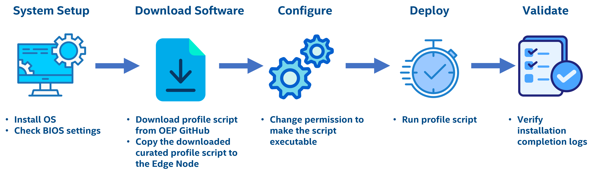
*<center>Figure 1: Flow for Intel® Edge Device Enablement Framework</center>*

## Step 1: Prerequisites & System Set-UP

Before starting the Edge Node deployment, perform the following steps:-

- System bootable to a fresh Ubuntu 24.04 for profile 1,2 & Ubuntu 22.04 OS for profile 3.
- Internet connectivity is available on the Node
- The target node(s) hostname must be in lowercase, numerals, and hyphen’ – ‘. 
  - For example: wrk-8 is acceptable; wrk_8, WRK8, and Wrk^8 are not accepted as hostnames.
- Required proxy settings must be added to the /etc/environment file.
- Get access to the Edge Software Hub portal.
- Below are the BIOS settings required across the profiles.
   <details>
   <summary><code><b>BIOS Settings</b></code></summary>

   ### Please follow the below BIOS settings for the three profiles

   | **Settings**                       | **Profile 1**                                                                                   | **Profile 2**                                                                                                    | **Profile 3**                                                                                                                                                                                                                                   |
   |------------------------------------|-----------------------------------------------------------------------------------------------|------------------------------------------------------------------------------------------------------------------|------------------------------------------------------------------------------------------------------------------------------------------------------------------------------------------------------------------------------------------------|
   | **Secure Boot**                    | **Dell R760** :– <br> - BIOS Settings → System Security → Secure Boot → Enabled                    | **Dell R760** :– <br> - BIOS Settings → System BIOS → System Security → Secure Boot → Enabled <br> **ASRock iEP-7020E, ASUS PE3000G** :– <br> - Press F2 → Go to UEFI Firmware Settings → Security Section → Secure Boot Section → Set Secure Boot Mode to Custom → Select Secure Boot → Enabled → Save Changes → Boot to setup. | **Dell R760** :– <br> - BIOS Settings → System BIOS → System Security → Secure Boot → Enabled <br> **ASRock iEP-7020E, ASUS PE3000G** :– <br> - Press F2 → Go to UEFI Firmware Settings → Security Section → Secure Boot Section → Set Secure Boot Mode to Custom → Select Secure Boot → Enabled → Save Changes → Boot to setup. |
   | **Hyperthreading**                 | N/A                                                                                           | N/A                                                                                                              | **Xeon** :– <br> - Processor Settings → Logical Processor → Disabled <br> **Core** :– <br> - Intel Advanced Menu ⟶ CPU Configuration → Disabled                                                                                                           |
   | **C-States and Power Management**  | N/A                                                                                           | N/A                                                                                                              | **Xeon** :– <br> - Processor Settings → Uncore Frequency RAPL → Disabled <br> - System Profile Settings → Optimized Power Mode → Disabled <br> - System Profile Settings → C1E → Disabled <br> - System Profile Settings → Workload Configuration → IO Sensitive <br> - System Profile Settings → Dynamic Load Line Switch → Disabled <br> - System Profile Settings → C-States → Disabled <br> - System Profile Settings → Turbo Boost → Disabled <br> - System Profile Settings → Uncore Frequency → Maximum <br> - System Profile Settings → Energy Efficient Policy → Performance <br> - System Profile Settings → CPU Interconnect Bus Link Power Management → Disabled <br> - System Profile Settings → PCI ASPM L1 Link Power Management → Disabled <br> **Core** :– <br> - Intel Advanced Menu ⟶ Power & Performance ⟶ CPU - Power Management Control → Disabled |
   | **Intel (VMX) Virtualization**     | N/A                                                                                           | N/A                                                                                                              | **Core** :– <br> - Intel Advanced Menu ⟶ CPU Configuration → Disabled                                                                                                                                                                               |
   | **Intel(R) SpeedStep**             | N/A                                                                                           | N/A                                                                                                              | **Core** :– <br> - Intel Advanced Menu ⟶ Power & Performance ⟶ CPU - Power Management Control → Disabled                                                                                                                                             |
   | **Turbo Mode**                     | N/A                                                                                           | N/A                                                                                                              | **Core** :– <br> - Intel Advanced Menu ⟶ Power & Performance ⟶ CPU - Power Management Control → Disabled                                                                                                                                             |
   | **RC6 (Render Standby)**           | N/A                                                                                           | N/A                                                                                                              | **Core** :– <br> - Intel Advanced Menu ⟶ Power & Performance ⟶ CPU - Power Management Control → Disabled                                                                                                                                             |
   | **Maximum GT freq**                | N/A                                                                                           | N/A                                                                                                              | **Core** :– <br> - Intel Advanced Menu ⟶ Power & Performance ⟶ CPU - Power Management Control → Lowest (usually 100MHz)                                                                                                                             |
   | **SA GV**                          | N/A                                                                                           | N/A                                                                                                              | **Core** :– <br> - Intel Advanced Menu ⟶ Memory Configuration → Fixed High                                                                                                                                                                           |
   | **VT-d**                           | N/A                                                                                           | N/A                                                                                                              | **Core** :– <br> - Intel Advanced Menu ⟶ System Agent (SA) Configuration → Enabled                                                                                                                                                                   |
   | **PCI Express Clock Gating**       | N/A                                                                                           | N/A                                                                                                              | **Core** :– <br> - Intel Advanced Menu ⟶ System Agent (SA) Configuration ⟶ PCI Express Configuration → Disabled                                                                                                                                     |
   | **Gfx Low Power Mode**             | N/A                                                                                           | N/A                                                                                                              | **Core** :– <br> - Intel Advanced Menu ⟶ System Agent (SA) Configuration ⟶ Graphics Configuration → Disabled                                                                                                                                         |
   | **ACPI S3 Support**                | N/A                                                                                           | N/A                                                                                                              | **Core** :– <br> - Intel Advanced Menu ⟶ ACPI Settings → Disabled                                                                                                                                                                                    |
   | **Native ASPM**                    | N/A                                                                                           | N/A                                                                                                              | **Core** :– <br> - Intel Advanced Menu ⟶ ACPI Settings → Disabled                                                                                                                                                                                    |
   | **Legacy IO Low Latency**          | N/A                                                                                           | N/A                                                                                                              | **Core** :– <br> - Intel Advanced Menu ⟶ PCH-IO Configuration → Enabled                                                                                                                                                                              |
   | **PCH Cross Throttling**           | N/A                                                                                           | N/A                                                                                                              | **Core** :– <br> - Intel Advanced Menu ⟶ PCH-IO Configuration → Disabled                                                                                                                                                                             |
   | **Delay Enable DMI ASPM**          | N/A                                                                                           | N/A                                                                                                              | **Core** :– <br> - Intel Advanced Menu ⟶ PCH-IO Configuration ⟶ PCI Express Configuration → Disabled                                                                                                                                                 |
   | **DMI Link ASPM**                  | N/A                                                                                           | N/A                                                                                                              | **Core** :– <br> - Intel Advanced Menu ⟶ PCH-IO Configuration ⟶ PCI Express Configuration → Disabled                                                                                                                                                 |
   | **Aggressive LPM Support**         | N/A                                                                                           | N/A                                                                                                              | **Core** :– <br> - Intel Advanced Menu ⟶ PCH-IO Configuration ⟶ SATA And RST Configuration → Disabled                                                                                                                                               |
   | **USB Periodic SMI**               | N/A                                                                                           | N/A                                                                                                              | **Core** :– <br> - Intel Advanced Menu ⟶ LEGACY USB Configuration → Disabled                                                                                                                                                                         |
   </details>

## Step 2: Download the ESH Profiles

1. Select Configure & Download to download the Intel® Edge Enablement package. <br>
<a href="https://edge-services-catalog-prod-qa.apps1-bg-int.icloud.intel.com/package/eef_24_11_sprint4" style="display: inline-block; padding: 10px 20px; font-size: 16px; font-weight: bold; color: white; background-color: #007bff; text-align: center; text-decoration: none; border-radius: 5px; border: none;">Configure & Download</a>

2. Download ESH Package
   <details>
   <summary><code><b>Recommended Configuration Package Download</b></code></summary>

   #### Download steps for Profile 1 & Profile 3
   1. Select the profile for package download.<br>
   2. Click on “Download”<br>
      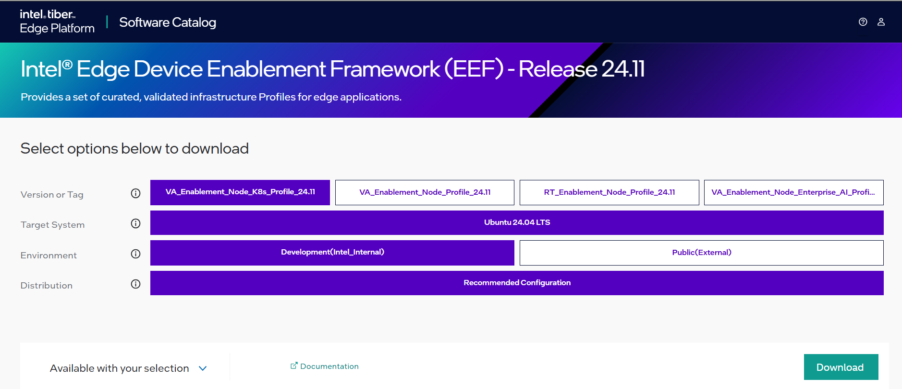<br>
      *<center>Figure 2: ESH Package for Intel® Edge Device Enablement Framework</center>* <br><br>
   3. Read the License Agreement and Click on “Accept”
      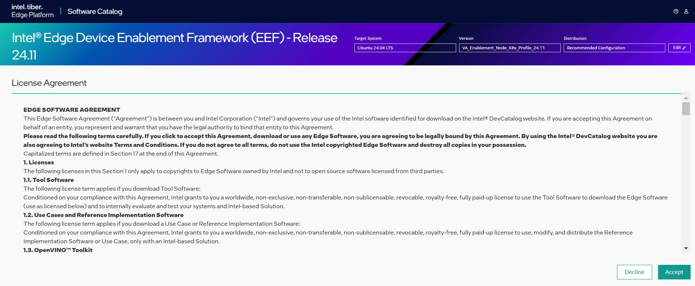
      *<center>Figure 3: Accept the License Agreement</center>* <br><br>
   4. Package Download Begins.
      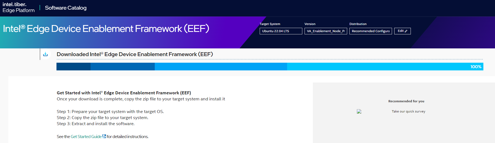
      *<center>Figure 4: Package Download Process Begins </center>*
   5. Provide file name to save the zip file
      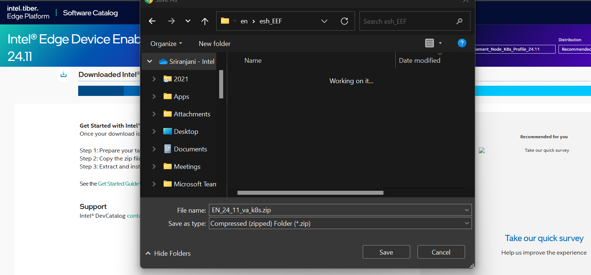
      *<center>Figure 5: Provide File Name </center>*

   </details>
   <details>
   <summary><code><b>Custom Configuration Package Download(Available for Profile 2 Only)</b></code></summary>

   #### Download steps for Profile 2

   6. Select the `Va_Enablement_Node_Profile_24.11` for package download.
   7. Click on “Custom Configuration”
      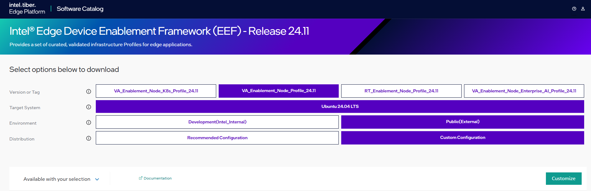
      *<center>Figure 2: ESH Package for Intel® Edge Device Enablement Framework</center>* <br><br>
   8. Select the containers & click Next
      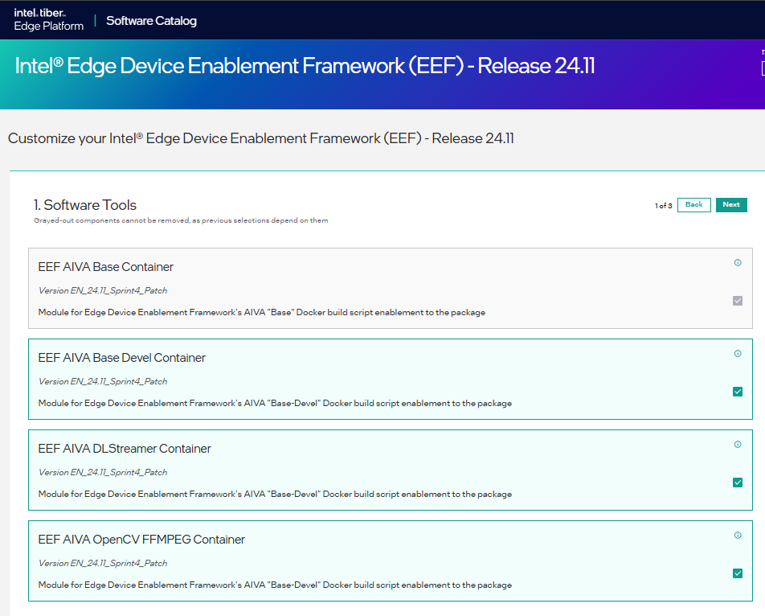
      *<center>Figure 2: Select the Containers</center>* <br><br>
   9.  Select curation script & click on Next
      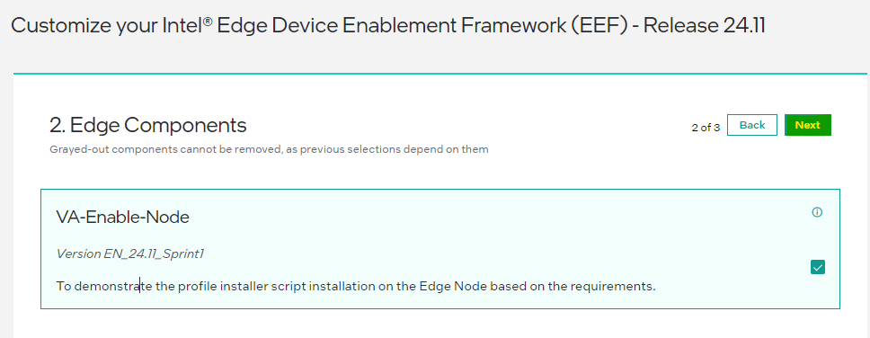
      *<center>Figure 2: Select the Curation Script</center>* <br><br>
   10. Read the License Agreement and Click on “Accept”
      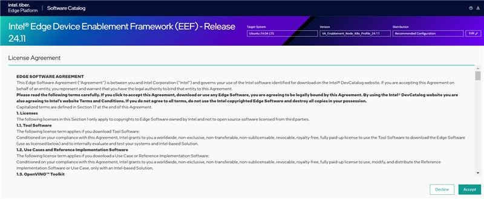
      *<center>Figure 3: Accept the License Agreement</center>* <br><br>
   11. Package Download Begins.
      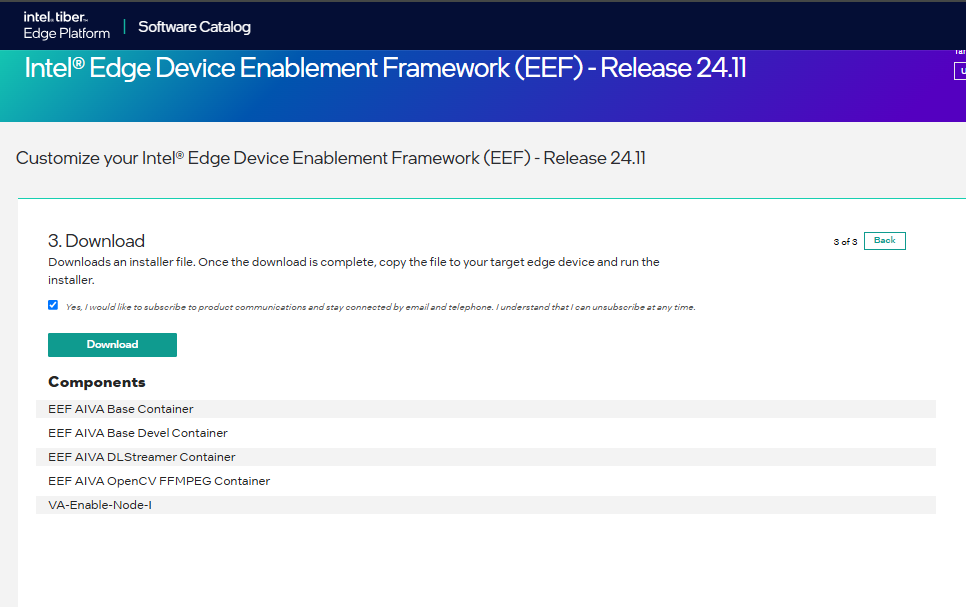
      *<center>Figure 4: Package Download Process Begins </center>*
   12. Provide file name to save the zip file
      
      *<center>Figure 5: Provide File Name </center>*

   </details>

## Step 3: Configure

The ESH Package will be downloaded on your Local System in a zip format, labeled as “<profile-name>.zip”.
> Note: The curation script might set up a component using a reference configuration, which means it's the responsibility of the user or the VBU (Vertical Business Unit) to ensure that it is configured and deployed securely. For instance, when deploying OpenTelemetry (otel), it should be done with security in mind.

1. Copy the ESH package from the Local System to a Edge Node running Ubuntu 22.04 <br>
   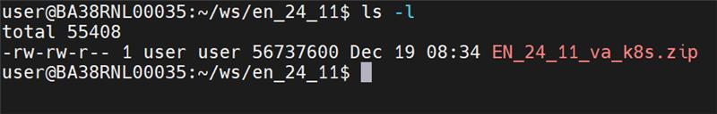 <br>
   *<center>Figure 6: Copy ESH Package to Target System</center>* <br><br>
2. Proceed to extract the compressed file to obtain the ESH Installer.
   ```bash
   $ unzip va_no_caas.zip
   ```
   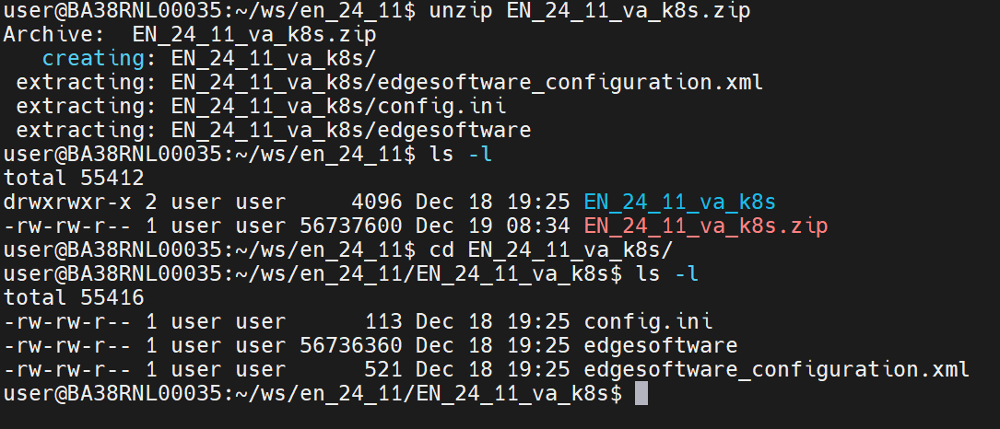 <br>
   *<center>Figure 7: Unzip the ESH Package</center>* <br><br>
3. Navigate to the extracted folder & modify the permissions of the ‘edgesoftware’ file to make it executable.
   ```bash
   $ chmod +x edgesoftware
   ```

   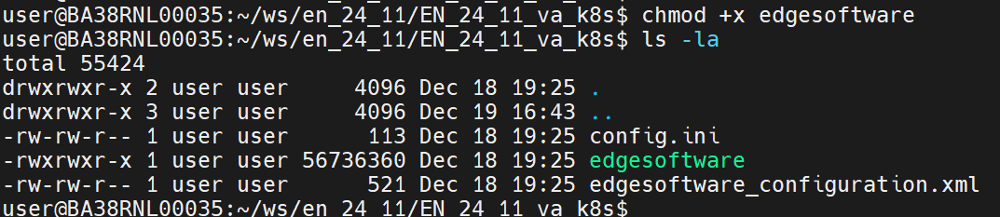 <br>
   *<center>Figure 8: Change Installer Permission</center>* <br><br>
4. Create a Python virtual environment
   - Navigate to the directory where you want to create the virtual environment, and then run below commands
     ```bash
      $ sudo apt install python3.12-venv
      ```
     ```bash
     $ python3 -m venv venv
     ```
   - Activate the virtual environment:  
     ```bash
     $ source ./venv/bin/activate
     ```
    <br>
   *<center>Figure 8: Starting the Python Virtual Environment</center>* <br><br>

### Note:
- The curation script might set up a component using a reference configuration, which means it's the responsibility of the user or the VBU (Vertical Business Unit) to ensure that it is configured and deployed securely. For instance, when deploying OpenTelemetry (otel), it should be done with security in mind.
- For Base Profile-1 (va_enablement_node_k8s_profile), setting up certificate-based authentication as an alternative to password authentication can enhance security by relying on cryptographic mechanisms.
- The curation script does not explicitly validate input parameters such as username, groupname, IP, password, and token. If these parameters are invalid, the respective utilities will throw an error.

> Please refer to below secure config details-

| **Agent/Component** | **Secure Config Detail** |
|---------------------|--------------------------|
| platform-observability-agent | [grafana datasource config](https://grafana.com/docs/grafana/latest/datasources/loki/) <br> [otel config](https://opentelemetry.io/docs/collector/configuration/) |
| Prometheus | [prometheus config](https://prometheus.io/docs/prometheus/latest/configuration/configuration/) |

#### Steps to modify curation script

1. Navigate to the extracted folder & execute ./edgesoftware with download option.
   ```bash
   $ ./edgesoftware download
   ```

   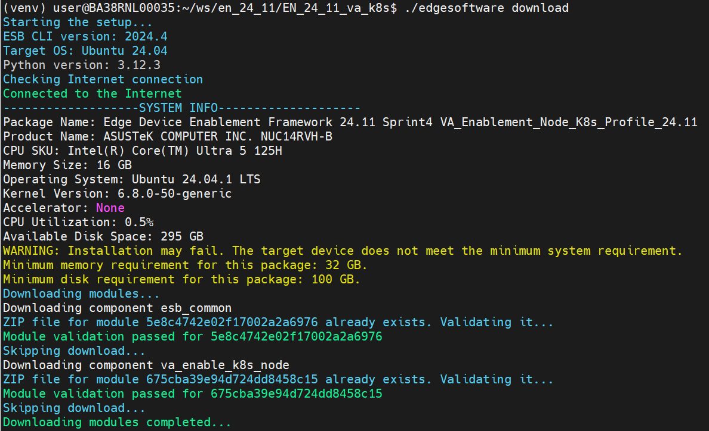 <br>

2. Navigate to the dir which contains curation script.
   ```bash
   $ vi va_enablement_node_k8s_profile.sh
   ```

   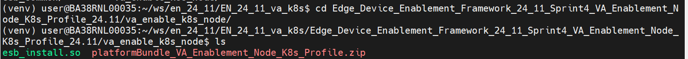 <br>
   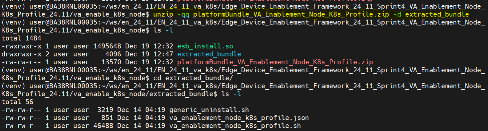 <br>

## Step 4:  Deploy

1. This step is common across all the profiles. Execute the ESH Installer to begin the installation process by using the following command.
   ```bash
   $ ./edgesoftware install
   ```
   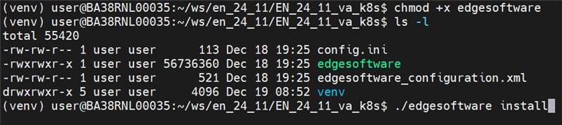 <br>
   *<center>Figure 10: Block Diagram</center>* <br><br>

<details>
   <summary><code><b>Know more about Edge Node Worker & Controller</b></code></summary>

### Edge Node Worker & Controller Block Diagram

#### Master Node (Edge Node - Controller)

Script on Edge Node Controller will perform following actions:

- Install Kubectl and the necessary packages
- Install and enable the RKE2 server <br>

Script on Edge Node Worker will perform following actions:
- Install the native components 
- Install and enable the RKE2  agent
- Establishes a connection between edge-node controller and worker node using controller node’s IP and token[requires user inputs]
  
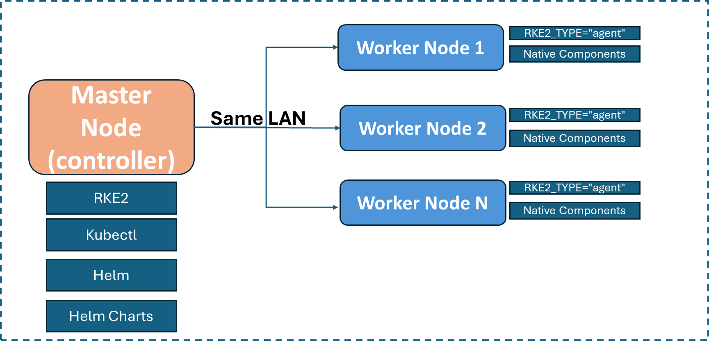 <br>
*<center>Figure 10: Block Diagram</center>* <br><br>

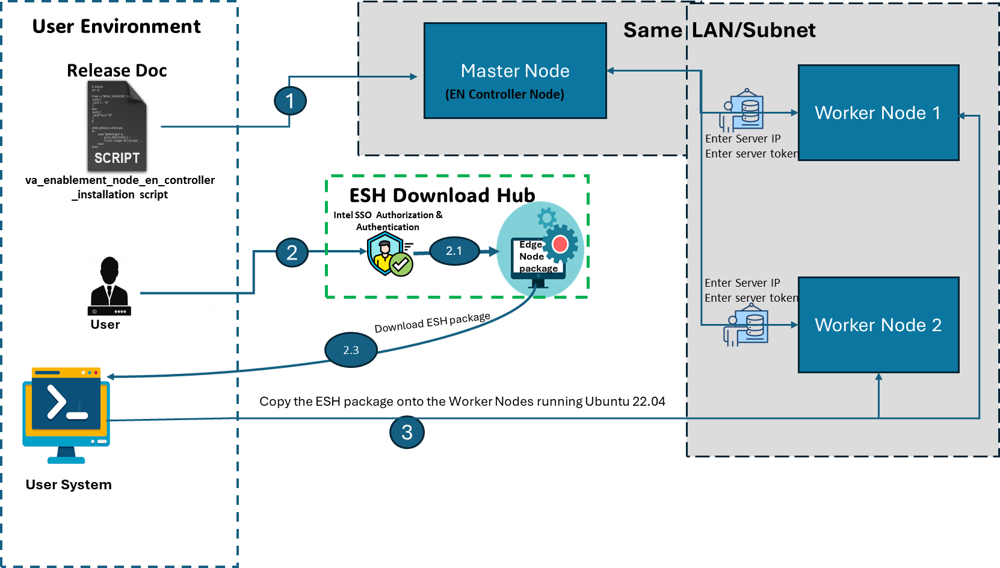 <br>
*<center>Figure 11: Rke2 server bringup Master Node</center>* <br><br>

 <br>
*<center>Figure 12: Rke2 server bringup Worker Node</center>* <br><br>

</details>


### 4.1 User Inputs Required for Profile 1 Execution

<details>
 <summary><code>User Input</code> <code><b>VA Enablement Node K8s Profile - Profile 1</b></code></summary>

#### 1. Execute the below script to set-up the rke2 Server(Edge Node - Controller) with the correct proxy, install kubectl and RKE2 server and other essential packages

   > Below script installs the RKE2 Kubernetes Server distribution and runs the services. It installs the kubectl (Kubernetes Command-Line Interface) for Creating and managing the resources on the cluster like Pods, Services and Deployments and to get their current running states.

   ```bash

   #!/bin/bash

   #shellcheck source=/dev/null
   # Load environment variables
   load_environment_variables() {
      source /etc/environment
      export http_proxy https_proxy ftp_proxy socks_server no_proxy
   }

   # Install Docker
   install_docker() {
      echo "Commencing Docker installation..."
      mkdir -p /etc/systemd/system/docker.service.d
      cat << EOF > /etc/systemd/system/docker.service.d/proxy.conf
   [Service]
   Environment="HTTP_PROXY=${http_proxy}"
   Environment="HTTPS_PROXY=${https_proxy}"
   Environment="NO_PROXY=${no_proxy}"
   EOF
   }

   # Configure RKE2 proxy settings
   configure_rke2_proxy() {
      echo "Configuring RKE2 proxy settings..."
      rke_proxy_conf="[Service]\nHTTP_PROXY=$http_proxy\nHTTPS_PROXY=$https_proxy\nNO_PROXY=$no_proxy\n"
      echo -e "$rke_proxy_conf" | tee /etc/default/rke2-server >/dev/null
      cat /etc/default/rke2-server
   }

   # Install Kubectl
   install_kubectl() {
      echo "Installing Kubectl..."
      curl -LO "https://dl.k8s.io/release/$(curl -L -s https://dl.k8s.io/release/stable.txt)/bin/linux/amd64/kubectl"
      chmod +x ./kubectl
      mv ./kubectl /usr/local/bin/kubectl
   }

   # Install required packages
   install_required_packages() {
      echo "Updating package lists and installing required packages..."
      apt-get update
      apt-get install -y ca-certificates curl
      install -m 0755 -d /etc/apt/keyrings
      curl -fsSL https://download.docker.com/linux/ubuntu/gpg -o /etc/apt/keyrings/docker.asc
      chmod a+r /etc/apt/keyrings/docker.asc
      echo "deb [arch=$(dpkg --print-architecture) signed-by=/etc/apt/keyrings/docker.asc] https://download.docker.com/linux/ubuntu $(. /etc/os-release && echo "$VERSION_CODENAME") stable" | sudo tee /etc/apt/sources.list.d/docker.list > /dev/null
      apt-get update
      apt-get install -y docker-ce docker-ce-cli containerd.io docker-buildx-plugin docker-compose-plugin
      usermod -aG docker "$USER"
      systemctl daemon-reload
      systemctl restart docker
      chmod 666 /var/run/docker.sock
   }

   # Install RKE2 server
   install_rke2_server() {
      echo "Installing RKE2 server..."
      curl -sfL https://get.rke2.io | INSTALL_RKE2_VERSION=v1.28.10+rke2r1 sh -
      echo "Configuring RKE2 server..."
      timeout 120 rke2 server > /dev/null 2>&1
      sudo mkdir -p /etc/rancher/rke2
      cat << EOF > /etc/rancher/rke2/config.yaml
   write-kubeconfig-mode: "0640"
   cni:
   - multus
   - calico
   https-listen-port: 9345
   EOF
      sudo systemctl enable rke2-server.service
      sudo systemctl start rke2-server.service
   }

   # Display RKE2 server token
   display_rke2_server_token() {
      echo "RKE2 Server Token for EdgeNode Worker:"
      echo "--- 8< --- start of server token info --- 8< ---"
      cat /var/lib/rancher/rke2/server/node-token
      echo "--- 8< --- end of server token info --- 8< ---"
   }

   # Configure kubectl
   configure_kubectl() {
      echo "Configuring kubectl..."
      mkdir -p /"$USER"/.kube
      cp /etc/rancher/rke2/rke2.yaml /"$USER"/.kube/config
      chmod 755 /etc/rancher/rke2/rke2.yaml
      echo "chmod 755 /etc/rancher/rke2/rke2.yaml" >>~/.profile
      chmod 755 /"$USER"/.kube/config
      chown "$USER":"$USER" /"$USER"/.kube/config
      kubectl get pods -A
   }

   # Main function to orchestrate the setup
   main() {
      load_environment_variables
      install_docker
      configure_rke2_proxy
      install_kubectl
      install_required_packages
      install_rke2_server
      display_rke2_server_token
      configure_kubectl
      echo "Setup complete."
   }

   # Execute the main function
   main

   ```

#### 2. Fetch the server token

   ```bash
   $ cat /var/lib/rancher/rke2/server/node-token
   ```

#### 3. The user needs to set-up the server(Edge Node - Controller) and then execute the installer script with the below input parameters on the Edge Node - Worker(Supports Multi Worker Nodes).

#### Parameters:-

| Prompt                | User Input                                    |
|-----------------------|-----------------------------------------------|
| Server IP             | Provide Server IP                             |
| Server Token          | Provide Server token (steps to fetch server token are provided below) |
| Username              | Server Username                               |
| Password              | Server Password                               |
| License Agreement     | Y                                             |

#### 4. Once the connection is established, execute the below script on Edge Node - Controller to install Helm Charts(Grafana, Network SRIOV Plugins, AKri, IPSEC Stack, GPU Plugins)

   ```bash
   #!/bin/bash

   if test "$(id -u)" -ne 0;then
      exec sudo "$0" ${1+"$@"};
   fi
   set -e

   echo 'NTP=corp.intel.com' >> /etc/systemd/timesyncd.conf

   STATUS_DIR=$(pwd)
   LOGFILE="$STATUS_DIR/output.log"
   exec > >(tee -a "$LOGFILE") 2>&1

   declare -i Intel_DMZ_Proxy_mod_build_status
   declare -i intel_proxy_build_status
   declare -i Disable_Popup_mod_build_status
   declare -i disable_popup_build_status
   declare -i Build_Dependency_mod_build_status
   declare -i Build_Dependency_build_status
   declare -i CA_Cert_Installation_mod_build_status
   declare -i ca_certificate_installation_build_status
   declare -i Docker_Install_mod_build_status
   declare -i docker_ce_build_status
   declare -i docker_compose_build_status
   declare -i docker_install_build_status
   declare -i rke2_dependency_mod_build_status
   declare -i rke2_agent_dependency_build_status
   declare -i Helm_Login_mod_build_status
   declare -i helm_login_build_status
   declare -i Device_Discovery_mod_build_status
   declare -i nfd_build_status
   declare -i akri_build_status
   declare -i Istio_Service_Mesh_mod_build_status
   declare -i istio_build_status
   declare -i Kubernetes_Virtualisation_mod_build_status
   declare -i kubevirt_build_status
   declare -i loki_mod_build_status
   declare -i loki_build_status
   declare -i cert_manager_mod_build_status
   declare -i cert_manager_build_status
   declare -i Network_Sriov_Plugins_mod_build_status
   declare -i sriov_network_operator_build_status
   declare -i Kubernetes_Persistent_Volumes_mod_build_status
   declare -i openebs_build_status
   declare -i Oras_mod_build_status
   declare -i oras_build_status
   declare -i Observability_Stack_for_Kubernetes_Cluster_mod_build_status
   declare -i rke2_multus_build_status
   declare -i cdi_build_status
   declare -i rke2_coredns_build_status
   declare -i prometheus_build_status
   declare -i Intel_GPU_Plugin_mod_build_status
   declare -i intel_gpu_plugin_build_status
   declare -i HW_BOM_mod_build_status
   declare -i os_build_status
   declare -i hw_bom_build_status
   declare -i Secure_Boot_mod_build_status
   declare -i secure_boot_build_status
   declare -i Validation_Report_Generation_mod_build_status
   declare -i validation_report_generation_build_status

   SETUP_STATUS_FILENAME="install_pkgs_status"
   PACKAGE_BUILD_FILENAME="package_build_time"
   STATUS_DIR=$(pwd)
   STATUS_DIR_FILE_PATH=$STATUS_DIR/$SETUP_STATUS_FILENAME
   PACKAGE_BUILD_TIME_FILE=$STATUS_DIR/$PACKAGE_BUILD_FILENAME

   touch "$PACKAGE_BUILD_TIME_FILE"
   if [ -e "$STATUS_DIR_FILE_PATH" ]; then
      echo "FIle $STATUS_DIR_FILE_PATH exists"
   else
      touch "$STATUS_DIR_FILE_PATH"
      {
      echo "Intel_DMZ_Proxy_mod_build_status=0"
      echo "intel_proxy_build_status=0"
      echo "Disable_Popup_mod_build_status=0"
      echo "disable_popup_build_status=0"
      echo "Build_Dependency_mod_build_status=0"
      echo "Build_Dependency_build_status=0"
      echo "CA_Cert_Installation_mod_build_status=0"
      echo "ca_certificate_installation_build_status=0"
      echo "Docker_Install_mod_build_status=0"
      echo "docker_ce_build_status=0"
      echo "docker_compose_build_status=0"
      echo "docker_install_build_status=0"
      echo "rke2_dependency_mod_build_status=0"
      echo "rke2_agent_dependency_build_status=0"
      echo "Helm_Login_mod_build_status=0"
      echo "helm_login_build_status=0"
      echo "Device_Discovery_mod_build_status=0"
      echo "nfd_build_status=0"
      echo "akri_build_status=0"
      echo "Istio_Service_Mesh_mod_build_status=0"
      echo "istio_build_status=0"
      echo "Kubernetes_Virtualisation_mod_build_status=0"
      echo "kubevirt_build_status=0"
      echo "loki_mod_build_status=0"
      echo "loki_build_status=0"
      echo "cert_manager_mod_build_status=0"
      echo "cert_manager_build_status=0"
      echo "Network_Sriov_Plugins_mod_build_status=0"
      echo "sriov_network_operator_build_status=0"
      echo "Kubernetes_Persistent_Volumes_mod_build_status=0"
      echo "openebs_build_status=0"
      echo "Oras_mod_build_status=0"
      echo "oras_build_status=0"
      echo "Observability_Stack_for_Kubernetes_Cluster_mod_build_status=0"
      echo "rke2_multus_build_status=0"
      echo "cdi_build_status=0"
      echo "rke2_coredns_build_status=0"
      echo "prometheus_build_status=0"
      echo "Intel_GPU_Plugin_mod_build_status=0"
      echo "intel_gpu_plugin_build_status=0"
      echo "HW_BOM_mod_build_status=0"
      echo "os_build_status=0"
      echo "hw_bom_build_status=0"
      echo "Secure_Boot_mod_build_status=0"
      echo "secure_boot_build_status=0"
      echo "Validation_Report_Generation_mod_build_status=0"
      echo "validation_report_generation_build_status=0"
      }>> "$STATUS_DIR_FILE_PATH"
   fi

   #shellcheck source=/dev/null
   source "$STATUS_DIR_FILE_PATH"


   if [ "$Intel_DMZ_Proxy_mod_build_status" -ne 1 ]; then
   if [ "$intel_proxy_build_status" -ne 1 ]; then
   SECONDS=0
   https_proxy="http://proxy-dmz.intel.com:911"
   ftp_proxy="http://proxy-dmz.intel.com:911"
   socks_proxy="socks://proxy-dmz.intel.com:1080"
   no_proxy="localhost,*.intel.com,*intel.com,192.168.0.0/16,172.16.0.0/12,127.0.0.0/8,10.0.0.0/8,/var/run/docker.sock,.internal"
   http_proxy="http://proxy-dmz.intel.com:911"
   HTTP_PROXY="http://proxy-dmz.intel.com:911/"
   HTTPS_PROXY="http://proxy-dmz.intel.com:912/"
   NO_PROXY="localhost,*.intel.com,*intel.com,192.168.0.0/16,172.16.0.0/12,127.0.0.0/8,10.0.0.0/8,/var/run/docker.sock"
   if grep -q "http_proxy" /etc/environment && grep -q "https_proxy" /etc/environment && grep -q "ftp_proxy" /etc/environment && grep -q "no_proxy" /etc/environment && grep -q "HTTP_PROXY" /etc/environment && grep -q "LD_LIBRARY_PATH" /etc/environment; then
         echo "Proxies are already present in /etc/environment."
   else
      {
      echo http_proxy=$http_proxy
      echo https_proxy=$https_proxy
      echo ftp_proxy=$ftp_proxy
      echo socks_proxy=$socks_proxy
      echo no_proxy="$no_proxy"
         echo HTTP_PROXY=$HTTP_PROXY
         echo HTTPS_PROXY=$HTTPS_PROXY
         echo NO_PROXY="$NO_PROXY"
         echo LD_LIBRARY_PATH=/usr/lib/x86_64-linux-gnu/
      } >> /etc/environment 
      echo "Proxies added to /etc/environment."
   fi
   #shellcheck source=/dev/null
   source  /etc/environment
   export http_proxy https_proxy ftp_proxy socks_proxy no_proxy;

   sed -i 's/intel_proxy_build_status=0/intel_proxy_build_status=1/g' "$STATUS_DIR_FILE_PATH"

   elapsedseconds=$SECONDS
   echo "intel_proxy build time = $((elapsedseconds))" >> "$PACKAGE_BUILD_TIME_FILE"

   fi

   sed -i 's/Intel_DMZ_Proxy_mod_build_status=0/Intel_DMZ_Proxy_mod_build_status=1/g' "$STATUS_DIR_FILE_PATH"

   fi

   if [ "$Disable_Popup_mod_build_status" -ne 1 ]; then
   if [ "$disable_popup_build_status" -ne 1 ]; then
   SECONDS=0
   if [ -e /etc/needrestart/needrestart.conf ]; then
      echo "Disable hints on pending kernel upgrades"
      sed -i "s/\#\\\$nrconf{kernelhints} = -1;/\$nrconf{kernelhints} = -1;/g" /etc/needrestart/needrestart.conf
      sed -i "s/^#\\\$nrconf{restart} = 'i';/\$nrconf{restart} = 'a';/" /etc/needrestart/needrestart.conf
      grep "nrconf{kernelhints}" /etc/needrestart/needrestart.conf
      grep "nrconf{restart}" /etc/needrestart/needrestart.conf
   fi

   sed -i 's/disable_popup_build_status=0/disable_popup_build_status=1/g' "$STATUS_DIR_FILE_PATH"

   elapsedseconds=$SECONDS
   echo "disable_popup build time = $((elapsedseconds))" >> "$PACKAGE_BUILD_TIME_FILE"

   fi

   sed -i 's/Disable_Popup_mod_build_status=0/Disable_Popup_mod_build_status=1/g' "$STATUS_DIR_FILE_PATH"

   fi

   if [ "$Build_Dependency_mod_build_status" -ne 1 ]; then
   if [ "$Build_Dependency_build_status" -ne 1 ]; then
   SECONDS=0
   echo \\\"Install build essentials\\\"
   apt-get update
   apt-get install -y bash python3 python3-dev ca-certificates wget python3-pip git
   apt-get -y -q install bc build-essential ccache gcc git wget xz-utils libncurses-dev flex
   apt-get -y -q install bison openssl libssl-dev dkms libelf-dev libudev-dev libpci-dev
   apt-get -y -q install libiberty-dev autoconf cpio
   apt-get -y install lz4 debhelper unzip jq
   systemctl daemon-reload
   systemctl restart snapd
   snap install oras --classic
   echo \\\"Build essentials installation done\\\"


   sed -i 's/Build_Dependency_build_status=0/Build_Dependency_build_status=1/g' "$STATUS_DIR_FILE_PATH"

   elapsedseconds=$SECONDS
   echo "Build_Dependency build time = $((elapsedseconds))" >> "$PACKAGE_BUILD_TIME_FILE"

   fi

   sed -i 's/Build_Dependency_mod_build_status=0/Build_Dependency_mod_build_status=1/g' "$STATUS_DIR_FILE_PATH"

   fi

   if [ "$CA_Cert_Installation_mod_build_status" -ne 1 ]; then
   if [ "$ca_certificate_installation_build_status" -ne 1 ]; then
   SECONDS=0
   mkdir -p ca_cert
   cd ca_cert
   wget http://owrdropbox.intel.com/dropbox/public/Ansible/certificates/IntelCA5A-base64.crt --no-proxy
   wget http://owrdropbox.intel.com/dropbox/public/Ansible/certificates/IntelCA5B-base64.crt --no-proxy
   wget http://owrdropbox.intel.com/dropbox/public/Ansible/certificates/IntelSHA256RootCA-base64.crt --no-proxy
   cp Intel* /usr/local/share/ca-certificates/
   update-ca-certificates
   cd ..
   rm -r ca_cert

   sed -i 's/ca_certificate_installation_build_status=0/ca_certificate_installation_build_status=1/g' "$STATUS_DIR_FILE_PATH"

   elapsedseconds=$SECONDS
   echo "ca_certificate_installation build time = $((elapsedseconds))" >> "$PACKAGE_BUILD_TIME_FILE"

   fi

   sed -i 's/CA_Cert_Installation_mod_build_status=0/CA_Cert_Installation_mod_build_status=1/g' "$STATUS_DIR_FILE_PATH"

   fi

   if [ "$Docker_Install_mod_build_status" -ne 1 ]; then
   if [ "$docker_ce_build_status" -ne 1 ]; then
   SECONDS=0

   sed -i 's/docker_ce_build_status=0/docker_ce_build_status=1/g' "$STATUS_DIR_FILE_PATH"

   elapsedseconds=$SECONDS
   echo "docker_ce build time = $((elapsedseconds))" >> "$PACKAGE_BUILD_TIME_FILE"

   fi
   if [ "$docker_compose_build_status" -ne 1 ]; then
   SECONDS=0

   sed -i 's/docker_compose_build_status=0/docker_compose_build_status=1/g' "$STATUS_DIR_FILE_PATH"

   elapsedseconds=$SECONDS
   echo "docker_compose build time = $((elapsedseconds))" >> "$PACKAGE_BUILD_TIME_FILE"

   fi
   if [ "$docker_install_build_status" -ne 1 ]; then
   SECONDS=0
   echo \"Installing Docker\"
   mkdir -p /etc/systemd/system/docker.service.d
   cat << EOF > /etc/systemd/system/docker.service.d/proxy.conf
   [Service]
   Environment="HTTP_PROXY=http://proxy-dmz.intel.com:911/"
   Environment="HTTPS_PROXY=http://proxy-dmz.intel.com:912/"
   Environment="NO_PROXY=localhost,*.intel.com,*intel.com,192.168.0.0/16,172.16.0.0/12,127.0.0.0/8,10.0.0.0/8,/var/run/docker.sock"
   EOF
      
   echo \"***installing docker***\"
   for pkg in docker.io docker-doc docker-compose docker-compose-v2 podman-docker containerd runc; do   apt-get -y remove $pkg; done

   apt-get update
   apt-get -y install ca-certificates curl cmake g++ wget unzip
   install -m 0755 -d /etc/apt/keyrings
   curl -fsSL https://download.docker.com/linux/ubuntu/gpg -o /etc/apt/keyrings/docker.asc
   chmod a+r /etc/apt/keyrings/docker.asc
   #shellcheck source=/dev/null
   echo "deb [arch=$(dpkg --print-architecture) signed-by=/etc/apt/keyrings/docker.asc] https://download.docker.com/linux/ubuntu $(. /etc/os-release && echo "$VERSION_CODENAME") stable" |   tee /etc/apt/sources.list.d/docker.list > /dev/null

   apt-get update

   apt-get install -y docker-ce docker-ce-cli containerd.io docker-buildx-plugin docker-compose-plugin

   systemctl daemon-reload
   systemctl restart docker


   sed -i 's/docker_install_build_status=0/docker_install_build_status=1/g' "$STATUS_DIR_FILE_PATH"

   elapsedseconds=$SECONDS
   echo "docker_install build time = $((elapsedseconds))" >> "$PACKAGE_BUILD_TIME_FILE"

   fi

   sed -i 's/Docker_Install_mod_build_status=0/Docker_Install_mod_build_status=1/g' "$STATUS_DIR_FILE_PATH"

   fi


   if [ "$rke2_dependency_mod_build_status" -ne 1 ]; then
   if [ "$rke2_agent_dependency_build_status" -ne 1 ]; then
   SECONDS=0
   apt-get install -y sshpass jq unzip curl
   echo "Installing Helm"
   snap set system proxy.http="http://proxy-dmz.intel.com:911"
   snap set system proxy.https="http://proxy-dmz.intel.com:912"
   snap install helm --classic

   sed -i 's/rke2_agent_dependency_build_status=0/rke2_agent_dependency_build_status=1/g' "$STATUS_DIR_FILE_PATH"

   elapsedseconds=$SECONDS
   echo "rke2_agent_dependency build time = $((elapsedseconds))" >> "$PACKAGE_BUILD_TIME_FILE"

   fi

   sed -i 's/rke2_dependency_mod_build_status=0/rke2_dependency_mod_build_status=1/g' "$STATUS_DIR_FILE_PATH"

   fi

   if [ "$Helm_Login_mod_build_status" -ne 1 ]; then
   if [ "$helm_login_build_status" -ne 1 ]; then
   SECONDS=0
   registry="registry-rs.internal.ledgepark.intel.com"
   read -r -p "Please paste your id token here:" TKN
   helm_login_status=$(echo "$TKN" | helm registry login --password-stdin $registry 2>&1)

   if [[ $helm_login_status != *"Succeeded"* ]]
   then
      echo "Please Enter Valid ID Token for Helm Login."
      exit 1
   fi

   oras_login_status=$(echo "$TKN" | oras login --password-stdin $registry)
   if [[ $oras_login_status != *"Succeeded"* ]]
   then
      echo "Please Enter Valid ID Token for Oras Login."
      exit 1
   fi


   sed -i 's/helm_login_build_status=0/helm_login_build_status=1/g' "$STATUS_DIR_FILE_PATH"

   elapsedseconds=$SECONDS
   echo "helm_login build time = $((elapsedseconds))" >> "$PACKAGE_BUILD_TIME_FILE"

   fi

   sed -i 's/Helm_Login_mod_build_status=0/Helm_Login_mod_build_status=1/g' "$STATUS_DIR_FILE_PATH"

   fi

   if [ "$Device_Discovery_mod_build_status" -ne 1 ]; then
   if [ "$nfd_build_status" -ne 1 ]; then
   SECONDS=0
   #Installing nfd/node feature discovery

   helm pull oci://"${registry}"/one-intel-edge/edge-node/nfd --version  0.1.3
   helm install --create-namespace --namespace=nfd nfd nfd-0.1.3.tgz

   kubectl get all -A | grep nfd

   sed -i 's/nfd_build_status=0/nfd_build_status=1/g' "$STATUS_DIR_FILE_PATH"

   elapsedseconds=$SECONDS
   echo "nfd build time = $((elapsedseconds))" >> "$PACKAGE_BUILD_TIME_FILE"

   fi
   if [ "$akri_build_status" -ne 1 ]; then
   SECONDS=0
   #Installing Akri

   helm pull oci://"${registry}"/one-intel-edge/edge-node/akri --version  0.12.13
   helm install --create-namespace --namespace=akri akri akri-0.12.13.tgz

   kubectl get all -A | grep akri

   sed -i 's/akri_build_status=0/akri_build_status=1/g' "$STATUS_DIR_FILE_PATH"

   elapsedseconds=$SECONDS
   echo "akri build time = $((elapsedseconds))" >> "$PACKAGE_BUILD_TIME_FILE"

   fi

   sed -i 's/Device_Discovery_mod_build_status=0/Device_Discovery_mod_build_status=1/g' "$STATUS_DIR_FILE_PATH"

   fi

   if [ "$Istio_Service_Mesh_mod_build_status" -ne 1 ]; then
   if [ "$istio_build_status" -ne 1 ]; then
   SECONDS=0
   curl -L https://istio.io/downloadIstio | ISTIO_VERSION=1.18.1 TARGET_ARCH=x86_64 sh -
   cd istio-1.18.1 || exit
   export PATH=$PWD/bin:$PATH
   istioctl install -y

   kubectl get all -A | grep istio-system

   cd ../

   sed -i 's/istio_build_status=0/istio_build_status=1/g' "$STATUS_DIR_FILE_PATH"

   elapsedseconds=$SECONDS
   echo "istio build time = $((elapsedseconds))" >> "$PACKAGE_BUILD_TIME_FILE"

   fi

   sed -i 's/Istio_Service_Mesh_mod_build_status=0/Istio_Service_Mesh_mod_build_status=1/g' "$STATUS_DIR_FILE_PATH"

   fi

   if [ "$Kubernetes_Virtualisation_mod_build_status" -ne 1 ]; then
   if [ "$kubevirt_build_status" -ne 1 ]; then
   SECONDS=0
   helm repo add prometheus-community https://prometheus-community.github.io/helm-charts
   helm repo update
   kubectl create ns monitoring
   kubectl create ns observability
   helm fetch prometheus-community/kube-prometheus-stack --version 65.0.0
   tar -xvzf kube-prometheus-stack-65.0.0.tgz
   cd kube-prometheus-stack
   sed -i 's/^      isDefaultDatasource: true/      isDefaultDatasource: false/' values.yaml
   sed -i '/## HTTP path to scrape for metrics/{n;n;s|#   path: /metrics|  ##\n  ##\n  path: http://localhost:9091/metrics|}' values.yaml
   helm install -n monitoring -f values.yaml prometheus prometheus-community/kube-prometheus-stack

   #Install Kubevirt
   helm pull oci://"${registry}"/one-intel-edge/edge-node/kubevirt --version 1.1.3
   helm install --create-namespace --namespace=kubevirt kubevirt kubevirt-1.1.3.tgz
   helm pull oci://"${registry}"/one-intel-edge/edge-node/cdi --version 1.58.2
   helm install --create-namespace --namespace=cdi cdi cdi-1.58.2.tgz

   kubectl get all -A | grep kubevirt
   kubectl get all -A | grep cdi

   sed -i 's/kubevirt_build_status=0/kubevirt_build_status=1/g' "$STATUS_DIR_FILE_PATH"

   elapsedseconds=$SECONDS
   echo "kubevirt build time = $((elapsedseconds))" >> "$PACKAGE_BUILD_TIME_FILE"

   fi

   sed -i 's/Kubernetes_Virtualisation_mod_build_status=0/Kubernetes_Virtualisation_mod_build_status=1/g' "$STATUS_DIR_FILE_PATH"

   fi

   if [ "$loki_mod_build_status" -ne 1 ]; then
   if [ "$loki_build_status" -ne 1 ]; then
   SECONDS=0
   #Installing loki

   helm repo add grafana https://grafana.github.io/helm-charts
   helm repo list
   helm repo update

   helm install loki grafana/loki-stack -n monitoring

   sed -i 's/loki_build_status=0/loki_build_status=1/g' "$STATUS_DIR_FILE_PATH"

   elapsedseconds=$SECONDS
   echo "loki build time = $((elapsedseconds))" >> "$PACKAGE_BUILD_TIME_FILE"

   fi

   sed -i 's/loki_mod_build_status=0/loki_mod_build_status=1/g' "$STATUS_DIR_FILE_PATH"

   fi

   if [ "$cert_manager_mod_build_status" -ne 1 ]; then
   if [ "$cert_manager_build_status" -ne 1 ]; then
   SECONDS=0
   helm pull oci://"${registry}"/one-intel-edge/edge-node/cert-manager --version 1.14.3
   helm install --create-namespace --namespace=cert-manager cert-manager cert-manager-1.14.3.tgz

   sed -i 's/cert_manager_build_status=0/cert_manager_build_status=1/g' "$STATUS_DIR_FILE_PATH"

   elapsedseconds=$SECONDS
   echo "cert_manager build time = $((elapsedseconds))" >> "$PACKAGE_BUILD_TIME_FILE"

   fi

   sed -i 's/cert_manager_mod_build_status=0/cert_manager_mod_build_status=1/g' "$STATUS_DIR_FILE_PATH"

   fi

   if [ "$Network_Sriov_Plugins_mod_build_status" -ne 1 ]; then
   if [ "$sriov_network_operator_build_status" -ne 1 ]; then
   SECONDS=0
   echo "SRIOV"
   snap install go --classic
   # Clone the repository
   git clone https://github.com/k8snetworkplumbingwg/sriov-network-operator.git
   cd sriov-network-operator

   # Initialize a Go module (if not already initialized)
   #if [ ! -f "go.mod" ]; then
   #    go mod init github.com/k8snetworkplumbingwg/sriov-network-operator
   #fi
   # Download the dependencies
   #go mod tidy
   #echo "sriov-network-operator repository has been cloned and Go module has been set up successfully."
   #make deploy-setup-k8s

   #kubectl create ns sriov-network-operator
   #kubectl -n sriov-network-operator create secret tls operator-webhook-cert --cert=cert.pem --key=key.pem
   #kubectl -n sriov-network-operator create secret tls network-resources-injector-cert --cert=cert.pem --key=key.pem
   #export ADMISSION_CONTROLLERS_ENABLED=true
   #export ADMISSION_CONTROLLERS_CERTIFICATES_OPERATOR_CA_CRT=$(base64 -w 0 < cacert.pem)
   #export ADMISSION_CONTROLLERS_CERTIFICATES_INJECTOR_CA_CRT=$(base64 -w 0 < cacert.pem)
   #make deploy-setup-k8s

   #kubectl apply -f https://github.com/jetstack/cert-manager/releases/download/v1.3.0/cert-manager.yaml

   kubectl create ns sriov-network-operator
   cat <<EOF | kubectl apply -f -
   apiVersion: cert-manager.io/v1
   kind: Issuer
   metadata:
   name: sriov-network-operator-selfsigned-issuer
   namespace: sriov-network-operator
   spec:
   selfSigned: {}
   ---
   apiVersion: cert-manager.io/v1
   kind: Certificate
   metadata:
   name: operator-webhook-cert
   namespace: sriov-network-operator
   spec:
   secretName: operator-webhook-cert
   dnsNames:
   - operator-webhook-service.sriov-network-operator.svc
   issuerRef:
      name: sriov-network-operator-selfsigned-issuer
   ---
   apiVersion: cert-manager.io/v1
   kind: Certificate
   metadata:
   name: network-resources-injector-cert
   namespace: sriov-network-operator
   spec:
   secretName: network-resources-injector-cert
   dnsNames:
   - network-resources-injector-service.sriov-network-operator.svc
   issuerRef:
      name: sriov-network-operator-selfsigned-issuer
   EOF

   #deploy
   export ADMISSION_CONTROLLERS_ENABLED=true
   export ADMISSION_CONTROLLERS_CERTIFICATES_CERT_MANAGER_ENABLED=true
   make deploy-setup-k8s

   # Get all nodes
   nodes=$(kubectl get nodes --no-headers | grep -vE 'control-plane|etcd|master' | awk '{print $1}')

   # apply the label
   for node in $nodes; do
   echo "Applying label to node: $node"
   kubectl label node "$node" node-role.kubernetes.io/worker= --overwrite
   done

   echo "check sriov-network-operator deployment"
   kubectl get -n sriov-network-operator all

   # kubectl get all -A | grep sriov-network-operator

   sudo sed -i 's/GRUB_CMDLINE_LINUX=.*/GRUB_CMDLINE_LINUX="intel_iommu=on iommu=pt pci=realloc console=tty1 console=ttyS0,115200"/' /etc/default/grub
   #Update GRUB
   sudo update-grub

   sed -i 's/sriov_network_operator_build_status=0/sriov_network_operator_build_status=1/g' "$STATUS_DIR_FILE_PATH"

   elapsedseconds=$SECONDS
   echo "sriov_network_operator build time = $((elapsedseconds))" >> "$PACKAGE_BUILD_TIME_FILE"

   fi

   sed -i 's/Network_Sriov_Plugins_mod_build_status=0/Network_Sriov_Plugins_mod_build_status=1/g' "$STATUS_DIR_FILE_PATH"

   fi

   if [ "$Kubernetes_Persistent_Volumes_mod_build_status" -ne 1 ]; then
   if [ "$openebs_build_status" -ne 1 ]; then
   SECONDS=0
   helm pull oci://"${registry}"/one-intel-edge/edge-node/openebs --version 3.10.0
   helm install --create-namespace --namespace=openebs openebs openebs-3.10.0.tgz
   kubectl port-forward svc/prometheus-grafana -n monitoring 3000:80 &
   kubectl port-forward svc/prometheus-kube-prometheus-prometheus -n monitoring 9090:9090 &

   sed -i 's/openebs_build_status=0/openebs_build_status=1/g' "$STATUS_DIR_FILE_PATH"

   elapsedseconds=$SECONDS
   echo "openebs build time = $((elapsedseconds))" >> "$PACKAGE_BUILD_TIME_FILE"

   fi

   sed -i 's/Kubernetes_Persistent_Volumes_mod_build_status=0/Kubernetes_Persistent_Volumes_mod_build_status=1/g' "$STATUS_DIR_FILE_PATH"

   fi

   if [ "$Oras_mod_build_status" -ne 1 ]; then
   if [ "$oras_build_status" -ne 1 ]; then
   SECONDS=0
   echo \"###### Checking and Installing oras######\"
   if ! command -v oras &> /dev/null
   then
      echo \"oras is not available. Installing..\"
         systemctl daemon-reload
         systemctl restart snapd
      snap install oras --classic
      if oras version &> /dev/null
      then
         echo \"oras installation is successful\"
      else
         echo \"oras installation Failed!!\"
      fi
   else
      echo \"oras is already available on the setup. Proceeding further..\"
   fi

   sed -i 's/oras_build_status=0/oras_build_status=1/g' "$STATUS_DIR_FILE_PATH"

   elapsedseconds=$SECONDS
   echo "oras build time = $((elapsedseconds))" >> "$PACKAGE_BUILD_TIME_FILE"

   fi

   sed -i 's/Oras_mod_build_status=0/Oras_mod_build_status=1/g' "$STATUS_DIR_FILE_PATH"

   fi

   if [ "$Observability_Stack_for_Kubernetes_Cluster_mod_build_status" -ne 1 ]; then
   if [ "$rke2_multus_build_status" -ne 1 ]; then
   SECONDS=0

   sed -i 's/rke2_multus_build_status=0/rke2_multus_build_status=1/g' "$STATUS_DIR_FILE_PATH"

   elapsedseconds=$SECONDS
   echo "rke2_multus build time = $((elapsedseconds))" >> "$PACKAGE_BUILD_TIME_FILE"

   fi
   if [ "$cdi_build_status" -ne 1 ]; then
   SECONDS=0

   sed -i 's/cdi_build_status=0/cdi_build_status=1/g' "$STATUS_DIR_FILE_PATH"

   elapsedseconds=$SECONDS
   echo "cdi build time = $((elapsedseconds))" >> "$PACKAGE_BUILD_TIME_FILE"

   fi
   if [ "$rke2_coredns_build_status" -ne 1 ]; then
   SECONDS=0

   sed -i 's/rke2_coredns_build_status=0/rke2_coredns_build_status=1/g' "$STATUS_DIR_FILE_PATH"

   elapsedseconds=$SECONDS
   echo "rke2_coredns build time = $((elapsedseconds))" >> "$PACKAGE_BUILD_TIME_FILE"

   fi

   if [ "$prometheus_build_status" -ne 1 ]; then
   SECONDS=0

   sed -i 's/prometheus_build_status=0/prometheus_build_status=1/g' "$STATUS_DIR_FILE_PATH"

   elapsedseconds=$SECONDS
   echo "prometheus build time = $((elapsedseconds))" >> "$PACKAGE_BUILD_TIME_FILE"

   fi

   sed -i 's/Observability_Stack_for_Kubernetes_Cluster_mod_build_status=0/Observability_Stack_for_Kubernetes_Cluster_mod_build_status=1/g' "$STATUS_DIR_FILE_PATH"

   fi

   if [ "$Intel_GPU_Plugin_mod_build_status" -ne 1 ]; then
   if [ "$intel_gpu_plugin_build_status" -ne 1 ]; then
   SECONDS=0
   kubectl apply -k 'https://github.com/intel/intel-device-plugins-for-kubernetes/deployments/nfd?ref=v0.28.0'
   kubectl apply -k 'https://github.com/intel/intel-device-plugins-for-kubernetes/deployments/nfd/overlays/node-feature-rules?ref=v0.28.0'
   kubectl apply -k 'https://github.com/intel/intel-device-plugins-for-kubernetes/deployments/gpu_plugin/overlays/nfd_labeled_nodes?ref=v0.28.0'

   sed -i 's/intel_gpu_plugin_build_status=0/intel_gpu_plugin_build_status=1/g' "$STATUS_DIR_FILE_PATH"

   elapsedseconds=$SECONDS
   echo "intel_gpu_plugin build time = $((elapsedseconds))" >> "$PACKAGE_BUILD_TIME_FILE"

   fi

   sed -i 's/Intel_GPU_Plugin_mod_build_status=0/Intel_GPU_Plugin_mod_build_status=1/g' "$STATUS_DIR_FILE_PATH"

   fi

   if [ "$HW_BOM_mod_build_status" -ne 1 ]; then
   if [ "$os_build_status" -ne 1 ]; then
   SECONDS=0

   sed -i 's/os_build_status=0/os_build_status=1/g' "$STATUS_DIR_FILE_PATH"

   elapsedseconds=$SECONDS
   echo "os build time = $((elapsedseconds))" >> "$PACKAGE_BUILD_TIME_FILE"

   fi
   if [ "$hw_bom_build_status" -ne 1 ]; then
   SECONDS=0

   sed -i 's/hw_bom_build_status=0/hw_bom_build_status=1/g' "$STATUS_DIR_FILE_PATH"

   elapsedseconds=$SECONDS
   echo "hw_bom build time = $((elapsedseconds))" >> "$PACKAGE_BUILD_TIME_FILE"

   fi

   sed -i 's/HW_BOM_mod_build_status=0/HW_BOM_mod_build_status=1/g' "$STATUS_DIR_FILE_PATH"

   fi

   if [ "$Secure_Boot_mod_build_status" -ne 1 ]; then
   if [ "$secure_boot_build_status" -ne 1 ]; then
   SECONDS=0

   sed -i 's/secure_boot_build_status=0/secure_boot_build_status=1/g' "$STATUS_DIR_FILE_PATH"

   elapsedseconds=$SECONDS
   echo "secure_boot build time = $((elapsedseconds))" >> "$PACKAGE_BUILD_TIME_FILE"

   fi

   sed -i 's/Secure_Boot_mod_build_status=0/Secure_Boot_mod_build_status=1/g' "$STATUS_DIR_FILE_PATH"

   fi

   if [ "$Validation_Report_Generation_mod_build_status" -ne 1 ]; then
   if [ "$validation_report_generation_build_status" -ne 1 ]; then
   SECONDS=0

   sed -i 's/validation_report_generation_build_status=0/validation_report_generation_build_status=1/g' "$STATUS_DIR_FILE_PATH"

   elapsedseconds=$SECONDS
   echo "validation_report_generation build time = $((elapsedseconds))" >> "$PACKAGE_BUILD_TIME_FILE"

   fi

   sed -i 's/Validation_Report_Generation_mod_build_status=0/Validation_Report_Generation_mod_build_status=1/g' "$STATUS_DIR_FILE_PATH"

   fi

   ```

#### 5. Signing Kernel for secure boot enablement (Post Installer Script execution)
   Please Refer to section [4.4](#44-signing-kernel-for-secure-boot-enablement-post-installer-script-execution-required-for-profile-1--2) for kernel signing

### 4.2 User Inputs Required for Profile 2 Execution

<details>
 <summary><code>User Input</code> <code><b>VA Enablement Node - Profile 2</b></code></summary>

#### Parameters:-

| Prompt                | User Input                                          |
|-----------------------|-----------------------------------------------------|
| Docker Group          | For AI BOX team enter ‘yes’, other users enter NO   |
| System is a production SKU or non-production SKU | Enter SKU info(mtl/rpl/adl/spr) <br> (Needed only for Non-Production Boards) |
| License Agreement     | Y                                             |

1. Signing Kernel for secure boot enablement (Post Installer Script execution)
   Please Refer to section [4.4](#44-signing-kernel-for-secure-boot-enablement-post-installer-script-execution-required-for-profile-1--2) for kernel signing

 </details>

### 4.3 User Inputs Required for Profile 3 Execution

<details>
 <summary><code>User Input</code> <code><b>Real Time (RT) Enablement Node - Profile 3</b></code></summary>

#### Parameters

| Prompt                | User Input                                                                                                                                                                                                    |
|-----------------------|---------------------------------------------------------------------------------------------------------------------------------------------------------------------------------------------------------------|
| Docker Group          | For AI BOX team enter ‘yes’, other users enter NO                                                                                                                                                             |

</details>

### 4.4 Signing Kernel for secure boot enablement (Post Installer Script execution, required for profile 1 & 2)

<details>
 <summary><b>Steps for Signing Kernel</b></code></summary>

- Once the installer script execution is completed & system has booted to the default Ubuntu kernel, the user needs to execute the below steps to sign kernel 6.6 and enable Secure Boot
- Pre-requisites: BIOS settings for Secure Boot are done.
- Steps to sign kernel:

```bash
$ sudo apt-get install -y mokutil sbsigntool

```

```bash
$ sudo openssl req -newkey rsa:4096 -nodes -keyout mok.key -new -x509 -sha512 -days 3650 -subj "/CN=Custom Ubuntu Kernel" -addext "nsComment=Custom Ubuntu Kernel certificate" -out mok.crt

```

```bash
$ sudo openssl x509 -in mok.crt -inform PEM -out mok.cer -outform DER

```

```bash
$ sudo mokutil --import mok.cer

```

> Set a password, which would be used later during boot-up to enroll MOK

```bash
$ sudo sbsign --key mok.key --cert mok.crt --output /boot/signed_vmlinuz-<kernel_version> /boot/vmlinuz-<kernel_version>
eg: sudo sbsign --key mok.key --cert mok.crt --output /boot/signed_vmlinuz-6.6-intel /boot/vmlinuz-6.6-intel 

```

```bash
$ sudo mv /boot/signed_vmlinuz-<kernel_version> /boot/vmlinuz-<kernel_version>
(use Command "uname -r" for checking kernel version)
eg: sudo mv /boot/signed_vmlinuz-6.6-intel /boot/vmlinuz-6.6-intel

```

```bash
$ sudo apt-get install sbsigntool openssl grub-efi-amd64-signed shim-signed

```

```bash
$ sudo grub-install --uefi-secure-boot

```

```bash
$ sudo reboot

```

- Follow the below steps at system bootup. <br>
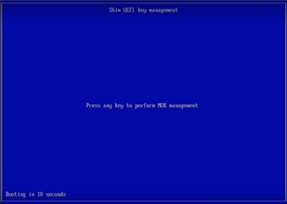 <br>
*Figure 13: Prompt to perform MOK management* <br>
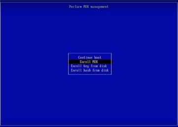 <br>
*Figure 14: Prompt to enroll MOK* <br>
 <br>
*Figure 15: Click Continue* <br>
 <br>
*Figure 16: Click OK* <br>
 <br>
*Figure 17: Prompt to provide the password* <br>
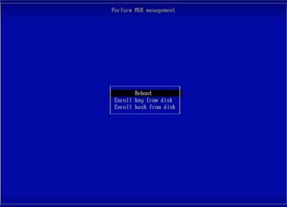 <br>
*Figure 18: Prompt to initiate a Reboot* <br>
 <br>
*Figure 19: After Reboot, check the Secure boot state* <br>

 </details>

## Step 5: Validate

This section highlights the validation steps for the Edge Node profiles.

### 5.1 Validation of Profile 1

<details>
 <summary><code>Validation</code> <code><b>VA Enablement Node K8s - Profile 1</b></code></summary>

#### Edge Node - Controller

1. RKE2 Server Status:
   ``` bash
   sudo systemctl status rke2-server.service
   ```
   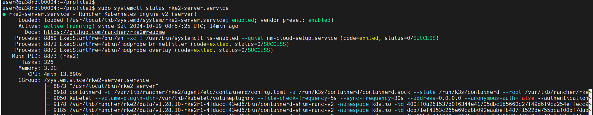 <br><br>
2. Pod Status: After enabling the RKE2 server
   ``` bash
   sudo kubectl get pods -A
   ```
   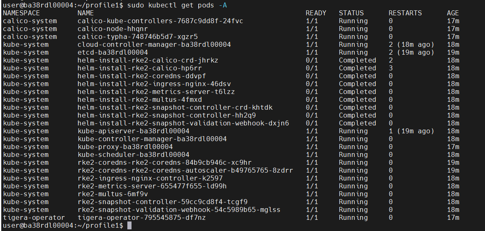 <br><br>
3. Nodes List/Status: After enabling the RKE2 server
   ``` bash
   sudo kubectl get nodes
   ```
   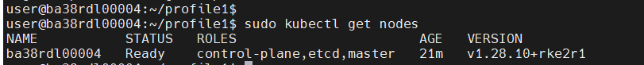 <br><br>

#### Edge Node - Worker

##### Worker Node 1:

1. RKE2 Agent Status:
   ``` bash
   sudo systemctl status rke2-agent.service
   ```
   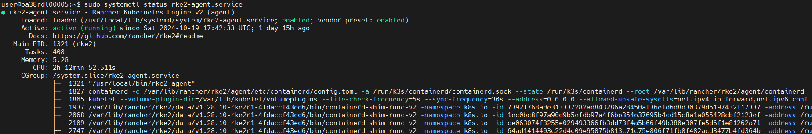 <br><br>
2. Pod Status: After enabling the RKE2 Agent (Before, Helm Chart Installation)
   ``` bash
   sudo kubectl get pods -A
   ```
   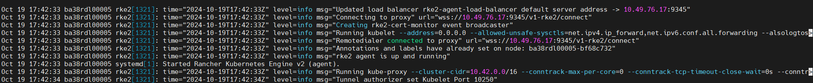 <br><br>
3. Nodes List/Status: After enabling the RKE2 server
   ``` bash
   sudo kubectl get nodes
   ```
   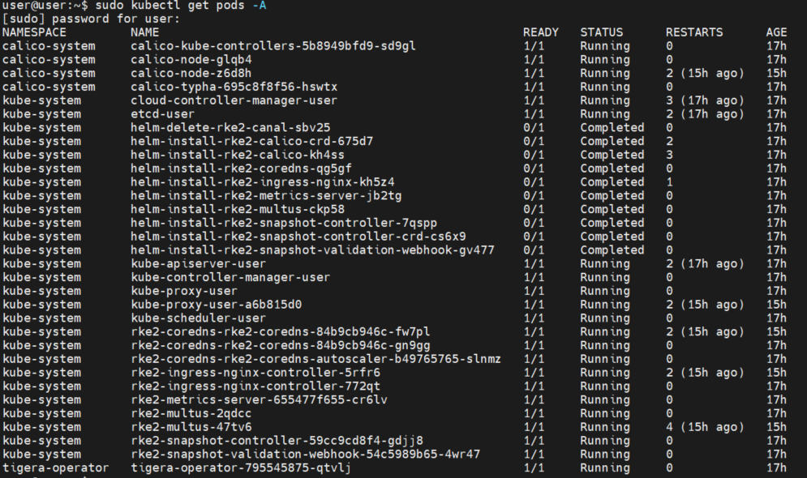 <br><br>

##### Worker Node 2:

1. RKE2 Agent Status:
   ``` bash
   sudo systemctl status rke2-agent.service
   ```
   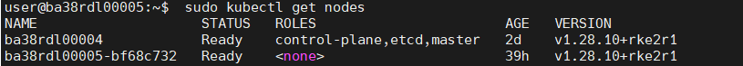 <br><br>
   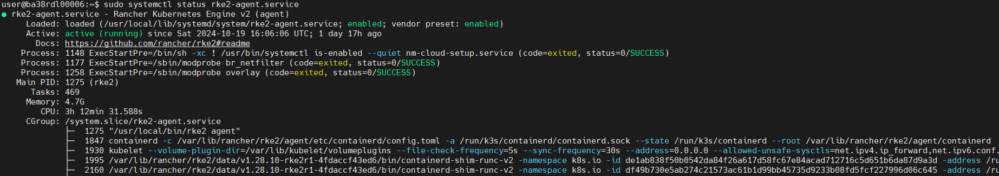 <br><br>
2. Pod Status: After enabling the RKE2 Agent (Before, Helm Chart Installation)
   ``` bash
   sudo kubectl get pods -A
   ```
   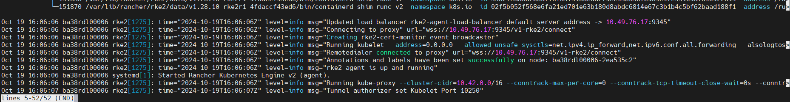 <br><br>
3. Nodes Status: After enabling the RKE2 server
   ``` bash
   sudo kubectl get nodes
   ```
   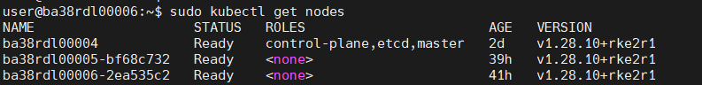 <br><br>

#### Edge Node Controller (Post worker & Controller node connection establishment):
> Executed the installer script on the multiple edge worker nodes and established a connection between edge-node controller and worker node using controller node’s IP and token and executed helm chart installation script on the Controller Node, to install helm charts  
1. Nodes List/Status:  (one controller node and five edge worker nodes)
   ``` bash
   sudo kubectl get nodes
   ```
   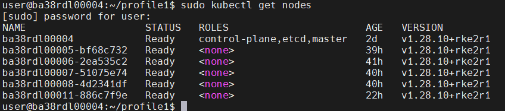 <br><br>
2.  Pod Status: After, Helm Chart Installation
   ``` bash
   sudo kubectl get pods -A -o wide
   ```
   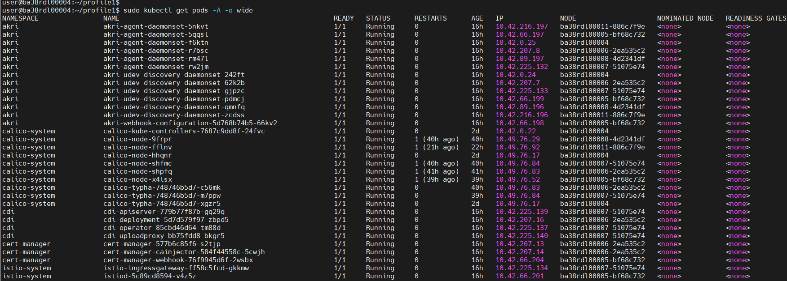 <br><br>
   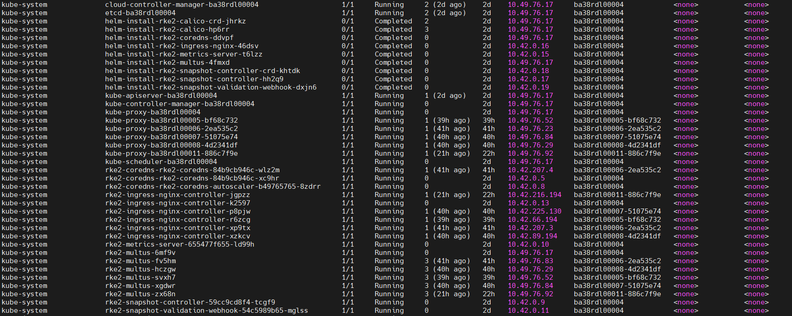 <br><br>
   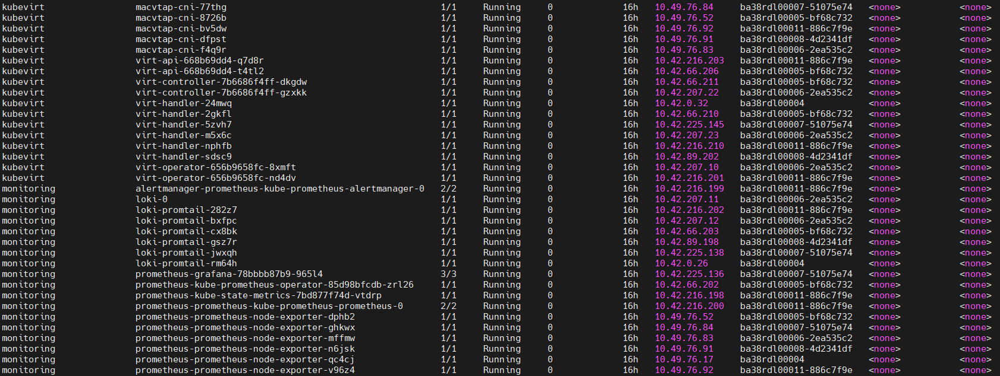 <br><br>
   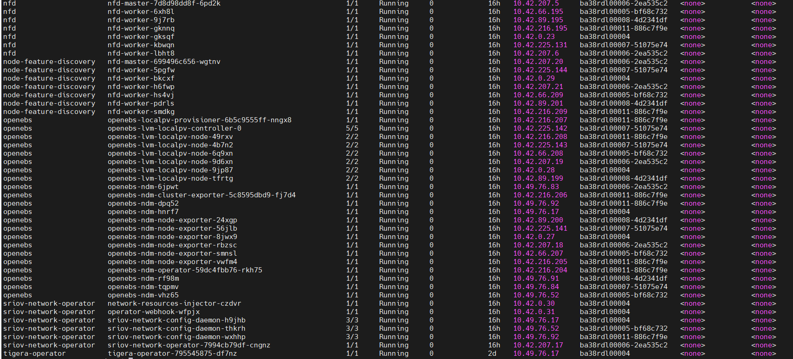 <br><br>
3. Helm List:
   ``` bash
   sudo helm list -A
   ```
   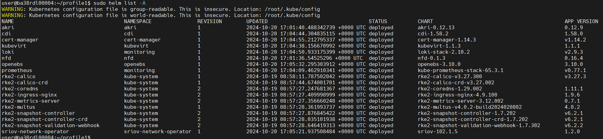 <br><br>
4. Monitoring List:
   ``` bash
   sudo kubectl get pods -A -o wide | grep monitoring
   ```
   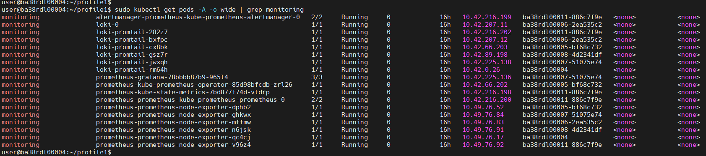 <br><br>

#### Worker Nodes

1. XPU Manager Status:
   ``` bash
   sudo systemctl status xpum.service
   ```
   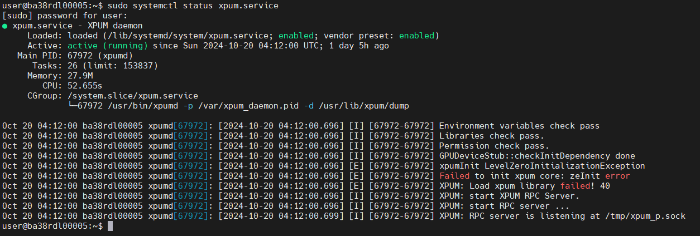 <br><br>
2. Platform-observability Status:
   ``` bash
   sudo systemctl status platform-observability-collector.service
   ```
   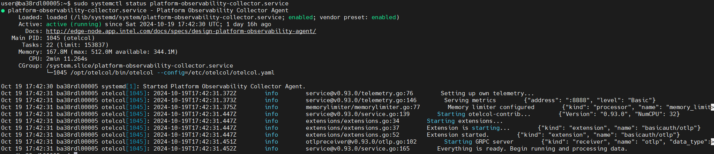 <br><br>
   ``` bash
   sudo systemctl status platform-observability-metrics.service
   ```
   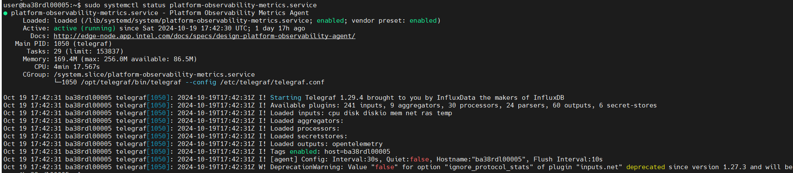 <br><br>
   ``` bash
   sudo systemctl status platform-observability-logging.service
   ```
   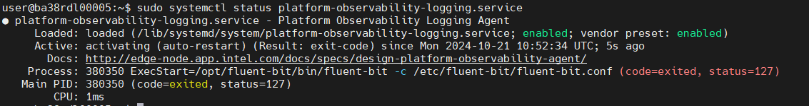 <br><br>
3. Docker and Docker Compose Version:
   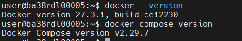 <br><br>
4. Kubectl: (Server and Client version:)
   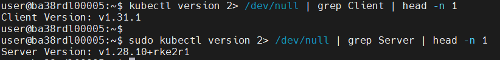 <br><br>
5. ffmpeg -version:
   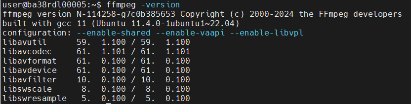 <br><br>
6. qemu and kvm version:
   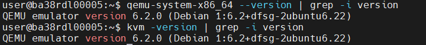 <br><br>
7. IPSEC
   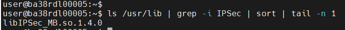 <br><br>
8. Fluent Bit:
   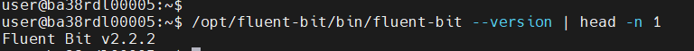 <br><br>
9.  Telegraf
   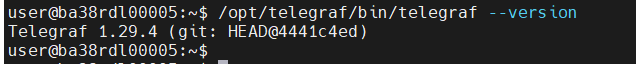 <br><br>
10. otelcol:
    <br><br>
11. openssl
    <br><br>
12. dpdk
    <br><br>
13. inbc status:
    <br><br>
14. Openvino:
    <br><br>
15. OpenCV_VERSION:
    <br><br>
 </details>

<!----------------------------------------------------------------------------------------------------------------------------------------------->

### 5.2 Validation of Profile 2

<details>
 <summary><code>Validation</code> <code><b>VA Enablement Node - Profile 2</b></code></summary>

#### MTL Platform:

##### Ubuntu 24.04:
1. OS Version:
    <br>
2. Kernel Version:
    <br>
3. Docker:
   - Docker version:
    <br>
   - Docker Compose Version:
    <br>
4. XPU:
   - Status:
    <br>
   - CLI output of GPU device info, telemetries and firmware update:
      ``` bash
      $ xpumcli discovery -d 0
      ```
    <br>
5. KVM and Qemu Version:
    <br>
6. ffmpeg version:
    <br>
7. Grafana version:
    <br>
8. Open Vino version:
    <br>
9.  OpenCV version:
    <br>
10. GPU Execution:
    <br>
    <br>
11. Platform Observability Status:
    <br>
    <br>
    <br>

##### Ubuntu 22.04:
1. OS Version:
    <br>
2. Kernel Version:
    <br>
3. Docker: 
   - docker images:
    <br>
   - docker compose version:
    <br>
   - docker version
    <br>
4. XPU:
   - Status:
    <br>
   - CLI output of GPU device info, telemetries and firmware update:
      ``` bash
      $ xpumcli discovery -d 0
      ```
    <br>
 </details>

<!----------------------------------------------------------------------------------------------------------------------------------------------->

### 5.3 Validation of Profile 3

<details>
 <summary><code>Validation</code> <code><b>Real Time (RT) Enablement Node - Profile 3</b></code></summary>

1. OS Configuration:<br>
   <br><br>
2. Kernel:<br>
   <br><br>
3. Component Installation Status:<br>
   <br><br>
4. Docker Status:<br>
   <br><br>
5. Prometheus Status:<br>
   <br><br>
6. Grafana Status:<br>
   <br><br>
7. Node-Exporter Status:<br>
   <br><br>
8. Prometheus Target Devices:<br>
   <br><br>
 </details>

<!----------------------------------------------------------------------------------------------------------------------------------------------->

## Step 6: Enabling of Time of Day (TOD)

Once the Installer script execution has completed, user can follow below steps to deploy Time of Day(TOD).

<details>
 <summary><code><b>Time of Day (TOD) Provisioning</b></code></summary>

The TOD allows power management provisioning to save power at a specific time of day and delivers power savings during non-peak hours on the Edge device using the Intel® Infrastructure Power Manager (IPM) . 
The user needs to download the [Time of Day Provisioning software package](https://www.intel.com/content/www/us/en/secure/content-details/828016/time-of-day-provisioning-with-intel-tiber-edge-platform.html?DocID=828016)  and the technology guide which is available through the same link as shown in the Figure. To deploy this feature, the user needs to follow the instructions mentioned in Chapter 9 of the TOD technology guide.


*<center>Figure 20: Time of Day Home Page</center>* <br>

 </details>

## Step 7: Uninstall the installed Profile

- Navigate to the directory where ESH installer is extracted
- Execute execute ./edgesoftware with uninstall option
  ```bash
  $ ./edgesoftware uninstall
  ```

*<center>Figure 21: Uninstall Execution</center>* <br>


*<center>Figure 22: Uninstall Execution logs</center>* <br>