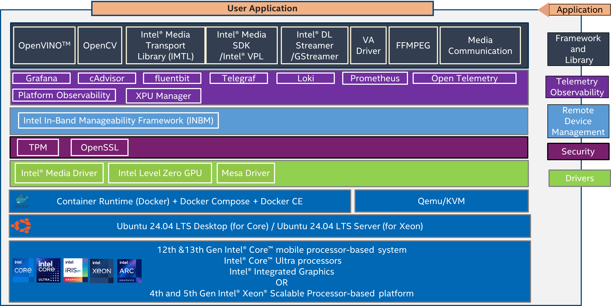
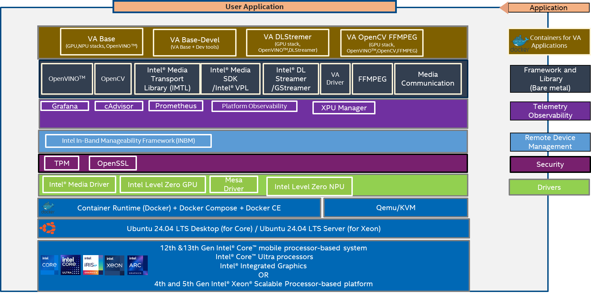
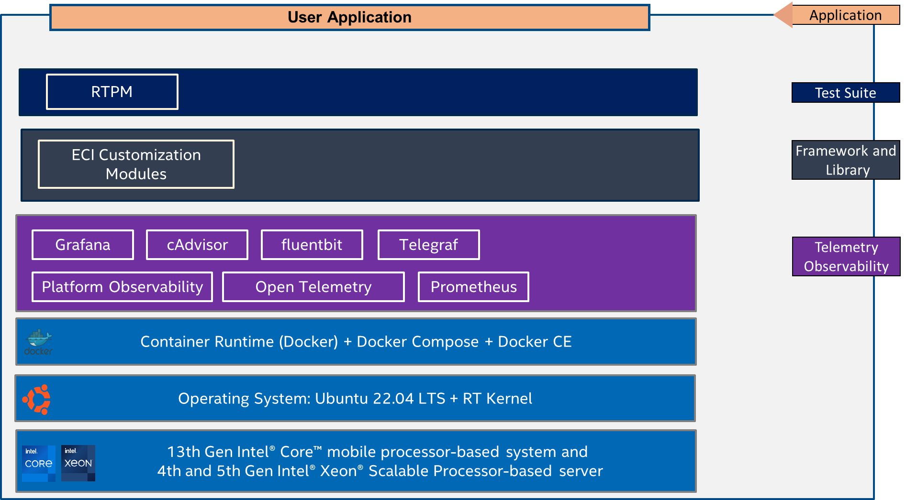

# Intel® Edge Device Enablement Framework (EEF)
Provides a set of curated, validated infrastructure Profiles for edge applications.

## Overview

**EEF Release - 25.12**

The Intel® Edge Device Enablement Framework (EEF) delivers a set of curated, validated infrastructure stacks (aka profiles), providing a runtime for edge applications. It is built on a modular framework where each node is based on a common foundation of hardware, OS, and container runtime.  

This document is a quick start guide to configure and deploy nodes using the Intel® Edge Device Enablement Framework on Intel® Core™ and Intel® Xeon® Scalable processors with Intel® Iris® Xe Integrated Graphics for Core platform.

## How It Works

This release of the Edge Device Enablement Framework currently supports three curated profiles tailoring mainly the needs of Video Analytics (VA) and industrial controller workloads.

|Profile Name             |Description      |
|-------------------------|-----------------|
|**Profile 1**: Video Analytics (VA) Enablement Node K8s Profile | - This profile has Video Analytics and Observability components along with the RKE2 K8s Cluster in a multi node   - Typical use case for this profile is Media and Video Analytics |
|**Profile 2**: Video Analytics (VA) Enablement Node Profile  | - This profile has Video Analytics and Observability components installed on Bare metal for Intel® Core and Intel® Xeon® systems.   - Typical use case for this profile is [Intel Edge AI Box](https://www.intel.com/content/www/us/en/developer/articles/reference-implementation/intel-edge-ai-box.html) |
|**Profile 3**: Real Time (RT) Enablement Node Profile  | - This profile has RT kernel related components such as Real-Time Performance Measurements and Intel® Edge Controls for Industrial (ECI) customization with Ubuntu RT   - Typical use case for this profile is to provide real-time analytics for Industrial Controller and for Real-Time Performance Measurement (RTPM) |

## Main Supported Features

|**Category**                   |**Feature**               |
|-------------------------------|--------------------------|
|**Hardware**                   | - Support for 4th & 5th Gen Intel® Xeon® Scalable processor   - Support for Intel® Core™ Ultra processor and 12th & 13th Gen Intel® Core™ industrial processors   - Support for Intel® Iris® Xe Integrated Graphics for Core platform - Intel® Atom® Processor |
|**OS**                         | - Ubuntu 24.04   - Ubuntu 22.04 + Real Time (RT) kernel |
|**CAAS**                       | - Model: Bare Metal; containerized/virtualized   - K8s Distro; RKE v2 w K8s 1.28+   - ContainerD; Docker CE; Docker Compose   - Kubevirt|
|**Observability/Telemetry**    | - Aggregate/query telemetry (e.g. Prometheus)   - GPU, CPU/Memory Telemetry   - Visualization / Logs analysis |
|**Security**                   | - Secure Boot (documentation) (Enabled for SPR, RPL. Not supported on MTL internal SKUs)   - A hardware RoT-based foundation (TPM chip SW)   - Secure network & comm.  IPSEC, OpenSSL |
|**Framework**                  | -	OVPL; OpenVINO LTS; DLStreamer; GStreamer; Graph Compute Runtime; OpenCV with Ffmpeg; IMTL   - ECI meta-packages |

## Key Hardware Elements Supported  

|**Hardware Element**                                   | **Description**   |
|-------------------------------------------------------|---------------------------------------------------------------------------------------------------|
|**Processor**                                          | - 4th & 5th Gen Intel® Xeon® Scalable processors   - Intel® Core™ Ultra processors   - 12th & 13th Gen Intel® Core™ mobile processor-based server                                                                                                                                                  |
|**Supported – Reference Platforms & Commercial HW**   | - 4th & 5th Gen Intel® Xeon® Scalable processors on [Dell PowerEdge R760](https://www.dell.com/en-us/shop/servers-storage-and-networking/poweredge-r760-rack-server/spd/poweredge-r760/pe_r760_tm_vi_vp_sb)   - Intel® Core™ Ultra processors on Intel reference platform   - 12th Gen Intel® Core™ desktop processors on [ASUS PE3000G]()   13th Gen Intel® Core™ desktop processors on ASRock [iEP-7020E Series](https://www.asrockind.com/en-gb/iEP-7020E)   - Intel® Atom® Processor [iEP-5020G Series](https://www.asrockind.com/en-gb/iEP-5020G%20Series)                                         |
|**Network**                                            | - Intel Integrated i229   - Intel integrated i226   - Intel® X710 Ethernet Network Adapter   -Intel® E810 Ethernet Network Adapter |
|**GPU**                                                | - Intel® Iris® Xe Graphics (integrated with 13th Gen Intel® Core™ mobile processor)               |

## Key Software Capabilities Updates

| **Capability**                  | **Software Packages**        |
|---------------------------------|------------------------------|
| **Latest Software Support Summary** | - Intel® Platform Observability 1.3.0   - Telegraf 1.29.4   - Open Telemetry 0.93.0   - FluentBit 2.2.2   - Prometheus 2.52.0   - Grafana 10.2.2   - cAdvisor v0.49.1   - Intel® XPU Manager 1.2.36   - Loki 3.0.0   - OpenVINO 2023.1.0   - OpenCV 4.10.0   - QEMU-KVM 6.2.0   - Intel® In-Band Manageability Framework software v.4.2.3   - FFmpeg 2024Q1   - oneVPL 24.2.5   - Intel® Media Driver 24.1.5   - Libva 2.22.0   - Mesa Driver 24.2   - Intel Level Zero for GPU 1.3.29735.27-914~22.04   - Media Transport Library 23.12   - Media Communication Mesh 24.6   - discreteTPM ubuntu-22.04   - OpenSSL 3.1.4   - Real-Time Performance Measurement (RTPM) 1.11   - ECI Customization components 1.0   - Intel® RT Kernel 5.15   - Intel® LTS Kernel 6.6-intel   - RKE2 Agent 1.28.10   - Docker Compose 2.29   - DockerCE 27.2   - ContainerD 1.7.22   - IPSEC Stack v1.4   - Istio Operator 1.18.1   - Calico v3.27.3   - Multus 4.0.2   - Network Feature Discovery 0.15.1   - Akri 0.12.13   - GPU driver i915 v0.28.0   - Kubevirt 1.1.1 |

## Intel® Edge Device Enablement Framework Profile Architecture

*
Figure 1: Architecture of the Video Analytics (VA) Enablement Node K8s Profile Intel® Edge Device Enablement Framework
*

*
Figure 2: Architecture of the Video Analytics (VA) Enablement Node Profile Intel® Edge Device Enablement Framework
*

*
Figure 3: Architecture of the Real Time (RT) Enablement Node Profile Intel® Edge Device Enablement Framework
*

## Hardware Bill of Materials (HBOM)

| Feature                  | Profile 1                                                                                                   | Profile 2                                                                                                            | Profile 3                                                                                                            |
|--------------------------|-------------------------------------------------------------------------------------------------------------|----------------------------------------------------------------------------------------------------------------------|----------------------------------------------------------------------------------------------------------------------|
| **Supported Target Platforms** | 4th & 5th Gen Intel® Xeon® Scalable Processor-based server (Dell PowerEdge R760 BIOS version)               | - 4th & 5th Gen Intel® Xeon® Scalable Processor-based server (Dell PowerEdge R760 BIOS version)   - 12th & 13th Gen Intel® Core™ mobile processor-based server (ASRock on iEP-7020E Series BIOS version)   - Intel® Core™ Ultra processors | - 4th & 5th Gen Intel® Xeon® Scalable Processor-based server (Dell PowerEdge R760 BIOS version)   - 12th & 13th Gen Intel® Core™ mobile processor-based server (ASRock on iEP-7020E Series BIOS version) - Intel® Atom® Processor iEP-5020G Series|
| **GPU**                  | N/A                                                                                                         | - Intel® Iris® Xe Graphics (integrated with 13th Gen Intel® Core™ mobile processor)                                   | - Intel® Iris® Xe Graphics (integrated with 13th Gen Intel® Core™ mobile processor)                                   |
| **Storage**              | - Minimum: 128 GB   - Recommended: 512 GB                                                                    | - Minimum: 128 GB   - Recommended: 256 GB                                                                            | - Minimum: 128 GB   - Recommended: 256 GB                                                                            |
| **Memory**               | 128 GB                                                                                                      | - Core: 64 GB   - Xeon: 128 GB                                                                                       | - Core: 64 GB   - Xeon: 128 GB                                                                                       |
| **Ethernet Adapter**     | - Intel integrated i229   - Intel® X710 Ethernet Network Adapter   - Intel® E810 Ethernet Network Adapter | - Xeon:   o Intel® X710 Ethernet Network Adapter   o Intel® E810 Ethernet Network Adapter   - Core:   o Intel integrated i226 | - Xeon:   o Intel® X710 Ethernet Network Adapter   o Intel® E810 Ethernet Network Adapter   - Core:   o Intel integrated i226 |

## Software Bill of Materials (SBOM)

| Feature                          | Profile 1                                                                                                                                                    | Profile 2                                                                                                                                                           | Profile 3                                                                                                          |
|----------------------------------|-------------------------------------------------------------------------------------------------------------------------------------------------------------|---------------------------------------------------------------------------------------------------------------------------------------------------------------------|--------------------------------------------------------------------------------------------------------------------|
| **Observability & Telemetry**    | - Platform-Observability - Telegraf - Open Telemetry - Fluent Bit - Prometheus - Grafana - cAdvisor  - Loki              | - Platform-Observability - Prometheus - Grafana - cAdvisor - Intel® XPU Manager            | - Platform-Observability - Telegraf - Open Telemetry - Fluent Bit - Prometheus - Grafana - cAdvisor - Loki |
| **Frameworks/ Test Suite**       | - OpenVINO™ Toolkit - OpenCV  - IPSEC Stack                                                                                                                            | - OpenVINO™ Toolkit - DLStreamer - OpenCV                                                                                                                      | Real-Time Performance Measurement (RTPM)                                                                            |
| **Remote Device Management**     | Intel In-Band Manageability Framework                                                                                                                      | Intel In-Band Manageability Framework                                                                                                                               | N/A                                                                                                                |
| **Kubernetes Security Service Mesh** | - Istio operator                                                                                                                                           |                                                                                                                                                                     |                                                                                                                    |
| **Power Management**             | - Intel Power Management                                                                                                                                     |                                                                                                                                                                     |                                                                                                                    |
| **Libraries**                    | - GPU A780 - GPU Flex 140 - Flex 170                                                                                           | - FFmpeg - Intel® OneVPL - Intel® Media Driver - Libva - Lib Mesa Driver - Intel® Level Zero for GPU - GPU A780 - Intel® Media Transport Library (iMTL) - Media Communication Mesh (MCM) | ECI-Customization                                                                                                  |
| **Networking & Connectivity**    | N/A                                                                                                                                                         | N/A                                                                                                                                                                 | N/A                                                                                                                |
| **Security**                     | - OpenSSL                                                                                                                                                   | - TPM - OpenSSL                                                                                                                                                  | N/A                                                                                                                |
| **Operators & Device Plugins**   | - Calico - Multus - Network Feature Discovery - Akri                                                                                               | N/A                                                                                                                                                                 | N/A                                                                                                                |
| **Scheduling**                   | N/A                                                                                                                                                         | N/A                                                                                                                                                                 | N/A                                                                                                                |
| **Orchestration**                | RKE2 Agent                                                                                                                                                  | N/A                                                                                                                                                                 | N/A                                                                                                                |
| **Container Runtime**            | Container-D                                                                                                                                                 | Docker Compose                                                                                                                                                      | N/A                                                                                                                |
| **Virtualization**               | -  QEMU-KVM - Kubevirt                                                                                                                                    | QEMU-KVM KVM                                                                                                                                                            | N/A                                                                                                                |
| **Kernel**                       | 6.8                                                                                                                                                         | 6.8 (Xeon Server), 6.11 (Core Desktop)                                                                                                                                                                 | 5.15-realtime                                                                                                      |
| **OS**                           | Ubuntu 24.04   - Xeon- [ubuntu-24.04.2-live-server-amd64.iso](https://releases.ubuntu.com/24.04/ubuntu-24.04.2-live-server-amd64.iso)  | Ubuntu 24.04   - Core- [ubuntu-24.04.2-desktop-amd64.iso](https://releases.ubuntu.com/24.04/ubuntu-24.04.2-desktop-amd64.iso)  - Xeon - [ubuntu-24.04.2-live-server-amd64.iso](https://releases.ubuntu.com/24.04/ubuntu-24.04.2-live-server-amd64.iso) |

## Enabling of Time of Day (TOD) Provisioning

The Intel® Edge Device Enablement Framework offers the possibility to enable the feature Time of Day (TOD) provisioning. It is implemented with the Intel® Infrastructure Power Manager (IPM) technology. This software allows power management provisioning to save power at a specific time of day when Edge Node’s may be unused or underutilized.  This feature delivers power savings during non-peak hours for Edge services. You can install the feature on bare metal once you have completed the deployment of the Edge Node. To install the feature please follow the steps in [Section 6](Get-Started-Guide.md#step-6-enabling-of-time-of-day-tod)
