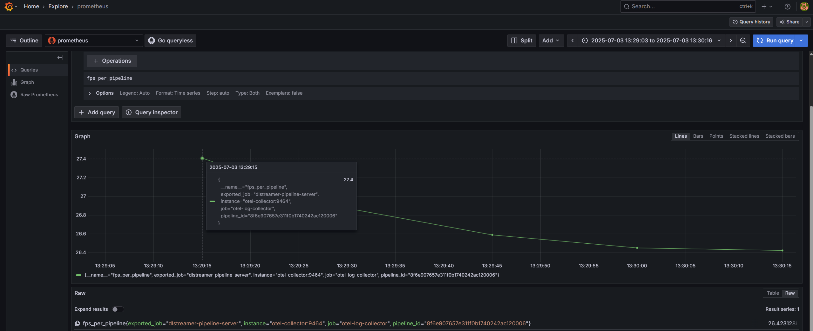
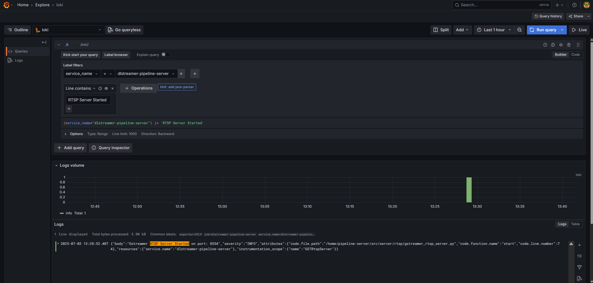

# Enable Open Telemetry

## What telemetry data is collected
DL Streamer Pipeline Server supports gathering metrics and logs over Open Telemetry. The supported metrics currently are:
- `cpu_usage_percentage`: Tracks CPU usage percentage of DL Streamer Pipeline Server python process
- `memory_usage_bytes`: Tracks memory usage in bytes of DL Streamer Pipeline Server python process
- `fps_per_pipeline`: Tracks FPS for each active pipeline instance in DL Streamer Pipeline Server

---

## Setup using docker compose
A ready-to-use docker compose file is provided to demonstrate Open Telemetry with DL Streamer Pipeline Server.
You can find it at: `[WORKDIR]/edge-ai-libraries/microservices/dlstreamer-pipeline-server/docker/docker-compose-otel.yml`

This deploys the following stack:
- Open Telemetry Collector: Receives metrics and logs from DL Streamer Pipeline Server
- Prometheus: Scrapes metrics from Open Telemetry Collector
- Loki: Receives logs from Open Telemetry Collector
- Grafana: Visualizes both metrics (via Prometheus) and logs (via Loki)

---

## Configuration files
| Purpose       | Path                                                                                                                                      |
| ------------- | ----------------------------------------------------------------------------------------------------------------------------------------- |
| OpenTelemetry | `[WORKDIR]/edge-ai-libraries/microservices/dlstreamer-pipeline-server/configs/open_telemetry/otel-collector-config.yaml`                  |
| Prometheus    | `[WORKDIR]/edge-ai-libraries/microservices/dlstreamer-pipeline-server/configs/open_telemetry/prometheus.yml`                              |

---

## Environment settings
All key configurations are in the .env file under `[WORKDIR]/edge-ai-libraries/microservices/dlstreamer-pipeline-server/docker/.env`
```sh
ENABLE_OPEN_TELEMETRY=true # true to enable open telemetry and false otherwise
OTEL_COLLECTOR_HOST=otel-collector # open telemetry container name in `[WORKDIR]/edge-ai-libraries/microservices/dlstreamer-pipeline-server/docker/docker-compose-otel.yml`. Can also be the IP address of the machine if open telemetry container is running on a different machine. Ex: OTEL_COLLECTOR_HOST=10.10.10.10
OTEL_COLLECTOR_PORT=4318 # Open telemetry container will receive data on this port. If this value is changed, ensure to update `[WORKDIR]/edge-ai-libraries/microservices/dlstreamer-pipeline-server/configs/open_telemetry/otel-collector-config.yaml` appropriately.
OTEL_EXPORT_INTERVAL_MILLIS=5000 # How often to export metrics to the open telemetry collector in milli seconds.
PROMETHEUS_PORT=9999 # The port on your host where the Prometheus UI & API will be accessible (ex: open http://<HOST_IP>:9999 to see Prometheus).
GRAFANA_PORT=3000 # The port on your host where the Grafana dashboard is exposed (ex: visit http://<HOST_IP>:3000 to visualize metrics & logs).
```

---

## Running the services

- Start the entire telemetry stack
    ```sh
        docker compose -f docker-compose-otel.yml up
    ```
- Open another terminal and start a pipeline in DL Streamer Pipeline Server.
    ```sh
        curl http://localhost:8080/pipelines/user_defined_pipelines/pallet_defect_detection -X POST -H 'Content-Type: application/json' -d '{
        "source": {
            "uri": "file:///home/pipeline-server/resources/videos/warehouse.avi",
            "type": "uri"
        },
        "destination": {
            "metadata": {
                "type": "file",
                "path": "/tmp/results.jsonl",
                "format": "json-lines"
            },
            "frame": {
                "type": "rtsp",
                "path": "pallet-defect-detection"
            }
        },
        "parameters": {
            "detection-properties": {
                "model": "/home/pipeline-server/resources/models/geti/pallet_defect_detection/deployment/Detection/model/model.xml",
                "device": "CPU"
            }
        }
    }'
    ```
- This returns a pipeline_id like: 
    ```sh
    658a5260f37d11ef94fc0242ac160005
    ```

---

## Visualizing metrics in Prometheus

Visit `http://<HOST_IP>:<PROMETHEUS_PORT>`

You can run queries like:
- `cpu_usage_percentage`
- `memory_usage_bytes`
- `fps_per_pipeline{}`
    - If you are starting multiple pipelines, then it can also be queried per pipeline ID. Example: `fps_per_pipeline{pipeline_id="658a5260f37d11ef94fc0242ac160005"}`


---

## Visualizing metrics & logs in Grafana

Open Grafana by visiting `http://<HOST_IP>:<GRAFANA_PORT>` (Default login: `admin` / `admin`)

### Add data sources in Grafana

- Add Prometheus
    - Click on "Add data source" and select Prometheus.
    - Set URL to: http://<HOST_IP>:<PROMETHEUS_PORT>
    - Click Save & test.

- Add Loki
    - Click on "Add data source" and select Loki.
    - Set URL to: http://<HOST_IP>:3100
    - Click Save & test.

### View metrics from Prometheus

- Go to "Explore" and choose Prometheus as data source.
- Enter queries like: `cpu_usage_percentage`, `memory_usage_bytes`, `fps_per_pipeline`
- 

### View logs from Loki

- Go to "Explore" and choose Loki as data source.
- Enter query with appropriate filters and view real time logs.
- 