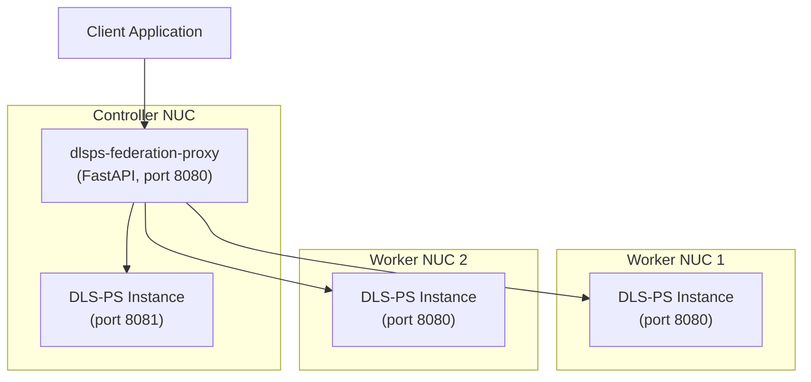
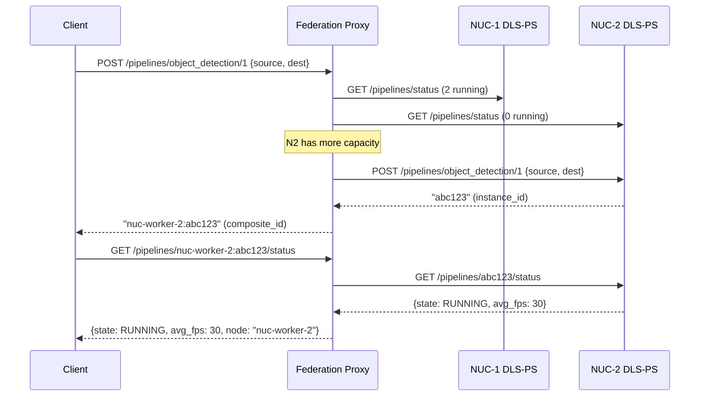

# Multi-System DLS-PS Federation — "Box-of-NUCs" Architecture

## Overview

A lightweight **federation proxy** that sits in front of N DLS-PS instances across physical NUCs, exposes the **identical** DLS-PS REST API, and routes/aggregates behind the scenes. No changes to existing DLS-PS code required.



## Key Design Decisions

| Decision | Choice | Rationale |
|----------|--------|-----------|
| Architecture | Reverse proxy (no DLS-PS modifications) | Demo-quality, zero risk to existing codebase, can be developed independently |
| API compatibility | 100% same OpenAPI spec | Clients don't know they're talking to a federation |
| Scheduling | Capacity-aware least-loaded | Each node reports `running_pipelines` via `GET /pipelines/status`; route to node with fewest running |
| Instance routing | Composite instance ID: `{node_id}:{instance_id}` | Transparently routes status/stop to correct node |
| Health management | Periodic polling + optional SSH/systemd restart | Detects down nodes, optionally restarts services |

## Component: `dlsps-federation-proxy`

A single Python service (~500-700 LOC) using **FastAPI** + **httpx** (async HTTP client).

### 1. Node Registry (`nodes.yaml` config)

```yaml
nodes:
  - id: nuc-controller
    url: http://localhost:8081          # Local DLS-PS on controller NUC
    max_pipelines: 50                   # Known capacity hint
    ssh: null                           # Local, managed directly
    
  - id: nuc-worker-1
    url: http://192.168.1.101:8080
    max_pipelines: 50
    ssh: user@192.168.1.101             # For remote restart capability
    
  - id: nuc-worker-2
    url: http://192.168.1.102:8080
    max_pipelines: 50
    ssh: user@192.168.1.102
```

### 2. API Routing Strategy

| DLS-PS Endpoint | Federation Behavior |
|-----------------|---------------------|
| `GET /pipelines` | Return union of all nodes' pipeline templates (deduplicated) |
| `POST /pipelines/{name}/{version}` | **Schedule** to least-loaded node, return composite `{node_id}:{instance_id}` |
| `GET /pipelines/status` | **Aggregate** status from all nodes (parallel fan-out) |
| `GET /pipelines/{instance_id}/status` | **Route** to owning node (parse `node_id` from composite ID) |
| `GET /pipelines/{instance_id}` | **Route** to owning node |
| `DELETE /pipelines/{instance_id}` | **Route** to owning node |

### 3. Capacity-Aware Scheduler (core logic)

```python
class FederationScheduler:
    """Least-loaded scheduling with capacity awareness."""

    def __init__(self, nodes: list[NodeConfig]):
        self.nodes = {n.id: n for n in nodes}
        self.instance_map: dict[str, str] = {}  # composite_id -> node_id

    async def select_node(self) -> NodeConfig:
        """Pick the node with the most remaining capacity."""
        node_loads = await asyncio.gather(
            *[self._get_node_load(n) for n in self.nodes.values()]
        )
        # Filter healthy nodes, sort by available capacity
        healthy = [(node, load) for node, load in node_loads if load is not None]
        if not healthy:
            raise NoCapacityError("No healthy nodes available")

        # Sort by (running / max_pipelines) ratio — lowest utilization first
        healthy.sort(key=lambda nl: nl[1] / nl[0].max_pipelines)
        return healthy[0][0]

    async def _get_node_load(self, node: NodeConfig) -> int | None:
        """Query node's running pipeline count. Returns None if unhealthy."""
        try:
            resp = await httpx_client.get(
                f"{node.url}/pipelines/status", timeout=2.0
            )
            running = [s for s in resp.json() if s["state"] == "RUNNING"]
            return len(running)
        except Exception:
            return None  # Node is down

    def make_composite_id(self, node_id: str, instance_id: str) -> str:
        return f"{node_id}:{instance_id}"

    def resolve_composite_id(self, composite_id: str) -> tuple[str, str]:
        node_id, instance_id = composite_id.split(":", 1)
        return node_id, instance_id
```

### 4. Aggregation Endpoints (fan-out pattern)

```python
@app.get("/pipelines/status")
async def get_all_status():
    """Fan-out to all nodes, merge results with node attribution."""
    tasks = []
    for node in scheduler.nodes.values():
        tasks.append(fetch_node_status(node))
    
    results = await asyncio.gather(*tasks, return_exceptions=True)
    merged = []
    for node, statuses in zip(scheduler.nodes.values(), results):
        if isinstance(statuses, Exception):
            continue  # Skip unhealthy nodes
        for status in statuses:
            status["id"] = scheduler.make_composite_id(node.id, status["id"])
            status["node"] = node.id  # Extra field for debugging
            merged.append(status)
    return merged
```

### 5. Health Monitor + Remote Restart

```python
class HealthMonitor:
    """Background task that polls node health and optionally restarts."""

    async def monitor_loop(self, interval: int = 10):
        while True:
            for node in self.nodes.values():
                healthy = await self._check_health(node)
                if not healthy and node.ssh:
                    logger.warning(f"Node {node.id} unhealthy, restarting...")
                    await self._restart_node(node)
            await asyncio.sleep(interval)

    async def _check_health(self, node: NodeConfig) -> bool:
        try:
            resp = await httpx_client.get(
                f"{node.url}/pipelines", timeout=3.0
            )
            return resp.status_code == 200
        except Exception:
            return False

    async def _restart_node(self, node: NodeConfig):
        """Restart DLS-PS container on remote node via SSH."""
        cmd = f"ssh {node.ssh} 'docker compose -f /opt/dlsps/docker-compose.yml restart dlstreamer-pipeline-server'"
        proc = await asyncio.create_subprocess_shell(cmd)
        await proc.wait()
```

## Proposed File Structure

```
microservices/dlstreamer-pipeline-server/
└── federation/
    ├── Dockerfile
    ├── Makefile
    ├── README.md
    ├── requirements.txt          # fastapi, uvicorn, httpx, pyyaml
    ├── nodes.yaml                # Node registry config
    ├── src/
    │   ├── __main__.py           # Entry point
    │   ├── proxy.py              # FastAPI app + route handlers
    │   ├── scheduler.py          # Capacity-aware scheduling
    │   ├── health.py             # Health monitor + restart
    │   └── config.py             # Node config model
    ├── docker/
    │   └── docker-compose.yml    # Controller deployment with local DLS-PS
    └── tests/
        ├── test_scheduler.py
        ├── test_proxy.py
        └── test_health.py
```

## Sequence: Start Pipeline (Scheduled)



## Future Extensions (out of scope for demo)

| Feature | Approach |
|---------|----------|
| OVMS federation | Same proxy pattern — OVMS has a similar HTTP/gRPC API |
| Heterogeneous nodes | Add `capabilities` field to node config (GPU, NPU, model list); scheduler matches pipeline requirements to node capabilities |
| Pipeline migration | Stop on overloaded node, restart on underloaded node (same source URI) |
| Shared telemetry | Proxy aggregates OpenTelemetry from all nodes into single collector |
| Auto-discovery | mDNS/Avahi service announcement instead of static `nodes.yaml` |
