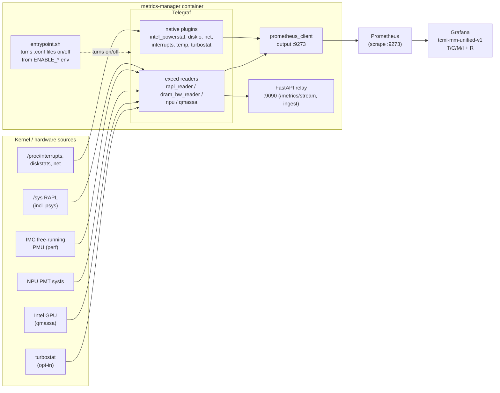
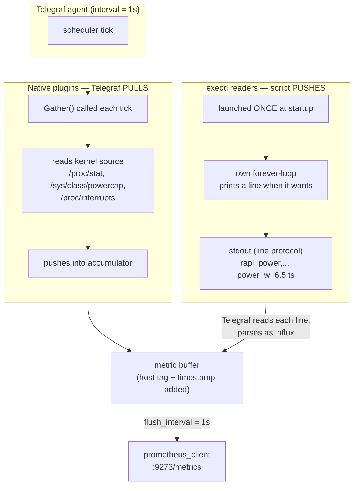

<!--
Copyright (C) 2025-2026 Intel Corporation
SPDX-License-Identifier: Apache-2.0
-->

# How the TCMI telemetry fits together inside Metrics Manager

This is the map of how a number gets from the kernel to a Grafana panel, now that TCMI's collection
lives inside the Metrics Manager service.

The whole thing is pretty boring in a good way: one container collects everything and exposes it in
Prometheus format on `:9273`, Prometheus scrapes that, Grafana reads Prometheus. The only pieces we
actually added are a few small Python readers for the metrics Telegraf's plugins can't reach on their
own, and a little switchboard (`.env` → entrypoint) for turning each collector on or off.

## The flow

## Who does what

| Layer | Piece | Notes |
|-------|-------|-------|
| Collect | Telegraf native plugins | `intel_powerstat`, `diskio`, `net`, `ethtool`, `interrupts`, `temp` — set up as `telegraf.d/*.conf` drop-ins. |
| Collect | execd readers (`scripts/*.py`) | Long-running processes that print InfluxDB line protocol. These cover what the plugins can't: psys power, DRAM bandwidth, turbostat, NPU, GPU. |
| On/off | `entrypoint.sh` + `ENABLE_*` env | At startup it renames `.conf` ↔ `.conf.disabled` (and copies `.conf.example` for the opt-in ones) so `--config-directory` only picks up what's enabled. Running it again does no harm. |
| Expose | Telegraf `prometheus_client` | Serves `/metrics` on `:9273`. |
| Expose | FastAPI relay | `:9090` — the SSE stream and custom-metric ingest. We didn't touch this. |
| Consume | Prometheus | Scrapes `:9273` via the `metrics-manager` job (`dashboards/prometheus-scrape-job.yml`). |
| Consume | Grafana | The `tcmi-mm-unified-v1` dashboard, built by `dashboards/generate_dashboard.py`. |

## How a metric actually gets collected: pull vs push

There are two ways a number gets into Telegraf, and they behave differently. Native plugins get
**pulled** on Telegraf's clock; execd readers **push** a stream on their own clock. Either way, both
land in the same buffer and come out looking identical at `:9273`.

The difference in one line each:
- **Native (pull):** Telegraf calls the plugin's `Gather()` every tick and the plugin reads a kernel
  file right then. Telegraf owns the timing.
- **execd (push):** Telegraf starts the script once, holds its stdout open, and just transcribes
  whatever lines the script decides to print. The script owns the timing (`signal = "none"`).

## Why there are custom readers at all

Telegraf has a lot of plugins. There are only two, and each exists because the native way was blocked:

- **`rapl_reader.py` (psys)** — `intel_powerstat` gives you CPU package and DRAM power, but not the
  RAPL platform (psys) domain, and psys is the whole-board number you actually want for a power budget.
- **`dram_bw_reader.py`** — the reference PTL chip reports a masked CPU model, and `intel_pmu`'s
  named-event lookup is keyed on the model, so it comes up empty. Reading the IMC free-running
  counters through `perf` doesn't care about the model, so it just works.

The R-dimension signals (IPC/SMI/per-core) *used* to be a third reader, but the native
`[[inputs.turbostat]]` plugin (Telegraf 1.36+, and we build 1.38.4) covers them, so we dropped the
script and turned the plugin on instead — opt-in, since turbostat is kernel-coupled.

Both readers follow the same rule: if the tool or counter or permission isn't there, the reader parks
itself instead of hot-looping under execd. That way a missing dependency is a quiet "no data," not a
crash loop.

For the reasoning behind these calls, see
[ADR 0001](adr/0001-tcmi-telemetry-collection.md).
