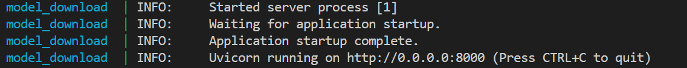

# How to Build from Source

This guide provides step-by-step instructions for building the Model Download Microservice from source.

## Prerequisites

Before you begin, ensure that you have the following prerequisites:
- Docker installed on your system: [Installation Guide](https://docs.docker.com/get-docker/).

## Steps to Build from Source
1. Clone the repository and navigate to the `model-download` directory:
```bash
cd microservices/model-download
```
2. Configure the environment variables and launch the service
```bash
export REGISTRY=""
export TAG=""
export HF_TOKEN=<your huggingface token>
```
3. Build and deploy docker image

```bash
source scripts/run_service.sh build --plugins all --model-path <host path>
``` 
__Note__: The above will build the service and install the dependencies for all the available plugins. For more details of the options available refer [here](./get-started.md#options-available-with-the-script)

- Once the service build, it is up and running


4.  **Access the Application**:
    - Open a browser and go to `http://<host-ip>:8200/api/v1/docs` to access the OpenApi documentation for the application.

## Verification

- Ensure that the application is running by checking the Docker container status:
  ```bash
  docker ps
  ```
- Access the application dashboard and verify that it is functioning as expected.

## Troubleshooting

- If you encounter any issues during the build or run process, check the Docker logs for errors:
  ```bash
  docker logs <container-id>
  ```