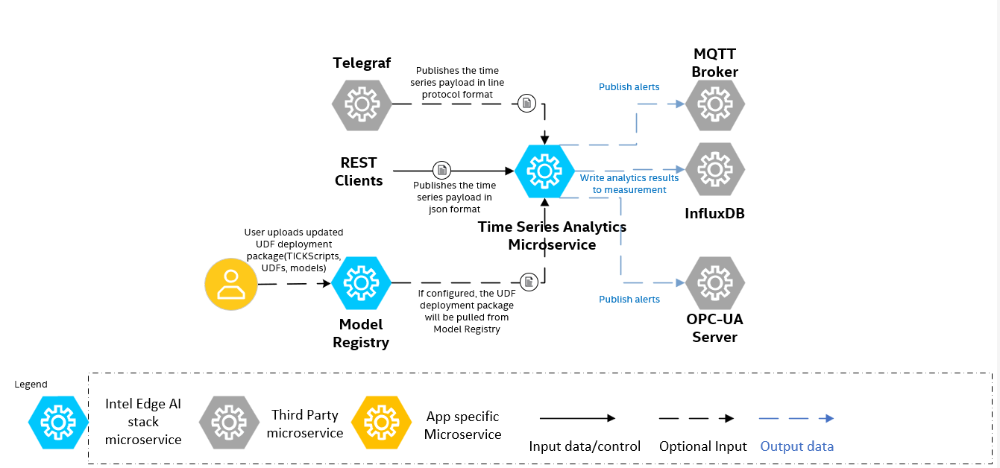

# High-Level Architecture

As seen in the following architecture diagram, the `Time Series Analytics` microservice can take input data from various sources.
The input data that this microservice takes can be broadly divided into two:
-  **Input payload and configuration management via REST APIs**
   a. REST clients sending the data in JSON format
   b. Telegraf services sending the data in line protocol format
-  **UDF deployment package** (comprises of UDF, TICKScripts, models)
   a. Through Volume mounts OR docker cp OR kubectl cp command
   b. Pulling the UDF deployment package from the Model Registry microservice

As a default flow, we have sample temperature simulator to ingest data in JSON format and have pre-packaged simple process based User Defined Function (UDF) in `Time Series Analytics` microservice to flag the temperature
points if they don't fall under a range as anomalies. The output is seen in the logs of the microservice now.

For understanding the other ways of ingesting data, UDF deployment package configuration, publishing alerts and writing data back to InfluxDB via TICKScripts, please refer the following docs of Wind Turbine Sample app:
- [Overview.md](https://github.com/open-edge-platform/edge-ai-suites/tree/main/manufacturing-ai-suite/wind-turbine-anomaly-detection/docs/user-guide/Overview.md)
- [Getting Started](https://github.com/open-edge-platform/edge-ai-suites/tree/main/manufacturing-ai-suite/wind-turbine-anomaly-detection/docs/user-guide/get-started.md)
- [How to configure alerts](https://github.com/open-edge-platform/edge-ai-suites/tree/main/manufacturing-ai-suite/wind-turbine-anomaly-detection/docs/user-guide/how-to-configure-alerts.md)
- [How to configure custom UDF](https://github.com/open-edge-platform/edge-ai-suites/tree/main/manufacturing-ai-suite/wind-turbine-anomaly-detection/docs/user-guide/how-to-configure-custom-udf.md)

---

## Summary

This guide demonstrated how the overview and architecture of the Wind Turbine Anomaly Detection sample app. For more details to get started, refer to [Getting Started](./get-started.md).
