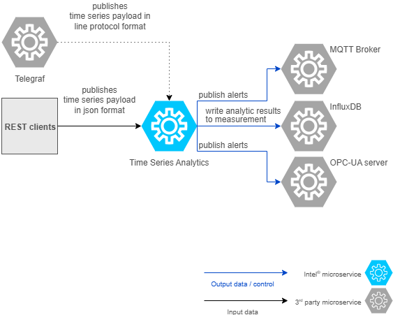

# How It Works

As seen in the following architecture diagram, the `Time Series Analytics` microservice can
take input data from various sources.
The input data that this microservice takes can be broadly divided into two:

- **Input payload and configuration management via REST APIs**
  a. REST clients sending the data in JSON format
  b. Telegraf services sending the data in line protocol format
- **UDF deployment package** (comprises a Core plugin, optional requirements, and models)
  a. Through Volume mounts OR docker cp OR kubectl cp command

The Wind Turbine sample sends OPC-UA or MQTT measurements through Telegraf into InfluxDB 3
Core. Core triggers the configured Python plugin, stores processed output in Core, and can
publish MQTT alerts or forward OPC-UA alerts through the Time Series Analytics API.

For the complete data flow, UDF package, and alert configuration, refer to the Wind Turbine
sample documentation:

- [Overview](https://docs.openedgeplatform.intel.com/dev/edge-ai-suites/ai-suite-manufacturing/industrial-edge-insights-time-series/index.html)
- [Get Started](https://docs.openedgeplatform.intel.com/dev/edge-ai-suites/ai-suite-manufacturing/industrial-edge-insights-time-series/get-started.html)
- [How to Configure Alerts](https://docs.openedgeplatform.intel.com/dev/edge-ai-suites/ai-suite-manufacturing/industrial-edge-insights-time-series/how-to-guides/configure-alerts.html)
- [Deploy with Custom UDF](https://docs.openedgeplatform.intel.com/dev/edge-ai-suites/ai-suite-manufacturing/industrial-edge-insights-time-series/how-to-guides/configure-custom-udf.html)

## Summary

This guide provides an overview of the architecture of the Time Series Analytics Microservice.
For more details, refer to [Get Started](./get-started.md).
