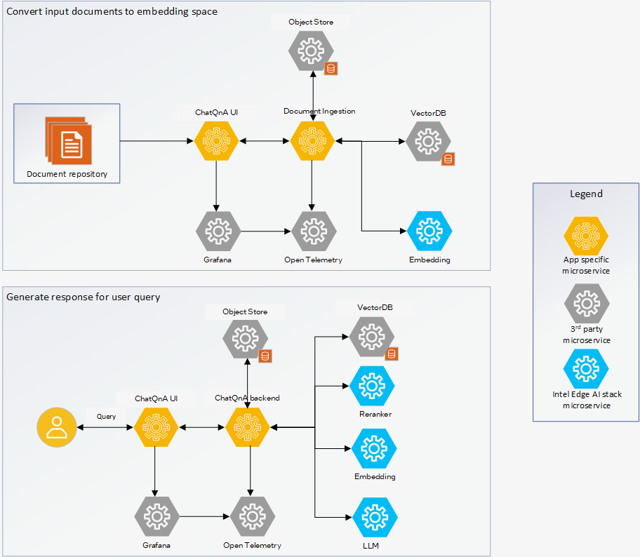
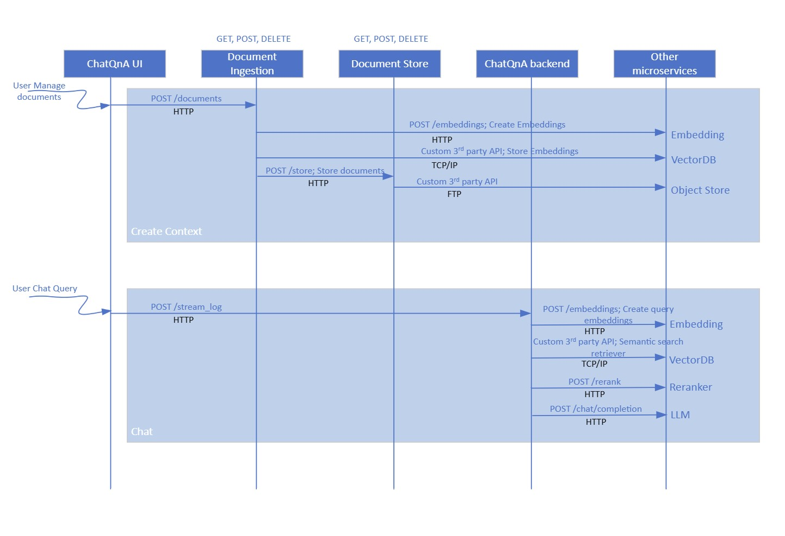

# ChatQ&A Overview

The ChatQ&A sample application is a RAG based chatbot pipeline that allows developers to customize and deploy the sample application in an on-prem environment and on their private documents without compromising on the accuracy of the responses. The application is built on a modular microservices approach using popular [LangChain framework](https://www.langchain.com/). This page provides a technical overview of the application’s architecture, components, and extensibility.

## Purpose

The ChatQ&A sample application is designed to:
- Demonstrate how Intel Edge AI catalog of inference microservices can be used to quickly build and deploy on Intel Edge AI systems portfolio.
- Serve as a blueprint for building similar scalable and modular solutions that can be deployed on Intel Edge AI systems.
- Showcase how popular frameworks like LangChain can be used to quickly implement a sample application and deploy the same on Intel Edge AI systems.
- Showcase the competitiveness of Intel Edge AI systems to address varied deployment scenario requirements (edge to cloud).
- Provide reference sample microservices for capabilities like document ingestion and UI front end that reduces the effort to customize the application.

## Detailed Architecture Overview
<!--
**User Stories Addressed**:
- **US-7: Understanding the Architecture**
  - **As a developer**, I want to understand the architecture and components of the application, so that I can identify customization or integration points.

**Acceptance Criteria**:
1. An architectural diagram with labeled components.
2. Descriptions of each component and their roles.
3. How components interact and support extensibility.
-->

ChatQ&A application is a combination of the core LangChain application logic that implements the ChatQ&A pipeline and the set of microservices that implements the salient blocks of a RAG based ChatQ&A application. The figure below illustrates the setup. The ChatQ&A UI communicates with the ChatQ&A backend application. The LLM, Reranker, and Embedding microservices are provided as part of Intel Edge AI inference microservices catalog supporting a rich set of open-source models that can be downloaded from popular model hubs like [Hugging Face OpenVINO](https://huggingface.co/OpenVINO). The document ingestion microservice provides capability to ingest popular document types, convert it into embedding space, and store it in the VectorDB. A copy of the document can also be saved to the object store.

### Technical Architecture Diagram

**Figure 1**: Detailed Architecture of ChatQ&A sample application

### Application Flow

1. **Input Sources**:
   - **Documents**: The document ingestion microservice supports ingesting documents in various formats. Supported formats are word and pdf.   
   - **Web pages**: Contents of accessible web pages can also be parsed and used as input for the RAG pipeline.
2. **Create the context**
   - **Upload input documents and web links**: The UI microservice allows the developer to interact with the ChatQ&A backend. It provides the interface to upload the documents and weblinks on which the RAG pipeline will be executed. The documents are uploaded and stored in object store. MinIO is the database used for object store.
   - **Convert to embeddings space**: The ChatQ&A backend microservice creates the embeddings out of the uploaded documents and web pages using the document ingestion microservice. The Embeddings microservice is used to create the embeddings. The embeddings are stored in a vector database. PGVector is used in the sample application.
3. **Chat flow**
   - **Ask a query**: The UI microservice provides prompt window in which the query is asked.
   - **Execute the RAG AI pipeline**: The ChatQ&A backend microservice performs the following actions to generate the output response using the RAG pipeline.
      -   The query is converted into embedding space using the Embeddings microservice.
      - Semantic retrieval is done to fetch the relevant documents or data points from VectorDB. The reranker microservice ranks them in order of accuracy.
      - The retrieved documents and data points is used as part of the prompt to the LLM model and a response is generated using the LLM microservice which hosts the configured LLM model.
4. **Output Generation**:
   - **Response**: The generated response from the LLM microservice is sent to the UI for display and consumption by the user.
   - **Observability dashboard**: If set up, the dashboard displays real-time logs, metrics, and traces providing a view of the performance, accuracy, and resource consumption by the application..

The application flow is illustrated in the flow diagram below. The diagram shows the API used and the data sharing protocol.

**Figure 2:** Dataflow for ChatQ&A sample application

## Key Components and Their Roles
<!--
**Guidelines**:
- Provide a short description for each major component.
- Explain how it contributes to the application and its benefits.
-->

1. **Intel Edge AI Inference microservices**:
   - **What it is**: Inference microservices are the LLM, Embeddings, and Reranker microservices that run the chosen models optimally on the hardware.
   - **How it's used**: Each of the microservices uses OpenAI APIs to support their functionality. The microservices are configured to use the required models and launched. The ChatQ&A backend accesses these microservices in the LangChain application which creates a RAG chain out of these microservices.
   - **Benefits**: The default configuration of these microservices as provided by the sample application is guaranteed to perform optimally for the chosen models and on the target deployment hardware. Standard OpenAI API ensures easy portability of different inference microservices.

2. **Document ingestion microservice**:
   - **What it is**: Document ingestion microservice provides capability to ingest contents from documents and web links, create the necessary context, and retrieve the right context based on user query.
   - **How it's used**: Document ingestion microservice provides a `documents` REST API endpoint that can be used to manage the contents. The ChatQ&A backend uses this API to access its capabilities.
   - **Benefits**: The core part of the document ingestion microservice is the vector handling capability which is optimized for target deployment hardware. Selection of the vectorDB is based on performance considerations. Rest of the document ingestion microservice can be treated as sample reference implementation.

3. **ChatQ&A backend microservice**:
   - **What it is**: ChatQ&A backend microservice is a LangChain based implementation of ChatQ&A RAG pipeline providing required handling of the user queries.
   - **How it’s used**: A `streamlog` REST API endpoint is provided which is used by the UI front end to send user queries and trigger the RAG pipeline.
   - **Benefits**: The microservice provides a reference of how LangChain framework is used to implement ChatQ&A using Intel Edge AI inference microservices.

4. **ChatQ&A UI**:
   - **What it is**: A reference front end providing an interface for users to interact with the ChatQ&A RAG pipeline.
   - **How it’s used**: The UI microservice runs on the deployed HW on a certain configured port. Accessing the specific URL allows users to use the UI.
   - **Benefits**: This microservice should be treated as a sample reference implementation.

## Extensibility

The ChatQ&A sample application is designed with modularity in mind, allowing developers to:
1. **Change inference microservices**:
   - The default option is OVMS for LLM and TEI for embeddings and reranker.
   - Use other model servers like vLLM with OpenVINO backend, and TGI to host LLM models.
   - Mandatory requirement is OpenAI API compliance. Note that other model servers are not guaranteed to provide same performance as default options.
2. **Load different LLM, Embedding, and Reranker models**:
   - Use different models from Hugging Face OpenVINO model hub or vLLM model hub. The models are passed as a parameter to corresponding model servers.
3. **Use other GenAI frameworks like Haystack and LlamaIndex**:
   - Integrate the inference microservices into an application backend developed on other frameworks similar to the LangChain integration provided in this sample application.
4. **Deploy on diverse Intel target hardware and deployment scenarios**:
   - Follow the system requirements guidelines on the different options available.

## Next Steps

- [Get Started](./get-started.md)
- [Benchmarks](./benchmarks.md)