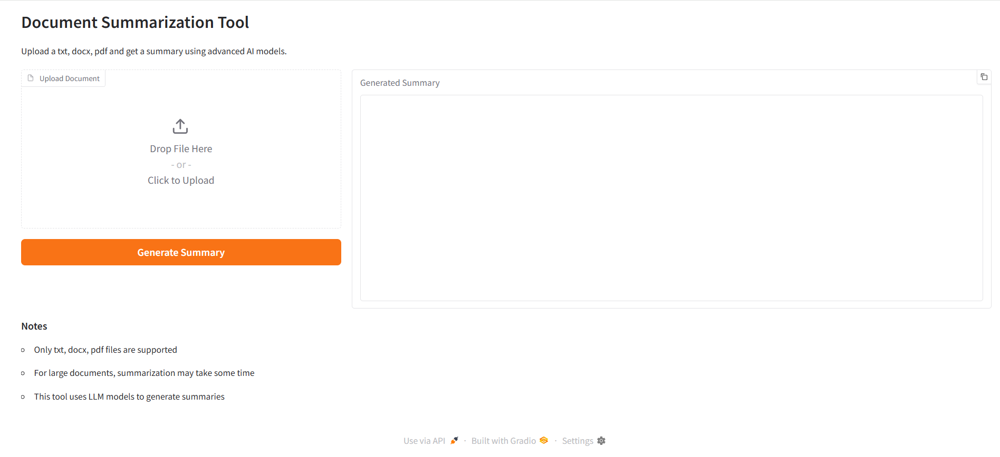

# Get Started: Document Summarization Application

## Overview

The Document Summarization Application enables you to upload documents and receive concise summaries generated by advanced AI models. The application provides a web UI and a REST API for a flexible interaction.



This section shows you how to:

- **Set up the sample application**: Use the Docker Compose tool to quickly deploy the application in your environment.
- **Run the application**: Execute the application to see real-time question and answering based on your data.

## Prerequisites

- Verify that your system meets the [minimum requirements](./system-requirements.md).
- Install Docker platform: [Installation Guide](https://docs.docker.com/get-docker/).
- Install Docker Compose tool: [Installation Guide](https://docs.docker.com/compose/install/).
- Install `Python 3.11` programming language.
- Access to required model files and API key, if applicable.

## Run the Application using Docker Compose Tool

1. **Clone the Repository**:
    - Clone the Document Summarization Sample Application repository:
      ```bash
      git clone <repository-url>
      ```

2. **Navigate to the Directory**:
    - Go to the directory where the Dockerfile is located:
      ```bash
      cd <repository-url>/sample-applications/document-summarization
      ```

3. **Set Up Environment Variables**:
    - Set up the following environment variables:

      ```bash
      # OVMS Configuration
      export VOLUME_OVMS=<model-export-path-for-OVMS>  # For example, use: export VOLUME_OVMS="$PWD"
      export LLM_MODEL=<llm-model>

      # Docker Image Registry Configuration
      export REGISTRY="/intel"
      export UI_TAG=1.0
      export BACKEND_TAG=1.0
      ```
        > **Note:**  
        > OpenTelemetry and OpenLit configurations are optional. Set these only if there is an OTLP endpoint available.

        > ```bash
        >  export OTLP_ENDPOINT=<OTLP-endpoint>
        >  export no_proxy=${no_proxy},$OTLP_ENDPOINT,
        >   ```
      
    - Run the following script to set up the rest of the environment:

        ```bash
        source ./setup.sh
        ```

4. **Build the Docker Image**:
    - Build the Docker image for the Document Summarization Sample Application:
      ```bash
      docker compose build
      ```

5. **Run the Docker Container**:
    - Run the Docker container using the built image:
      ```bash
      docker compose up
      ```
      
    - This will start:
     
        - The  OpenVINO™ model server service for model serving (gRPC: port 9300, REST: port 8300)
        
        - The FastAPI backend service (port 8090)
        
        - The Gradio UI service (port 9998)
        
        - The NGINX web server (port 8101)

6. **Access the Application**:
    - Open a browser and go to `http://<host-ip>:8101` to access the application dashboard (Gradio UI at port 9998 and Gradio UI through NGINX web server at port 8101).
    - To access FastAPI documentation, go to `http://${host_ip}:8090/docs` in the browser.

## Running in Kubernetes Environment

Refer to [Deploy with Helm Chart](./deploy-with-helm.md) for the details. Ensure the prerequisites mentioned on this page are addressed before proceeding to deploy with Helm chart.

## Running Tests

1. Ensure you have the necessary environment variables set up as mentioned in the setup section.

2. Run the tests using `pytest`:
   ```sh
   cd sample-applications/document-summarization/tests/unit_tests/
   poetry run pytest
   ```

## Advanced Setup Options

For alternative ways to set up the sample application, see:

- [How to Build from Source](./build-from-source.md)


## Supporting Resources

- [Docker Compose Documentation](https://docs.docker.com/compose/)
