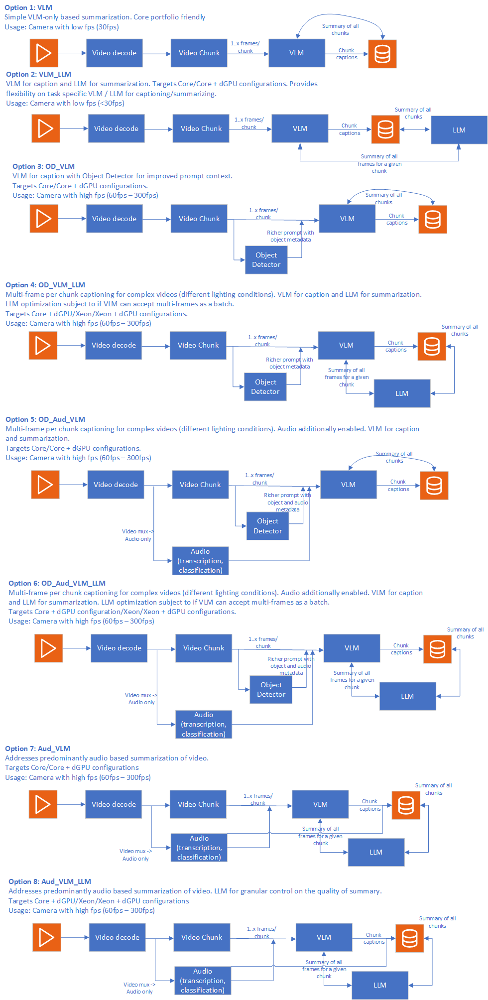

# Video Search and Summary Overview

Video Search and Summary pipeline creates both concise summaries and enables semantic search across collections of long-form videos. It uses Generative AI Vision Language Models (VLMs) and multimodal embedding models, which leverage advanced AI techniques to combine visual, audio, and textual data to understand and extract relevant content from videos. This unified approach enables efficient content review, improved searchability, and intelligent video discovery within large video collections.

Video Search and Summary provides a rich pipeline with a host of capabilities aiding qualitatively rich responses for both summarization and search. The application demonstrates how to create a comprehensive video understanding experience using a cost efficient portfolio of Intel AI systems and using Intel's Edge AI microservices catalog. It makes it easy to develop, customize, and deploy Video Search and Summary solutions in diverse deployment scenarios with out-of-the-box support for on-premise and edge environments.

## Table of Contents
1. [Overview and Architecture](#overview-and-architecture)
2. [How to Use the Application](#how-to-use-the-application)

## Purpose

This implementation of Video Search and Summary pipeline is intended to address a broad set of industry segment specific requirements on both video summarization and semantic search targeting required accuracy - performance tradeoff. The implementation provides a composable pipeline of capabilities that help with video understanding accuracy while providing insights into required compute for the chosen pipeline configuration. In essence, what the implementation provides is a means to realize different video search and summary pipelines at certain performance and accuracy tradeoffs. The figure below shows an example set of pipeline configurations corresponding to different compute requirements.

*Figure 1: Sample video search and summary pipeline configurations

Each of the pipelines shown in the figure (and more) can be realized with this sample application. The purpose of this sample application is to enable users to create both video summarization and semantic search pipelines with the best possible accuracy for given compute resources. To enable this, the sample application follows the listed approach:
- Demonstrates how Intel Edge AI catalog of inference microservices can be used to quickly build video search and summary pipelines. The inference microservices are optimized for Intel Edge AI systems. 
- Serve as a blueprint for building similar scalable and modular solutions that can be deployed on Intel Edge AI systems.
- Showcase the competitiveness of Intel Edge AI systems to address varied deployment scenario requirements (edge to cloud).
- Provide reference sample microservices for capabilities like video ingestion, embedding generation, vector search, and UI front end that reduces the effort to customize the application.

### Key Features

Leveraging GenAI VLMs, LLMs, multimodal embedding models, object detection, and a host of other configurable capabilities, the video search and summary application is a powerful tool to both quickly grasp the main points of long-form videos and discover relevant content within large video collections, enhancing productivity and user experience. The key capabilities are as follows:

- **Efficient Summarization**: Automatically generate detailed summaries of lengthy videos, highlighting key moments and essential information.
- **Semantic Video Search**: Enable intuitive natural language search across video collections using multimodal embeddings that understand both visual and audio content.
- **Unified Video Processing**: Process videos simultaneously for both summarization and search indexing, maximizing the value extracted from each video.
- **Enhanced Searchability**: Improve the ability to search within and across videos by providing both summarized content and semantic embeddings that can be indexed and queried.
- **Contextual Understanding**: Utilize VLMs to combine audio and visual elements, ensuring a richer and more accurate understanding of the video content for both summary generation and search.
- **Content Discovery**: Facilitate quick discovery of relevant videos within large collections through semantic search capabilities that understand content meaning rather than just keywords.
- **Content Review**: Facilitate quicker and more efficient content review processes by providing concise summaries that capture the essence of the video.
- **Customizable Processing**: Allow customization of capabilities and parameters to suit specific use cases and preferences, such as focusing on particular topics or themes within the video or enabling context extraction from audio. The capabilities on both search and summary pipelines are configurable to suit the target application.
- **Scalability**: Handle large volumes of video data, making it suitable for various applications, including media analysis, content management, video libraries, and personalized recommendations.

The Video Search and Summary sample application provides the above listed capabilities through following features:

- **Rich Video Search and Summary pipeline**: The application provides a host of capabilities that can be used to qualitatively influence both the summary and search functionality of the given user video. The capabilities help with richer contextual and perceptual understanding of the video content. Example: Using an object detector to enrich the quality of prompt given as input to VLM captioning, and using multimodal embeddings to enable semantic search. Further details of configurability is provided in the [architecture overview](./overview-architecture-summary.md) document.
- **Multimodal Embedding Generation**: Create vector representations of video content that enable semantic search across video collections, allowing users to find relevant content using natural language queries.
- **Vector Database Integration**: Store and index embeddings in optimized vector databases for fast and accurate semantic search across large video collections.
- **Optimized pipeline on Intel Edge AI Systems hardware**: The application is optimized to run efficiently on Intel® Edge AI systems, ensuring high performance and reliability.
- **Customizable pipeline with optimized microservices**: The application allows for customization of various components of the pipeline, such as video ingestion, model selection, selection of capabilities enabled on the pipeline, and deployment options to suit specific use cases and deployment scenarios. Intel's Edge AI inference microservices allow developers to customize and adapt specific parts of the application to suit their deployment and usage needs. For example, developers can customize the VLM model with different levels of guardrail capabilities based on segment specific needs. Intel's inference microservices provide the flexibility to tailor the application for specific deployment scenarios and usage requirements without compromising performance on the given deployment hardware.
- **Flexible deployment options**: The application provides options for deployment using Docker Compose and Helm charts, enabling developers to choose the best deployment environment for their needs.
- **Support for a wide range of open-source models**: Intel's Edge AI inference microservices provide flexibility to use the right GenAI models (VLM, LLM, Embeddings for example) as required for target usage. The application supports various [open-source models](https://huggingface.co/OpenVINO), allowing developers to select the best models for their search and summary use cases.
- **Optimized for Performance**: The default configuration of the pipeline is optimized to run efficiently on target hardware, providing high performance and low cost of ownership.
- **Self-hosting inference**: Perform inference locally or on-premises, ensuring data privacy and reducing latency.
- **Observability and monitoring**: The application provides observability and monitoring capabilities using [OpenTelemetry](https://opentelemetry.io/) & [OpenLIT](https://github.com/openlit/openlit), enabling developers to monitor the application's performance and health in real-time.
- **User-Friendly Interface**: A reference intuitive and easy-to-use interface is provided for users to interact with both the video search and summary capabilities of the application.
- **Implemented capabilities**: The following capabilities have been implemented and are available in the current version:
    - **Natural Language Querying**: The embeddings generated during video processing enable users to search or query video content using natural language queries, making the search process intuitive and user-friendly. This capability combines the video summary pipeline with video search pipeline in a unified workflow.
    - **Audio capability**: For videos where audio provides richer context, the audio pipeline creates transcription of the audio channel and uses it as additional context information for both VLM captioning and embedding generation.

## How to Use the Application Effectively
The Video Search and Summary pipeline offers features to improve accuracy for complex long-form videos while enabling efficient discovery across video collections. Choosing which features to use involves balancing accuracy and performance for both search and summary capabilities. To use the tool effectively, start by answering the following key questions:
1. What is the complexity of the videos that need to be processed for both search and summary?
2. What is the accuracy target both the summary pipeline and search functionality need to achieve as measured by key qualitative metrics like BERT score for summaries and search relevance metrics?
3. What are the available compute resources to run both pipelines? 
4. What are the key performance metrics like throughput, latency, and search response time that need to be achieved by the application?
5. What is the expected size of the video collection and search query volume?

Answering these key questions determines the tradeoff between compute and accuracy for both search and summary functionality. Based on these decisions, the pipeline is configured and customized using various settings in the sample application. Once the pipeline is optimized for accuracy on the specific hardware, the application is ready for deployment. You upload videos to be processed for both summary generation and search indexing, set required parameters like chunk duration and frame count, and submit the request. The application updates the user on progress and provides both the final summary and adds the video to the searchable collection. Users can then perform semantic searches across the processed videos and view summaries of relevant results. The API specification outlines how to access all the application's features.

Detailed hardware and software requirements are available [here](./system-requirements.md).

To get started with the application, please refer to the [Get Started](./get-started.md) page.