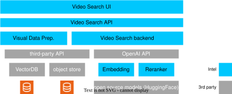
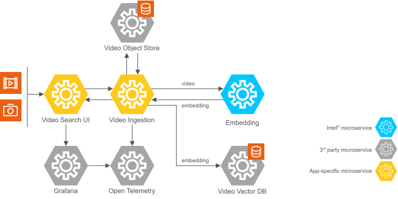
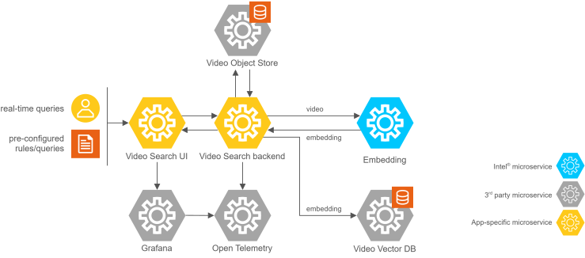
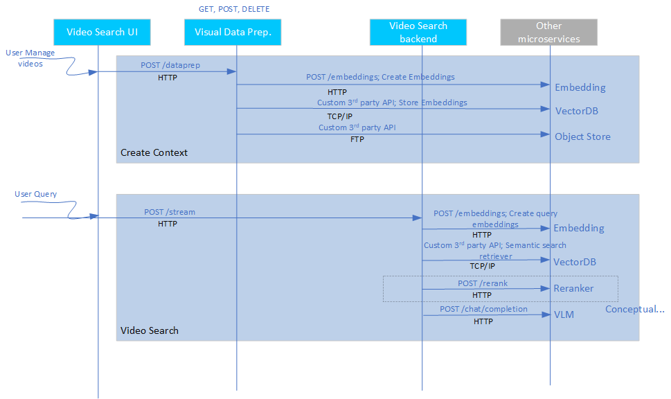

# Video Search

The application is built on a modular microservices approach using the [LangChain framework](https://www.langchain.com/).

\
\*Figure 1: Video Search mode system architecture

## Pipeline Components

The following are the Video Search pipeline's components:

- **Video Search UI**: You can use the reference UI to interact with and raise queries to the Video Search sample application. You can mark a query to run in the background for the current video corpus or all incoming videos. See [Automatic Refresh of Watched Queries](#automatic-refresh-of-watched-queries) for how often such queries are refreshed.

- **Visual Data Prep. microservice**: The sample Visual Data Prep. microservice allows ingestion of video from the object store. The ingestion process creates embeddings of the videos and stores them in the preferred vector database. The modular architecture allows you to customize the vector database; the sample application supports both [Visual Data Management System (VDMS)](https://github.com/IntelLabs/vdms) and Milvus. The raw videos are stored in the MinIO object store, which is also customizable.

- **Video Search backend microservice**: The Video Search backend microservice orchestrates a query. It delegates the vector similarity search to the Vector Retriever microservice and then aggregates the returned frame matches into ranked video segments for the response.

- **Vector Retriever microservice**: The Vector Retriever microservice owns all vector similarity search for the search path. It embeds the user query, retrieves the best-matching frames from the active vector database, and returns them to the Video Search backend. It is vector-database agnostic — the same interface serves both the VDMS and Milvus backends (one backend-flavored image per database), so the Video Search backend holds no vector-database client of its own.

- **Embedding inference microservice**: The OpenVINO™ toolkit-based microservice runs embedding models on the target Intel® hardware.

- **Reranking inference microservice**: Though an option, the reranker is currently not used in the pipeline. The OpenVINO™ model server runs the reranker models.

> [!NOTE]
> Although the reranker is shown in the figure, support for the reranker depends
> on the vector database used. The default Video Search pipeline uses the VDMS
> vector database, where there is no support for the reranker.
> See details on the system architecture below.

## Automatic Refresh of Watched Queries

Selecting the checkbox next to a query in the sidebar marks it as *watched*. A
watched query is re-run in the background so its results keep up with newly
indexed video.

Watched queries are **not** re-run once per embedding. Doing so ties refresh
load to the ingestion rate, which does not scale when video is ingested
continuously. Instead:

1. Each batch of new embeddings marks the vector index as *dirty*. This is an
   in-memory counter update, so its cost does not grow with ingestion rate.
2. A scheduler in the Pipeline Manager wakes up every
   `SEARCH_WATCH_REFRESH_INTERVAL_MS` (default 10 s). If the index is not dirty,
   the cycle does nothing at all, so an idle deployment performs no search work.
3. If the index is dirty, the scheduler waits until ingestion has been quiet for
   `SEARCH_WATCH_REFRESH_QUIET_PERIOD_MS` so a burst of embeddings produces one
   refresh rather than many.
4. Watched queries are then selected and refreshed. Four separate knobs shape
   this step, each answering a different question:

   | Question | Knob | Effect |
   | --- | --- | --- |
   | *When* may a cycle run? | `SEARCH_WATCH_REFRESH_INTERVAL_MS` + `..._QUIET_PERIOD_MS` | Bounds how often any refresh work happens at all. |
   | *How many* queries in one cycle? | `SEARCH_WATCH_REFRESH_MAX_QUERIES_PER_TICK` | Caps the cost of a single cycle, so a large watch list cannot produce an unbounded burst. |
   | *How are they packed* into requests? | `SEARCH_WATCH_REFRESH_BATCH_SIZE` | Queries per HTTP request to the Video Search backend. Changes request granularity, not how many queries run. |
   | *How fresh* can one query get? | `SEARCH_WATCH_REFRESH_MIN_QUERY_INTERVAL_MS` | Floor on the gap between two automatic refreshes of the *same* query. |

   Selection is **stalest-first**: queries are ordered by `lastRefreshedAt`
   ascending, so the query waiting longest goes first. Queries refreshed more
   recently than `SEARCH_WATCH_REFRESH_MIN_QUERY_INTERVAL_MS` are skipped for
   this cycle. Whatever exceeds `SEARCH_WATCH_REFRESH_MAX_QUERIES_PER_TICK` is
   carried over and placed at the **front** of the next cycle's order, which
   drains a large watch list round-robin and prevents starvation.

   These combine into two hard ceilings, independent of ingestion rate:

   - **System-wide:** `MAX_QUERIES_PER_TICK` refreshes per `INTERVAL_MS`
     (defaults: 50 per 10 s = 5 queries/second maximum).
   - **Per query:** at most one refresh per
     `max(INTERVAL_MS, MIN_QUERY_INTERVAL_MS)`.

   *Worked example* — 120 watched queries at default settings (10 s interval,
   50 per tick, batch size 10): cycle 1 refreshes the 50 stalest as 5 requests
   and carries 70; cycle 2 takes 50 of those carried; cycle 3 takes the last 20
   plus 30 others. A full sweep costs 30 s and a steady 5 requests per cycle,
   whether embeddings arrived once or ten thousand times in that window.

   If the dirty marker was set but every watched query was skipped by its
   minimum interval, the index deliberately stays dirty so a later cycle picks
   the work up rather than dropping it.
5. Each batch is sent to the Video Search backend as **one** request containing
   all queries in the batch. The Video Search backend and Vector Retriever both
   accept a list of queries and apply their own bounded concurrency.
6. Results are fingerprinted so the UI is notified only when a refresh actually
   changed the result set. The fingerprint is **not** a hash of the raw JSON
   response — that would change on any incidental field churn and defeat the
   purpose. It is a stable string of the form:

   ```text
   <result-count>|<clip>,<clip>,...
   ```

   where each `<clip>` identifies the *moment of a video* that matched:

   ```text
   video_id : id : interval_num : timestamp : segment_start : segment_end : relevance_score
   ```

   An empty result set fingerprints as `empty`. Timestamps and segment bounds
   are rounded to 3 decimals and the score to 4, so floating-point jitter does
   not register as a change. Fields the backend does not send are written as
   `na` (or left blank) and simply carry no information.

   Identifying a clip by `video_id` alone is not sufficient: a continuously
   ingested live stream is a *single* video, so every result would share one
   `video_id` and the fingerprint would barely move as new footage arrived. The
   timestamp and segment bounds are what make a new moment of that stream
   register as a genuine change.

   Because the clips are joined in result order, the fingerprint is also
   sensitive to **re-ranking**: if the same clips come back in a different
   order, that is a real change and the UI is updated.

   When the new fingerprint equals the stored one, the Pipeline Manager records
   only the refresh timestamp — no results are written and no socket event is
   emitted, so there is no re-render and no unread indicator.

Relative time filters (for example "last 5 minutes") are recomputed against the
current wall clock on every automatic refresh, so a watched query keeps tracking
a moving window. Absolute date ranges are left unchanged.

Manual re-runs (`POST /search/{queryId}/refetch`) are unaffected and always run
immediately.

### Configuration

| Environment variable | Purpose | Default |
| --- | --- | --- |
| `SEARCH_WATCH_REFRESH_ENABLED` | Enable/disable automatic refresh of watched queries. When disabled, the checkbox is greyed out in the UI. | `true` |
| `SEARCH_WATCH_REFRESH_INTERVAL_MS` | Scheduler tick interval. Lower values shorten the delay before new video appears in watched results; higher values reduce load. Clamped to at least `1000`. | `10000` |
| `SEARCH_WATCH_REFRESH_QUIET_PERIOD_MS` | Time ingestion must be quiet before a refresh cycle runs. | `2000` |
| `SEARCH_WATCH_REFRESH_BATCH_SIZE` | Watched queries per batched search request. | `10` |
| `SEARCH_WATCH_REFRESH_MIN_QUERY_INTERVAL_MS` | Minimum time between two automatic refreshes of the same query. | `10000` |
| `SEARCH_WATCH_REFRESH_MAX_QUERIES_PER_TICK` | Maximum watched queries refreshed per cycle. | `50` |
| `SEARCH_QUERY_TIMEOUT_MS` | Timeout for requests to the Video Search backend `/query` endpoint. | `30000` |

The effective values are also served by `GET /search/refresh-config` (through
nginx: `GET /manager/search/refresh-config`), which the UI uses to describe the
behavior accurately.

## Live Stream Storage and Retention Sizing

A registered RTSP camera ingests continuously, so — unlike a one-off upload — its
storage footprint grows for as long as the stream runs. Use the ballpark figures
below to plan disk capacity and to choose a retention window. If you remember one
thing: **the recorded video segments dominate; embeddings are a rounding error.**

### What a live stream stores

For each running camera, two things are persisted:

1. **Playback video segments** (MinIO/local storage) — short MP4 clips
   (`MM_DATAPREP_LIVE_SEGMENT_DURATION_SECONDS`, default `10`s) so a search hit on
   live footage can be played back. These are **remuxed, not re-encoded**: the
   camera's already-compressed H.264/H.265 bitstream is copied into MP4 as-is. So
   the stored size is essentially **whatever bitrate the camera transmits** — it
   does *not* depend on the embedding/extraction rate.
2. **Embeddings + metadata** (vector DB: VDMS or Milvus) — one vector per *sampled*
   frame. With `MM_DATAPREP_FRAME_INTERVAL` (default `15`) only every 15th frame is
   embedded.

> Live mode does **not** store individual JPEG frames. The retained media is the
> video segments; frames exist only transiently in memory while they are embedded.

### Worked example

Assume a camera matching the question's setup:

- Input: **1920×1080 @ 25 fps**, H.264
- Extraction: **every 15th frame** → `25 / 15 ≈ 1.67` embedded frames/second
- Embedding model: **`CLIP/clip-vit-b-32`** → 512-dimensional `float32` vectors

**Embeddings (small, fixed by sampling rate):**

- `1.67 frames/s × 3600 s ≈ 6,000` embeddings per hour.
- Each vector: `512 × 4 bytes = 2 KB`, plus ~0.5–1 KB of metadata (ids, timestamps,
  redacted stream URL, segment reference, tags) → **~3 KB per embedding**.
- `6,000 × 3 KB ≈ 18 MB per hour`. Call it **~15–20 MB/hour per camera**.

**Video segments (large, fixed by camera bitrate — the real cost):**

Because segments are a remuxed copy of the camera stream, size/hour is driven by
the encoder bitrate, not by resolution or our sampling:

`segment GB per hour ≈ bitrate_Mbps × 3600 / 8 / 1000`

| Camera bitrate (1080p25) | Video stored per hour |
| --- | --- |
| 2 Mbps (efficient H.265) | ~0.9 GB |
| 4 Mbps (typical H.264) | ~1.8 GB |
| 8 Mbps (high quality) | ~3.6 GB |

A typical 1080p25 H.264 camera runs **~4–8 Mbps**, so budget **~2–4 GB per
camera-hour**. (For reference, *uncompressed* 1080p25 would be ~150 MB **per
second** — remuxing the camera's compressed stream is what keeps this manageable.)

**Total per camera-hour ≈ video segments + embeddings ≈ 2–4 GB**, of which the
embeddings are well under 1%.

### From per-hour to a retention budget

Steady-state disk ≈ `per-hour footprint × MM_DATAPREP_LIVE_RETENTION_HOURS ×
number of cameras`. At ~2.5 GB/camera-hour:

| Retention window | Per camera | 4 cameras | 8 cameras (`MM_DATAPREP_LIVE_STREAM_MAX_CONCURRENT` default) |
| --- | --- | --- | --- |
| 1 hour | ~2.5 GB | ~10 GB | ~20 GB |
| 24 hours (VSS demo default) | ~60 GB | ~240 GB | ~480 GB |
| 7 days | ~420 GB | ~1.7 TB | ~3.4 TB |
| `0` = keep forever (service default) | unbounded | unbounded | unbounded |

> **Unbounded by default at the service level.** `multimodal-dataprep` ships with
> `MM_DATAPREP_LIVE_RETENTION_HOURS=0` (retain forever). The VSS demo compose
> overrides this to **24h** precisely so continuous cameras do not fill the disk.
> If you raise or remove it, size the volume for the table above.

### Controlling the footprint

| Knob | Effect |
| --- | --- |
| `MM_DATAPREP_LIVE_RETENTION_HOURS` | Primary lever. A sweeper (`MM_DATAPREP_LIVE_RETENTION_SWEEP_MINUTES`, default 15) deletes embeddings **and** segments older than this window. `0` keeps everything. |
| `MM_DATAPREP_LIVE_STORE_SEGMENTS=false` | Stop recording playback video entirely. Removes ~99% of the cost (leaving only ~20 MB/hour of embeddings), **but search hits on live footage then have no clip to play back**. |
| Camera bitrate / codec / resolution | The most effective way to shrink the dominant cost. Lower bitrate, H.265 over H.264, or a smaller resolution directly reduces segment size. |
| `MM_DATAPREP_FRAME_INTERVAL` | Higher = fewer embeddings. Reduces only the small embedding cost (and recall granularity); **does not change video segment size.** |
| `MM_DATAPREP_LIVE_SEGMENT_DURATION_SECONDS` | Changes the number/size of individual MP4 objects, not the total bytes stored. |

**Rule of thumb:** for a 1080p25 H.264 camera, plan for roughly **2–4 GB per
camera per hour of retention**, almost all of it video. Multiply by your retention
window and camera count; add a negligible ~20 MB/hour per camera for embeddings.

## Detailed Architecture
<!--
**User Stories Addressed**:
- **US-7: Understanding the Architecture**
  - **As a developer**, I want to understand the architecture and components of the application, so that I can identify customization or integration points.

**Acceptance Criteria**:
1. An architectural diagram with labeled components.
2. Descriptions of each component and their roles.
3. How components interact and support extensibility.
-->

The Video Search pipeline combines core LangChain application logic and a set of microservices. The following figures show the architecture.

### Video Ingestion Architecture



### Video Query Architecture



The Video Search UI communicates with the Video Search backend microservice. The Embedding microservice is provided as part of Intel's Edge AI inference microservices catalog, supporting open-source models that can be downloaded from model hubs, for example [Hugging Face Hub models that integrate with OpenVINO™ toolkit](https://huggingface.co/OpenVINO).

The Visual Data Prep. microservice ingests common video formats, converts them into embedding space, and store them in the vector database. You can also save a copy of the video to the object store.

### Application Flow

1. **Input Sources**:
   - **Videos**: The Visual Data Prep. microservice ingests common video formats.

   - **Live RTSP streams**: Registered RTSP cameras are decoded continuously and indexed alongside uploaded videos. A live stream is a long-lived resource with its own identity, so its embeddings are listed, filtered, and deleted like any other ingested video. Register and manage cameras from the **Live Streams** button in the UI toolbar, or through the Pipeline Manager `/streams` endpoints.

2. **Create Context**

   - **Upload input videos**: The UI microservice allows you to interact with the application through the defined application API, and provides an interface for you to upload videos. The application stores the videos in the MinIO database. Videos can be ingested continuously from pre-configured folder locations, for surveillance scenarios.

   - **Convert to embeddings space**: The Video Ingestion microservice creates the embeddings from the uploaded videos using the embedded microservice. The application stores the embeddings in Visual Data Management System (VDMS).

   - **Ingest live cameras**: For a registered RTSP stream, a dedicated worker in the Visual Data Prep. microservice decodes frames continuously, embeds them, and records short playback segments so that a search hit on live footage can still be played back. The worker reconnects on transport failures and, when a retention window is configured, a sweeper removes embeddings and media older than that window. Credentials supplied in an RTSP URL are used to connect but are redacted from every API response, log line, and search result.

3. **Query Flow**

   - **Input a query**: The UI microservice provides a prompt window for user queries that can be saved. You can enable up to eight queries to run in the background continuously on any new video being ingested. This is a critical capability for agentic reasoning.

   - **Execute the Video Search pipeline**: The Video Search backend microservice does the following to generate the output response:
      - Delegates the query to the Vector Retriever microservice, which converts the query into an embedding space using the Embeddings microservice.

      - The Vector Retriever does a semantic retrieval to fetch the relevant frames from the vector database (top-k, with k being configurable) and returns them to the Video Search backend, which aggregates them into ranked video segments. Does not use a reranker microservice currently.

4. **Generate the Output**:
   - **Response**: The application sends the search results, including the retrieved video from object store, to the UI.

   - **Observability dashboard**: If set up, the dashboard displays real-time logs, metrics, and traces, which shows the application's performance, accuracy, and resource consumption.

The following figure shows the application flow, including the APIs and data sharing protocols:
\
*Data flow for Video Search mode

## Key Components and Their Roles
<!--
**Guidelines**:
- Provide a short description for each major component.
- Explain how it contributes to the application and its benefits.
-->

The key components of the Video Search mode are as follows:

1. **Intel's Edge AI Inference microservices**:
   - **What it is**: Inference microservices are the embeddings and reranker microservices that run the chosen models on the hardware, optimally.
   - **How it is used**: Each microservice uses OpenAI APIs to support their functionality. The microservices are configured to use the required models and are ready. The Video Search backend accesses these microservices in the LangChain application, which creates a chain out of these microservices.
   - **Benefits**: Intel guarantees that the sample application's default microservices configuration is optimal for the chosen models and the target deployment hardware. Standard OpenAI APIs ensure easy portability of different inference microservices.

2. **Visual Data Prep. microservice**:
   - **What it is**: This microservice ingests videos, creates the necessary context, and retrieves the right context based on user query.
   - **How it is used**: Video ingestion microservice provides a REST API endpoint that can be used to manage the contents. The Video Search backend uses this API to access its capabilities.
   - **Benefits**: The core part of the video ingestion functionality is the vector handling capability that is optimized for the target deployment hardware. You can select the vector database based on performance considerations. You can treat this microservice as a reference implementation.

3. **Video Search backend microservice**:
   - **What it is**: Video Search backend microservice orchestrates Video Search's Retrieval-Augmented Generation (RAG) pipeline, which handles user queries. It delegates vector similarity search to the Vector Retriever microservice and aggregates the returned frame matches into ranked video segments.
   - **How it is used**: The UI frontend uses a REST API endpoint to send user queries and trigger the Video Search pipeline.
   - **Benefits**: This microservice provides a reference query-orchestration and aggregation layer that stays vector-database agnostic by delegating retrieval.

4. **Vector Retriever microservice**:
   - **What it is**: A standalone, vector-database-agnostic retrieval microservice that embeds the query and performs the vector similarity search against the active vector database (VDMS or Milvus).
   - **How it is used**: The Video Search backend calls its REST `/query` endpoint for every search; the retriever is part of the search stack for every backend. The backend flavor is selected at build time (one image per database), so switching databases needs no change to the Video Search backend.
   - **Benefits**: Centralizes all vector-database coupling in one reusable microservice, making it easy to add new vector databases without touching the search backend.

5. **Video Search UI**:
   - **What it is**: A reference frontend interface for you to interact with the Video Search pipeline.
   - **How it is used**: The UI microservice runs on the deployed platform on a certain configured port. You can access the specific URL to use the UI.
   - **Benefits**: You can treat this microservice as a reference implementation.

## Extensibility

The Video Search mode is modular and allows you to:

1. **Change inference microservices**:

   - The default option is OpenVINO™ model server. You can use other model servers, for example the Virtual Large Language Model (vLLM) with OpenVINO model server as backend, and the Text Generation Inference (TGI) toolkit to host Embedding and Vision-Language Models (VLMs) but Intel has not validated this method.

   - The compulsory requirement is OpenAI API compliance. Intel does not guarantee that other model servers can provide the same performance compared to the default options.

2. **Load different embedding and reranker models**:

   - Use models from Hugging Face Hub that integrate with OpenVINO toolkit, or from vLLM model hub. The models are passed as parameters to the corresponding model servers.

3. **Use other generative AI frameworks like the Haystack framework and LlamaIndex tool**:

   - Integrate the inference microservices into an application backend developed on other frameworks similar to the LangChain framework integration provided in this sample application.

4. **Deploy on diverse target Intel® hardware and deployment scenarios**:

   - Follow the system requirements guidelines on the options available.

## Next Steps

- [System requirements](../get-started/system-requirements.md)
- [Get Started](../get-started.md)
