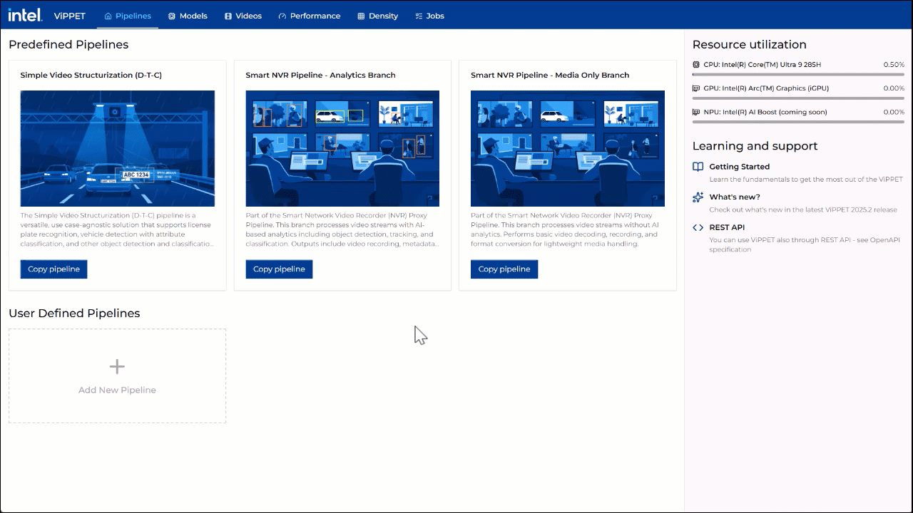

# Visual Pipeline and Platform Evaluation Tool
<!-- required for catalog, do not remove -->
Assess Intel® hardware options, benchmark performance, and analyze key metrics to optimize hardware selection for AI workloads.

<!--
**Guidelines for Authors**:
- Clearly explain the application’s purpose in one or two paragraphs.
- Describe the primary domain and high-level goal.
- Follow Microsoft Writing Guidelines: Use direct, active voice and avoid unnecessary jargon.
-->

## Overview

The Visual Pipeline and Platform Evaluation Tool simplifies hardware selection for AI workloads by enabling
configuration of workload parameters, performance benchmarking, and analysis of key metrics such as throughput,
CPU usage, and GPU usage. With its intuitive interface, the tool provides actionable insights that support
optimized hardware selection and performance tuning.

### Use Cases

<!--
**Guidelines for Authors**:
- Provide two or three real-world use cases in "Problem → Solution → Outcome" format.
- Ensure use cases are practical and highlight unique features of the application.
-->

**Evaluating Hardware for AI Workloads**: Intel® hardware options can be assessed to balance cost, performance,
and efficiency. AI workloads can be benchmarked under real-world conditions by adjusting pipeline parameters
and comparing performance metrics.

**Performance Benchmarking for AI Models**: Model performance targets and KPIs can be validated by testing AI
inference pipelines with different accelerators to measure throughput, latency, and resource utilization.

### Key Features

<!--
**Guidelines for Authors**:
- Clearly highlight value propositions.
- Use concise, benefit-driven statements.
-->

**Optimized for Intel® AI Edge Systems**: Pipelines can be run directly on target devices for seamless Intel®
hardware integration.

**Comprehensive Hardware Evaluation**: Metrics such as CPU frequency, GPU power usage, and memory utilization
are available for detailed analysis.

**Configurable AI Pipelines**: Parameters such as input channels, object detection models, and inference engines
can be adjusted to create tailored performance tests.

**Automated Video Generation**: Synthetic test videos can be generated to evaluate system performance under
controlled conditions.

### Performance Testing Capabilities

**Single Pipeline Testing**: 
Test individual AI pipelines with configurable stream counts to measure baseline performance. 
Users can specify the number of concurrent streams and optionally save output videos for quality verification. 
Real-time metrics including Total FPS and Per Stream FPS are displayed during testing.

**Multi-Pipeline Concurrent Testing**: 
Evaluate system performance under complex workloads by running multiple different pipelines simultaneously. 
Each pipeline can be configured with its own stream count, allowing simulation of real-world deployment scenarios 
where multiple AI workloads compete for system resources.

**Real-Time Metrics Dashboard**: 
Monitor CPU frequency, GPU power usage, memory utilization, and throughput metrics in real-time during all performance tests. 
This enables immediate identification of bottlenecks and resource constraints.

**Output Video Validation**: 
Optionally capture and save processed video outputs during performance testing to verify 
that AI inference quality is maintained under load conditions.

### **Workflow Overview**

**Data Ingestion**: Video streams from live cameras or recorded files are provided and pipeline parameters are
configured to match evaluation needs.

**AI Processing**: AI inference is applied using OpenVINO™ models to detect objects in the video streams.

**Performance Evaluation**: Hardware performance metrics are collected, including CPU/GPU usage and power consumption.

**Visualization & Analysis**: Real-time performance metrics are displayed on the dashboard to enable comparison of
configurations and optimization of settings.

## Example: Real-Time License Plate Recognition (ALPR)

This example mirrors a common smart city workload and can be reproduced in ViPPET to compare Intel® platforms for
license plate analytics.

**Problem**: Detect vehicles, localize license plates, and read plate text from live or recorded video in real time.

**ViPPET Pipeline Example**:

1. **Vehicle Detection**: Run an object detection model to detect vehicles in each frame.
2. **License Plate Detection**: Run a second model on vehicle regions to localize license plates.
3. **Plate Recognition (OCR)**: Run an OCR/sequence recognition model on cropped plate images to decode text.

**How to Evaluate in ViPPET**:

- Configure input stream count and resolution (for example, 1080p single-stream vs multi-stream).
- Select model variants and inference settings (FP16/INT8 where applicable).
- Measure throughput, latency, CPU/GPU utilization, and power over the same test scenario.
- Compare results across hardware targets to choose the best cost/performance configuration.

**Expected Outcome**: A repeatable benchmark that shows whether a platform can sustain required ALPR accuracy and
real-time performance under target deployment conditions.

### Performance Results (1080p, End-to-End)

Below table shows the end-to-end performance of processing 1080p videos with this sample application.

TO DO: Add real values
| Device | Number of streams | Batch Size | Total FPS |
|---|---:|---:|---:|
| Device 1 | 1 | 1 | 9.20 |
| Device 2 | 3 | 3 | 80.31 |
| Device 3 | 5 | 5 | 146.43 |
| Device 4 | 5 | 5 | 341.65 |
| Device 5 | 14 | 14 | 447.15 |

### Density View (Derived from the same data, FPS floor = 30)

This density-oriented view estimates how many streams can be sustained at a 30 FPS floor based on the measured
Total FPS values above.

TO DO: Add real values
| Device | FPS Floor | Estimated Max Streams @ Floor | Estimated Per Stream FPS |
|---|---:|---:|---:|
| Device 1 | 30 | 0 | N/A |
| Device 2 | 30 | 2 | 40.16 |
| Device 3 | 30 | 4 | 36.61 |
| Device 4 | 30 | 11 | 31.06 |
| Device 5 | 30 | 14 | 31.94 |

For ViPPET, use the built-in **Density Test** to report measured (not estimated) stream density directly per platform.

## Learn More

- [System Requirements](docs/user-guide/get-started/system-requirements.md)
- [Get Started](docs/user-guide/get-started.md)
- [How to Build Source](docs/user-guide/get-started/build-from-source.md)
- [How to Use ViPPET](docs/user-guide/use-vippet.md)
- [How to Use Video Generator](docs/user-guide/how-to-guides/use-video-generator.md)
- [Release Notes](docs/user-guide/release-notes.md)
