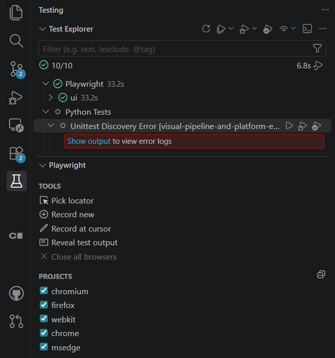
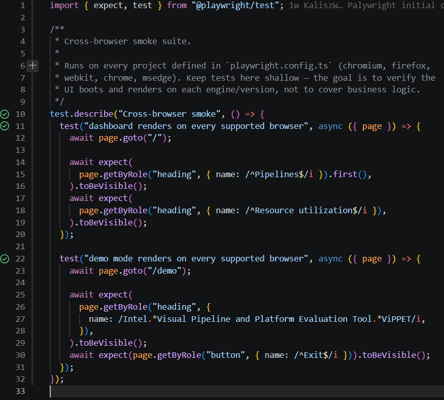

# UI end-to-end tests (Playwright)

The ViPPET UI comes with a Playwright end-to-end test suite located in
[`ui/tests/e2e/`](https://github.com/open-edge-platform/edge-ai-libraries/tree/main/tools/visual-pipeline-and-platform-evaluation-tool/ui/tests/e2e).

This page covers what a contributor needs in order to run the tests
locally, wire them up in VS Code, extend them, and debug them on a
headless remote host.

## What is on disk

```text
ui/
├── playwright.config.ts               # Projects, base URL, reporters
├── tsconfig.playwright.json           # Strict TS config for the suite
└── tests/
    └── e2e/
        ├── demo-mode.spec.ts          # Basic Demo Mode smoke (chromium only)
        └── cross-browser/
            └── smoke.spec.ts          # Runs on every project
```

Worth knowing:

- The default project is `chromium`. It is the only one **without** a
  `testMatch`, so it picks up **every** file under `tests/e2e/`.
- The other projects (`firefox`, `webkit`, `chrome`, `msedge`) have
  `testMatch: "tests/e2e/cross-browser/**"`. They run **only** the
  cross-browser suite.
- `chromium`, `firefox` and `webkit` use the browser binaries **bundled**
  with the installed `@playwright/test` version. Reproducibility is
  pinned to that version.
- `chrome` and `msedge` use `channel: "chrome"` / `channel: "msedge"`.
  They run against the real Google Chrome / Microsoft Edge installed on
  the host, which is how the suite exercises real-world browser versions.
- The base URL is taken from `PLAYWRIGHT_BASE_URL`. Default is
  `http://localhost`, which matches the Nginx-served UI from `make run`.
  For a plain Vite dev server use `http://localhost:5173`.

## One-time setup

Two `make` targets automate the whole install for you. Pick one:

```bash
# Regular tests — installs UI Node deps + bundled Chromium only.
# Use this if you only run `npm run test:e2e -- --project=chromium`.
make ui-e2e-setup

# Cross-browser — additionally installs bundled Firefox, WebKit,
# and the real Google Chrome / Microsoft Edge system packages.
# Requires sudo (system deps and .deb packages).
make ui-e2e-setup-cross-browser
```

Both targets are sentinel-gated (see `shared/.ui-*.stamp`) so re-running
them is a no-op unless `ui/package-lock.json` changes.

### What the targets actually do

If you prefer to run the commands manually (for example on a system
without `make`), the equivalent commands are:

```bash
cd ui
npm install

# Bundled Chromium, Firefox, WebKit (used by projects: chromium, firefox, webkit)
npx playwright install --with-deps chromium firefox webkit

# Real Google Chrome and Microsoft Edge (used by projects: chrome, msedge)
sudo npx playwright install-deps chrome msedge
npx playwright install chrome msedge
```

Why the split? The first `install` unpacks self-contained builds into
`~/.cache/ms-playwright/` and needs no elevated privileges. The Chrome
and Edge block installs the official Google / Microsoft `.deb` packages
system-wide (into `/opt/google/chrome` and `/opt/microsoft/msedge`) and
therefore needs `sudo`. Both are one-time.

Binaries land in `~/.cache/ms-playwright/` (bundled engines) or the
system (Chrome, Edge). Bumping `@playwright/test` in `ui/package.json`
and re-running `npx playwright install` is how the bundled engine
versions are updated; Chrome and Edge follow their own OS-level update
mechanism.

## Running the tests

The UI must be reachable at the configured `baseURL` **before** running
the tests. Start it in a separate terminal with `make run` (Nginx on
`http://localhost`) or `npm run dev` from `ui/` (Vite on
`http://localhost:5173`).

All commands run from `ui/`.

### Common commands

```bash
# Everything (all projects, all specs)
npm run test:e2e

# Chromium only — quickest sanity check
npm run test:e2e -- --project=chromium

# Only the cross-browser suite, skipping real Chrome / Edge
# (useful if you have not installed them yet)
npx playwright test tests/e2e/cross-browser \
  --project=chromium --project=firefox --project=webkit

# Only a specific file
npx playwright test tests/e2e/demo-mode.spec.ts

# List everything that would run, without executing (great for debugging config)
npx playwright test --list
```

### Non-default base URL

```bash
PLAYWRIGHT_BASE_URL=http://localhost:5173 npm run test:e2e
```

### Reporting

An HTML report is written to `ui/playwright-report/`. On failures, traces,
screenshots and videos are attached automatically.

```bash
cd ui
npx playwright show-report
# or, from the repo root:
npx playwright show-report ui/playwright-report
```

`show-report` starts a local server (default port `9323`). Under
VS Code Remote-SSH the port is auto-forwarded — click **Open in Browser**
in the notification to view the report on your local machine.

To view a single trace file directly:

```bash
npx playwright show-trace ui/test-results/<test-dir>/trace.zip
```

## VS Code integration

The [**Playwright Test for VSCode**](https://marketplace.visualstudio.com/items?itemName=ms-playwright.playwright)
extension (extension ID: `ms-playwright.playwright`, publisher: Microsoft)
integrates with the Test Explorer, adds a `Pick locator` helper, and can
open the trace viewer inside a VS Code tab.

### Install it in the right place

When you connect through Remote-SSH, install the extension **on the
remote host**, not on the local VS Code:

1. Open Extensions (`Ctrl+Shift+X`).
2. Search for `Playwright Test for VSCode`.
3. Click **Install in SSH: `<host>`** (not the plain **Install**
   button).
4. Reload the window (`Ctrl+Shift+P` → `Developer: Reload Window`).

### Point it at the ViPPET config

The extension auto-discovers every `playwright.config.*` in the
workspace. Open the **Testing** view (flask icon in the Activity Bar).
At the bottom of the panel there is a **PLAYWRIGHT** section listing the
discovered configs and their projects. For ViPPET:

- Tick `ui/playwright.config.ts`.
- Tick the projects you want the extension to use. `chromium` alone is
  a good default for the fastest inner loop; enable `firefox`, `webkit`,
  `chrome`, `msedge` when you specifically want cross-browser coverage
  from the extension.



The test tree in the Testing view now shows the ViPPET suite. Each test
has inline `Run` / `Debug` icons; the extension respects the projects
you ticked above.



Optional workspace-level defaults (env vars, browser reuse) can be added
under `.vscode/settings.json`, for example:

```jsonc
// tools/visual-pipeline-and-platform-evaluation-tool/.vscode/settings.json
{
  "playwright.env": {
    "PLAYWRIGHT_BASE_URL": "http://localhost"
  },
  "playwright.reuseBrowser": true,
  "playwright.showTrace": true
}
```

## Debugging on a headless remote host

VS Code Remote-SSH does **not** forward X11, and ViPPET dev hosts are
typically headless. `--headed` and `--ui` need a display and will fail
with `Looks like you launched a headed browser without having a XServer
running.` The workflow is:

1. Run tests headless with tracing on:

    ```bash
    npm run test:e2e -- --project=chromium --trace=on
    ```

2. Open the HTML report:

    ```bash
    npx playwright show-report
    ```

3. Click the failing test → **Trace** tab. You get a time-travel timeline
   of DOM snapshots, actions, network and console — the same information
   the Electron-based UI Mode shows.

The Playwright VS Code extension opens the same trace viewer inside a
VS Code tab, no external browser needed.

## Adding new tests

- **Business-logic smoke, Chromium-only** → new file under
  `ui/tests/e2e/`.
- **Cross-engine coverage** → new file under
  `ui/tests/e2e/cross-browser/`. Every project picks it up automatically.

Follow the existing conventions:

- Use `getByRole` / `getByLabel` / `getByText` locators. They work well
  with the Radix / shadcn components used across the UI.
- Keep cross-browser tests shallow. Their job is to prove that the UI
  boots and renders on each engine, not to cover feature logic.
- Do not hard-code hostnames. Use relative paths in `page.goto("/...")`
  and let `baseURL` do the routing.

### Recording a test

With the extension installed, right-click a spec file in the Testing view
and choose **Record new test**. The extension launches a browser, records
your interactions, and appends a runnable test to the file. On headless
hosts, this only works if you run it locally (see below).

If you have a workstation with a display, another option is to check the
repo out locally and use `npm run test:e2e:ui` for the Electron-based
Playwright UI Mode. Point it at a running remote UI with
`PLAYWRIGHT_BASE_URL=http://<remote-host>/`.

## Troubleshooting

| Symptom                                                               | Cause                                                                                  | Fix                                                                                                    |
| --------------------------------------------------------------------- | -------------------------------------------------------------------------------------- | ------------------------------------------------------------------------------------------------------ |
| `No tests found` / only `chromium` runs                               | Ran from the repo root, so `ui/playwright.config.ts` is not picked up.                 | `cd ui` first, or pass `--config ui/playwright.config.ts`.                                             |
| `Executable doesn't exist` for `chrome` / `msedge`                    | Real Google Chrome / Microsoft Edge is not installed on the host.                      | Either install them (`npx playwright install chrome msedge`) or exclude the projects with `--project`. |
| `connect ECONNREFUSED 127.0.0.1`                                      | The UI is not running at `baseURL`.                                                    | Start it with `make run` or `npm run dev`, or set `PLAYWRIGHT_BASE_URL`.                               |
| `Looks like you launched a headed browser without having an XServer.` | `--headed` / `--ui` on a headless host.                                                | Use the trace viewer via `npx playwright show-report` instead.                                         |
| Firefox / WebKit missing binaries                                     | `npm install` does not fetch browsers.                                                 | `npx playwright install --with-deps chromium firefox webkit`.                                          |
| Extension shows tests but does not run Firefox                        | The **PLAYWRIGHT** panel at the bottom of the Testing view has `firefox` un-ticked.    | Tick the desired projects there.                                                                       |

## Related pages

- [Backend contributing guide](./backend.md)
- [How to add a new pipeline](./new-pipeline.md)
- [Playwright documentation](https://playwright.dev/docs/intro)
- [Playwright Test for VSCode extension](https://playwright.dev/docs/getting-started-vscode)
