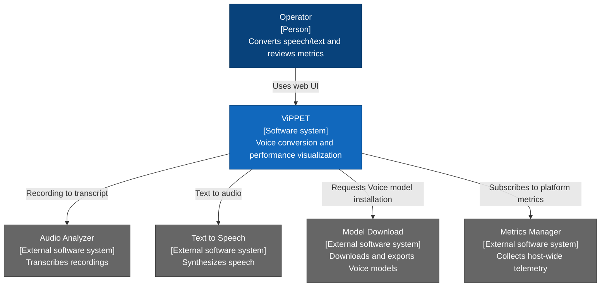
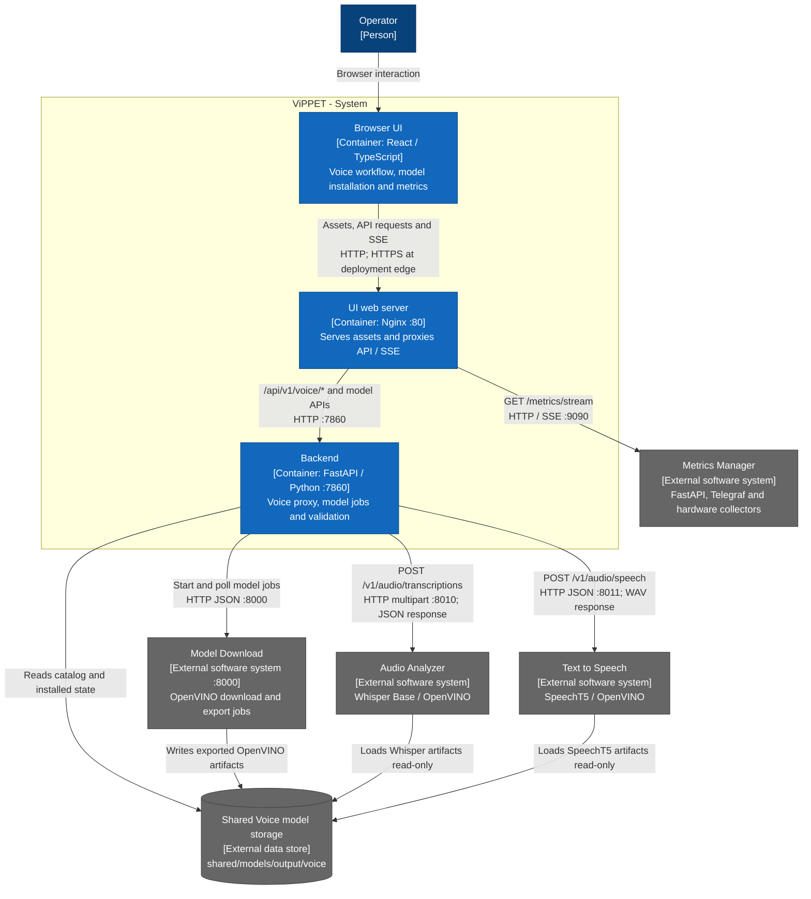
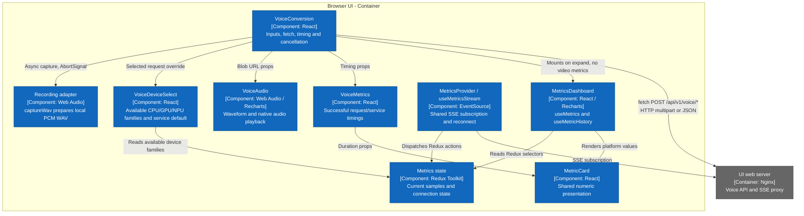
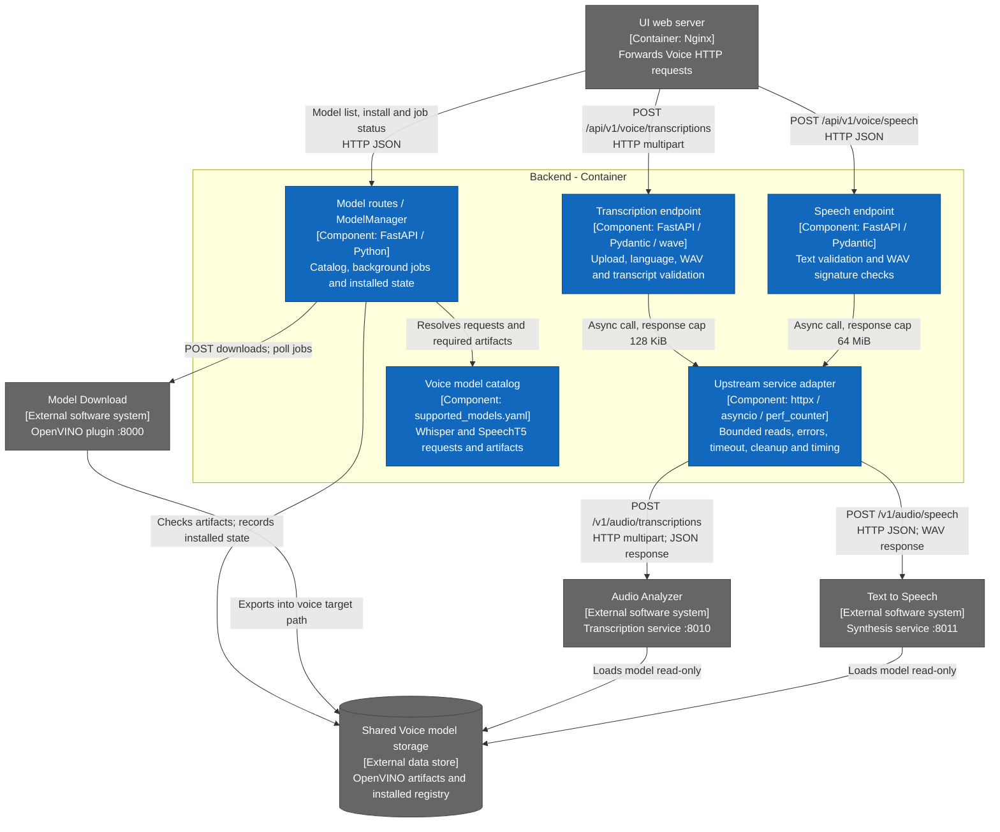
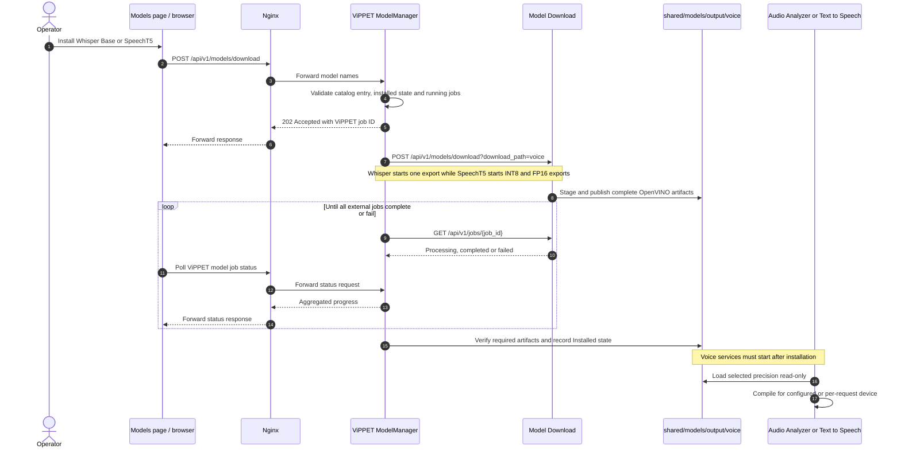
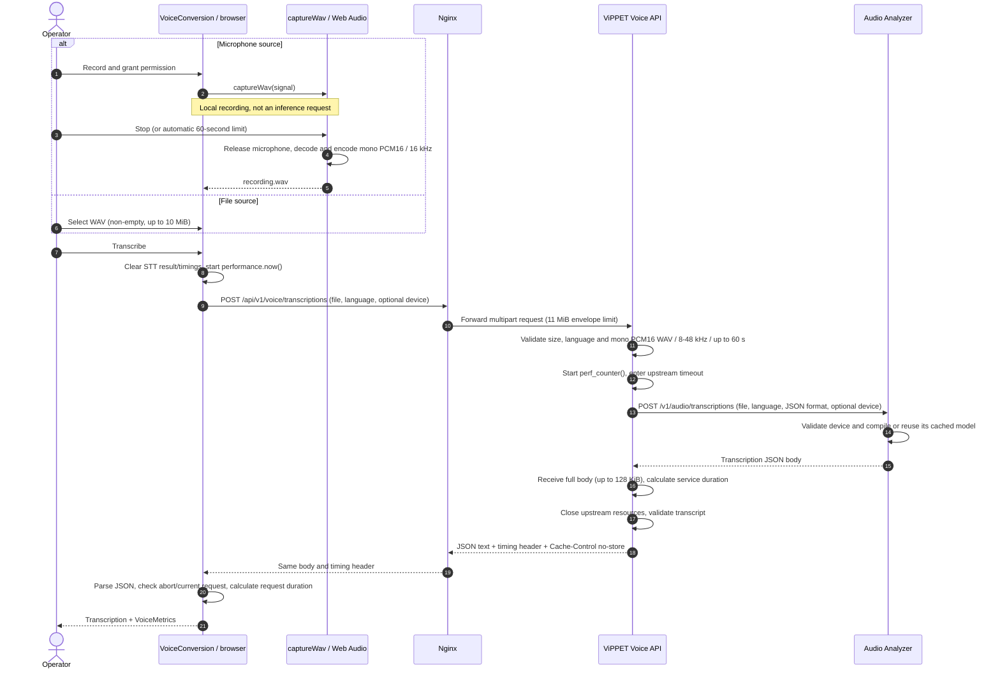
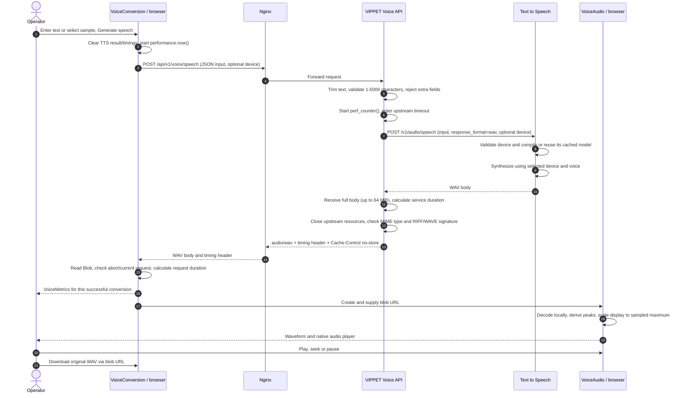
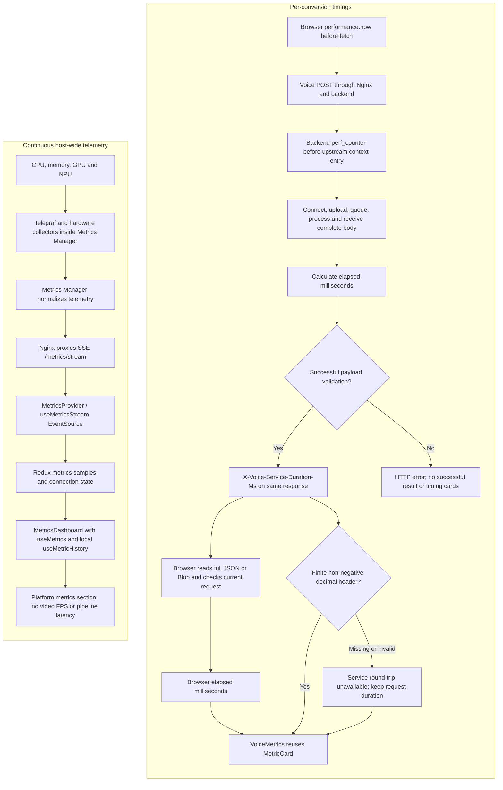
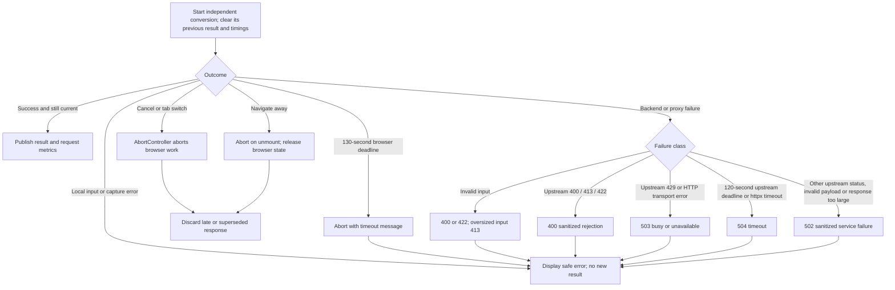

<!-- SPDX-FileCopyrightText: (C) 2026 Intel Corporation -->
<!-- SPDX-License-Identifier: Apache-2.0 -->

# Voice Architecture: STT, TTS and Metrics

These diagrams describe the implemented Voice integration as of 2026-09-24.
They follow the [C4 model](https://c4model.com/diagrams) at System Context,
Container and Component levels only. Flow diagrams describe runtime behavior;
there is no Code-level diagram.

## Scope and Notation

- The system of interest is ViPPET. Audio Analyzer, Text to Speech, Model
  Download and Metrics Manager are independently deployable supporting software
  systems, even when installed in the same Docker Compose stack.
- A C4 container is an application or data store, not necessarily a Docker
  container. The browser SPA and its Nginx web server are separate C4 containers;
  Nginx serves the SPA from the `vippet-ui` Docker image.
- Each Component view zooms into one ViPPET container. Components describe
  existing responsibilities, not proposed services or new source files.
- Relationships in C4 diagrams describe dependencies/calls; response data is
  summarized in their labels. Flow diagrams show response direction explicitly.
- C4 notation is rendered using Mermaid `flowchart`: every box identifies its
  type, technology where relevant, and responsibility. Blue boxes belong to
  ViPPET; gray boxes are dependencies outside the view's system/container boundary.
  Runtime diagrams use `sequenceDiagram` and `flowchart`. This avoids the
  overlapping labels of Mermaid's experimental native C4 layout.
- Unrelated video pipelines, LLMs, chat history and kiosk-core are out of scope.
  STT and TTS are independent conversions, not an automatic chained conversation.

## C4 Level 1: System Context

The operator normally uses the ViPPET UI. Direct upstream API access is possible
through published service ports, but bypasses the ViPPET proxy and its controls.

## C4 Level 2: Containers

Nginx enforces an 11 MiB Voice request-body limit and disables response caching.
The backend imposes its own input, response-size and deadline limits. It does not
forward upstream error bodies or environment HTTP proxy settings to these calls.

### Deployment and Storage Boundaries

- The current Compose file publishes `8010:8010` and `8011:8011` without a
  loopback host address. Network reachability depends on the host/firewall;
  these bindings are not restricted to localhost by this configuration.
  Protect direct access with deployment-level access control and TLS.
- The Models page starts ViPPET background jobs for Whisper Base and SpeechT5.
  `ModelManager` forwards their OpenVINO requests to Model Download, polls the
  returned jobs and tracks installed state. SpeechT5 installs INT8 and FP16 in
  one ViPPET job.
- Model Download exports device-neutral OpenVINO artifacts on CPU under
  `shared/models/output/voice`. Audio Analyzer and Text to Speech mount the
  shared model tree read-only and compile the selected artifact for the runtime
  device when they load it.
- ASR keeps runtime cache, chunks and storage in `voice_asr_cache`,
  `voice_asr_chunks` and `voice_asr_storage`. Recordings/transcripts can persist
  in its storage volume; clear-on-startup is enabled, not a per-request retention
  guarantee. TTS keeps runtime cache and storage in `voice_tts_cache` and
  `voice_tts_storage`, but `PERSIST_OUTPUTS=false` disables output persistence.
- ViPPET does not persist Voice content or request timings. Completed results
  and timings live in React state; each tab retains its latest result until
  replacement, input changes or unmount. Blob URLs are revoked during cleanup.
- Hardware overrides determine the default service devices and which device
  nodes are mounted. Per-request Voice overrides select among compatible,
  visible devices. Telemetry reflects the whole host and can include unrelated
  workloads on those devices.

## C4 Level 3: Browser UI Components

`VoiceMetrics` does not read global service `/v1/performance` values and does not
send timings to Metrics Manager. `MetricsProvider` is mounted at application
level, so expanding the Voice dashboard does not create another SSE subscription.
The dashboard's local history is created on mount and discarded on unmount; its
hook keeps a 60-second window with updates no more often than once per second.

## C4 Level 3: Backend Components

The Voice endpoints and upstream adapter currently reside in the same router
module. The adapter is `call_service` with `create_client`; WAV input validation
is `validate_audio`. The routes publish `X-Voice-Service-Duration-Ms` only after
successful payload validation. There is no shared mutable timing value between
requests. Model routes and `ModelManager` are separate from the Voice router but
run in the same backend container.

## Flow: Install Voice Models

Voice services do not download models during startup. They preload models, so
starting them before installation makes their health checks fail until the
required artifacts exist and the services restart. Model Download stages
exports before publishing complete artifacts; subsequent starts reuse them.

## Flow: Speech to Text

The sequence shows the successful path. WAV preparation is excluded from both
request metrics. The adapter closes its contexts before control returns to the
endpoint for transcript validation; cleanup order is stream, client, timeout.

## Flow: Text to Speech

Waveform decoding, display normalization and playback are excluded from the
reported request duration. Normalization changes only the plot, not the audio
bytes or volume. A visualization failure does not disable playback or download.
The proxy buffers the entire upstream body; this is not streaming playback or a
time-to-first-byte measurement.

## Flow: Two Independent Metrics Paths

No arrow connects Voice timing cards to the telemetry ingestion path: this
integration does not persist or publish request timings to Metrics Manager.
The services' global `last_ms` and `/v1/model-info` are not queried by Voice.

- **Request duration:** browser fetch start through complete response consumption
  and success checks, including upload, proxy handling, service work and download.
- **Service round trip:** backend adapter start through complete upstream body
  reception and local response construction; excludes browser transfer and
  subsequent route payload validation/context cleanup. Includes transport,
  queueing and service processing, not only model inference.
- The intervals use independent monotonic clocks. No cross-machine timestamp
  subtraction or global last-request variable is needed.
- Platform charts are live system-wide telemetry, not a frozen snapshot of a
  conversion and not resource attribution to a particular STT/TTS request.

## Flow: Errors and Cancellation

Cancellation stops browser recording/fetch and prevents stale results from being
published. It does **not** guarantee that an already-started upstream inference
stops. Backend contexts close resources on return or exceptions; their total
upstream deadline is 120 seconds, with a 5-second connection timeout. Nginx Voice
read/send timeouts are 130 seconds, separate from the browser's 130-second timer.
Proxy-generated failures may differ from the backend's status mapping above.

## Implementation References

- [Voice workflow](../../../ui/src/features/voice/VoiceConversion.tsx),
  [recording adapter](../../../ui/src/features/voice/recording.ts),
  [audio preview](../../../ui/src/features/voice/VoiceAudio.tsx) and
  [request timing cards](../../../ui/src/features/voice/VoiceMetrics.tsx).
- [Voice API and upstream adapter](../../../vippet/api/routes/voice.py).
- [Models page](../../../ui/src/pages/Models.tsx),
  [model installation hook](../../../ui/src/features/models/useModelInstall.ts),
  [model routes](../../../vippet/api/routes/models.py),
  [model manager](../../../vippet/managers/model_manager.py) and
  [supported model catalog](../../../shared/models/supported_models.yaml).
- [Metrics stream](../../../ui/src/hooks/useMetricsStream.ts),
  [local chart history](../../../ui/src/hooks/useMetricHistory.ts) and
  [shared dashboard](../../../ui/src/features/metrics/MetricsDashboard.tsx).
- [Nginx routing](../../../ui/nginx.conf),
  [Voice Compose configuration](../../../compose.voice.yml) and
  [system telemetry architecture](./metrics/system-performance.md).
- [Voice user guide](../user-guide/voice-conversion.md),
  [backend regression tests](../../../vippet/tests/unit/api_tests/voice_test.py) and
  [browser regression tests](../../../ui/tests/voice.spec.ts).
