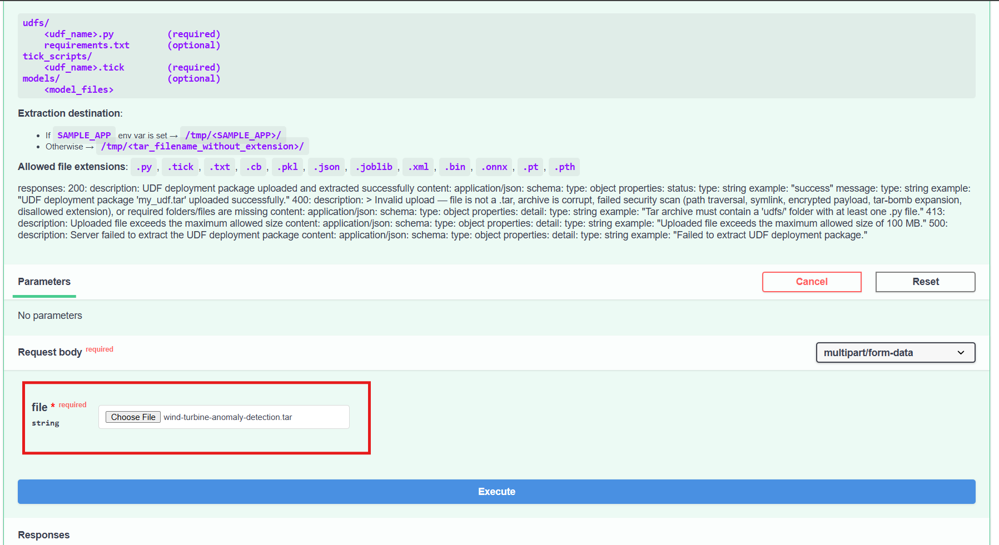
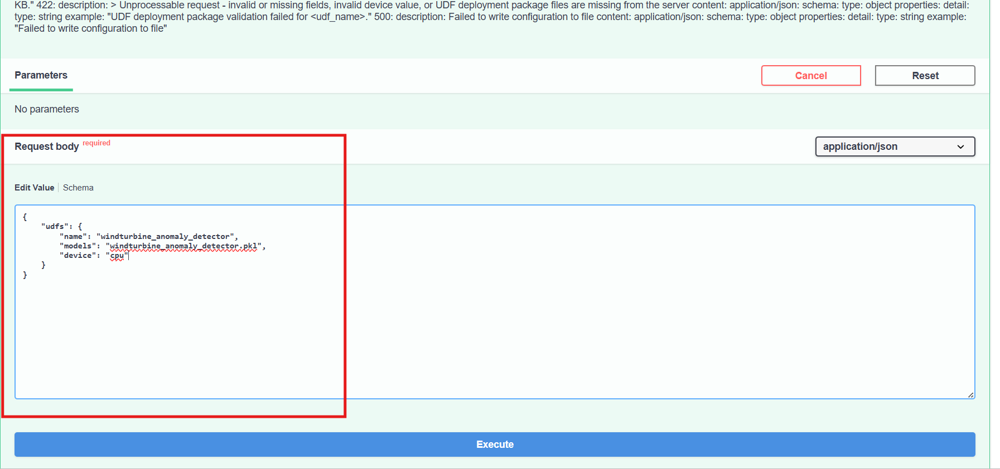

# Deploy Time Series Analytics Microservice

This guide describes how to build, start, and stop the Time Series Analytics Microservice (TSAM) as part of the ViPPET stack, and how to configure it with a sample Wind Turbine anomaly detection UDF.

## Prerequisites

- Docker and Docker Compose installed
- `make` available on the host
- `wget` installed (required to download UDF packages)

---

## Build, Start, and Stop

### Build

Build all required Docker images:

```bash
make build
```

### Start

Start all services, including the Time Series Analytics Microservice:

```bash
make run
```

### Stop

Stop all running services:

```bash
make stop
```

---

## Configure the Wind Turbine Anomaly Detection UDF

Once the services are running, follow the steps below to deploy the Wind Turbine anomaly detection UDF into the TSAM.

The TSAM Swagger UI is available at **http://localhost:5000/docs**.

### Step 1. Download the UDF package

Download the pre-built Wind Turbine UDF tar archive:

```bash
wget https://raw.githubusercontent.com/open-edge-platform/edge-ai-resources/main/timeseries-udf-deployment-packages/wind-turbine-anomaly-detection.tar
```

### Step 2. Upload the UDF package

1. Open **http://localhost:5000/docs** in a browser.
2. Navigate to **POST /udfs/package**.
3. Click **Try it out**.
4. Under **Choose File**, select the downloaded `wind-turbine-anomaly-detection.tar` file.
  
5. Click **Execute**.

A successful response returns the message: `UDF deployment package 'wind-turbine-anomaly-detection.tar' uploaded successfully.`

### Step 3. Apply the configuration

1. Open **http://localhost:5000/docs** in a browser.
2. Navigate to **POST /config**.
3. Click **Try it out**.
4. In the **Request Body** field, paste the following configuration:

```json
{
    "udfs": {
        "name": "windturbine_anomaly_detector",
        "models": "windturbine_anomaly_detector.pkl",
        "device": "cpu"
    }
}
```
  

5. Click **Execute**.

A successful response returns the message: `Configuration updated successfully.`
